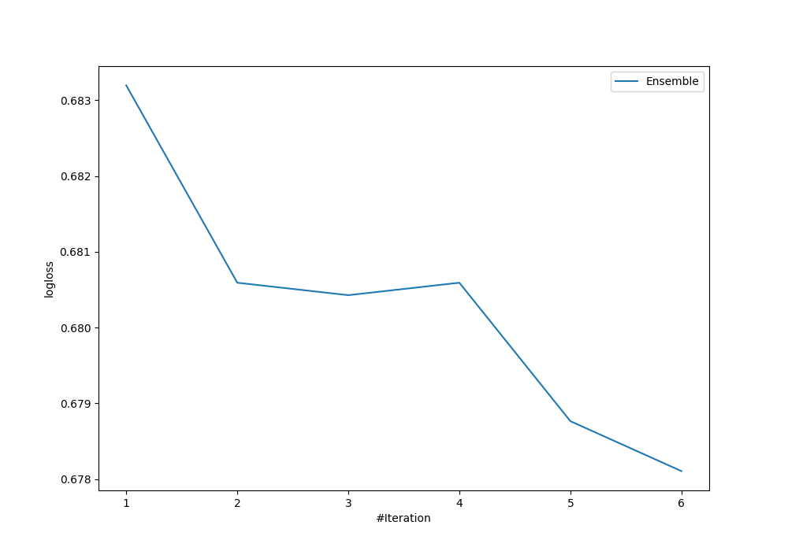
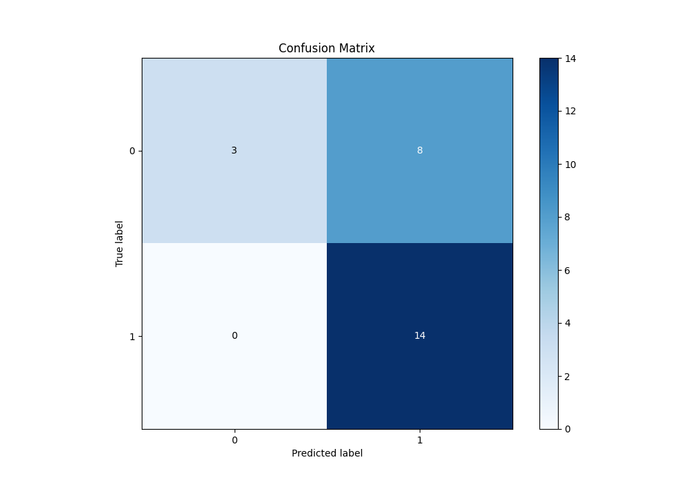
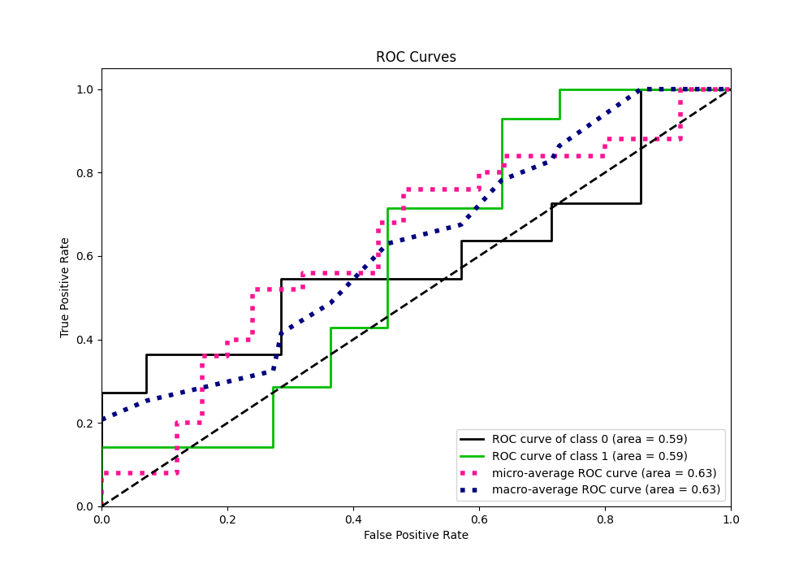
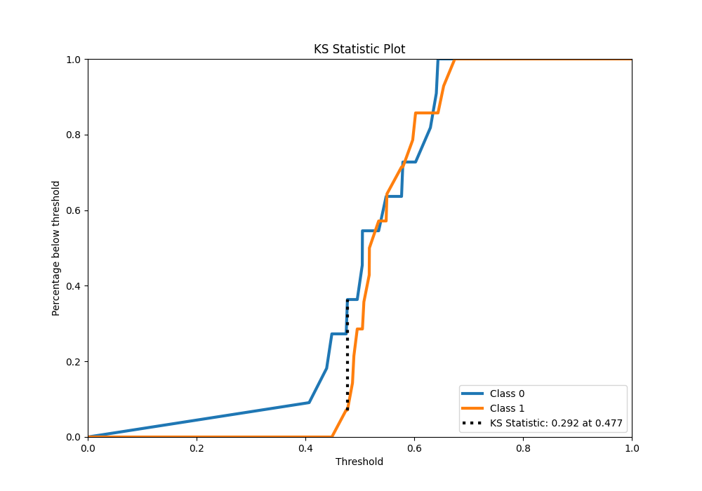
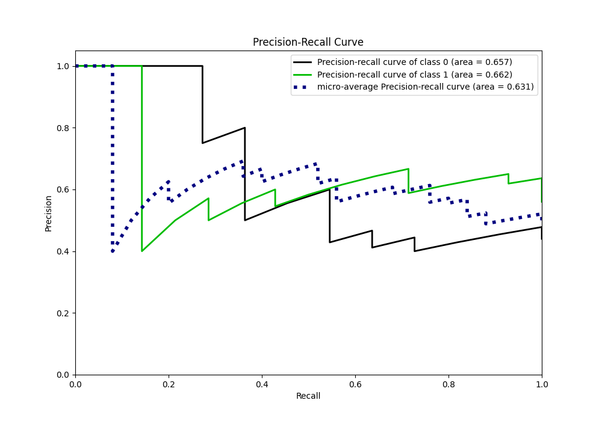
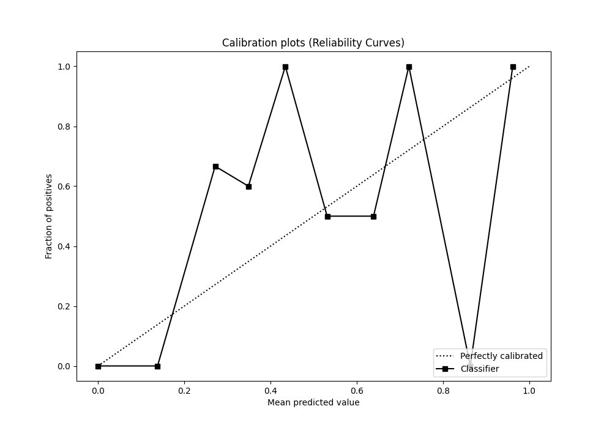
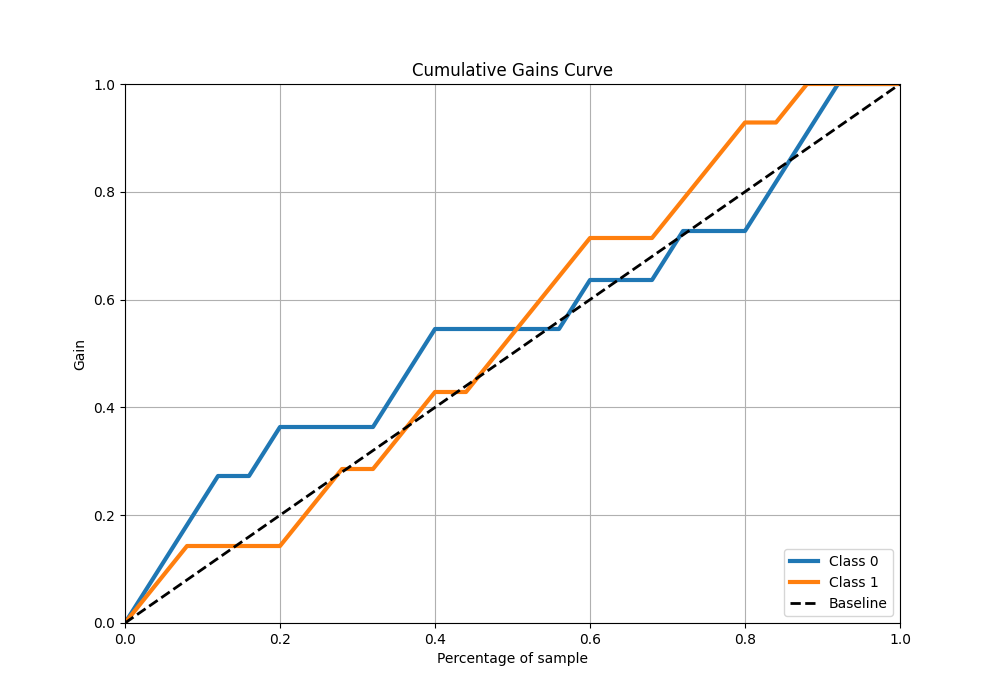
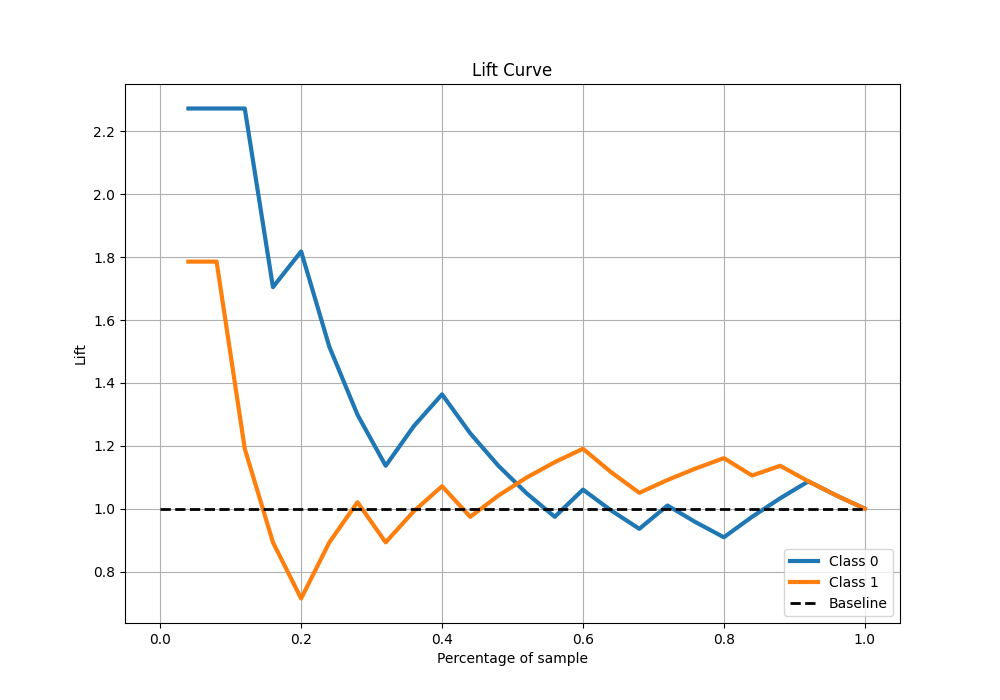

# Summary of Ensemble

[<< Go back](../README.md)

## Ensemble structure
| Model                  |   Weight |
|:-----------------------|---------:|
| 1_Baseline             |        3 |
| 2_DecisionTree         |        1 |
| 6_Default_RandomForest |        2 |

## Metric details
|           |    score |   threshold |
|:----------|---------:|------------:|
| logloss   | 0.678106 |  nan        |
| auc       | 0.590909 |  nan        |
| f1        | 0.777778 |    0.461848 |
| accuracy  | 0.68     |    0.461848 |
| precision | 1        |    0.648989 |
| recall    | 1        |    0.366272 |
| mcc       | 0.416598 |    0.461848 |

## Metric details with threshold from accuracy metric
|           |    score |   threshold |
|:----------|---------:|------------:|
| logloss   | 0.678106 |  nan        |
| auc       | 0.590909 |  nan        |
| f1        | 0.777778 |    0.461848 |
| accuracy  | 0.68     |    0.461848 |
| precision | 0.636364 |    0.461848 |
| recall    | 1        |    0.461848 |
| mcc       | 0.416598 |    0.461848 |

## Confusion matrix (at threshold=0.461848)
|              |   Predicted as 0 |   Predicted as 1 |
|:-------------|-----------------:|-----------------:|
| Labeled as 0 |                3 |                8 |
| Labeled as 1 |                0 |               14 |

## Learning curves

## Confusion Matrix

## Normalized Confusion Matrix

## ROC Curve

## Kolmogorov-Smirnov Statistic

## Precision-Recall Curve

## Calibration Curve

## Cumulative Gains Curve

## Lift Curve

[<< Go back](../README.md)
