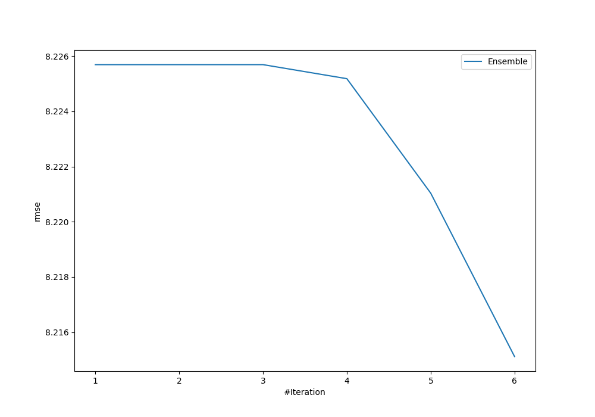
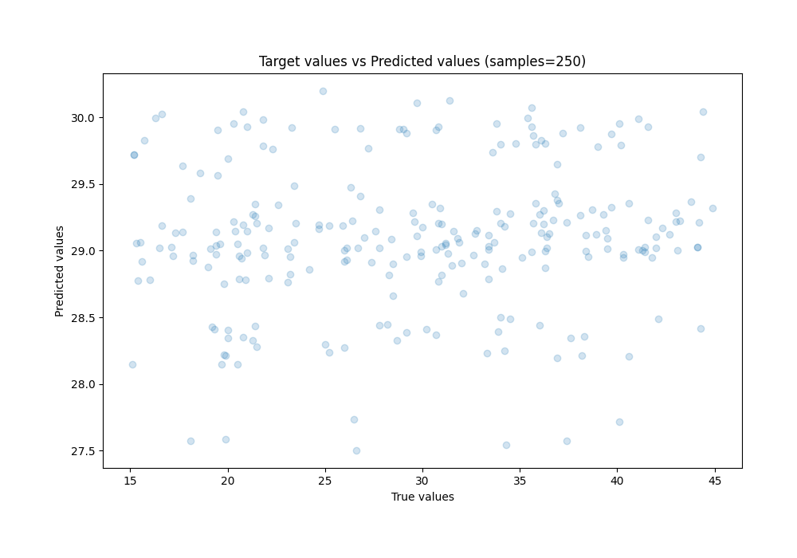
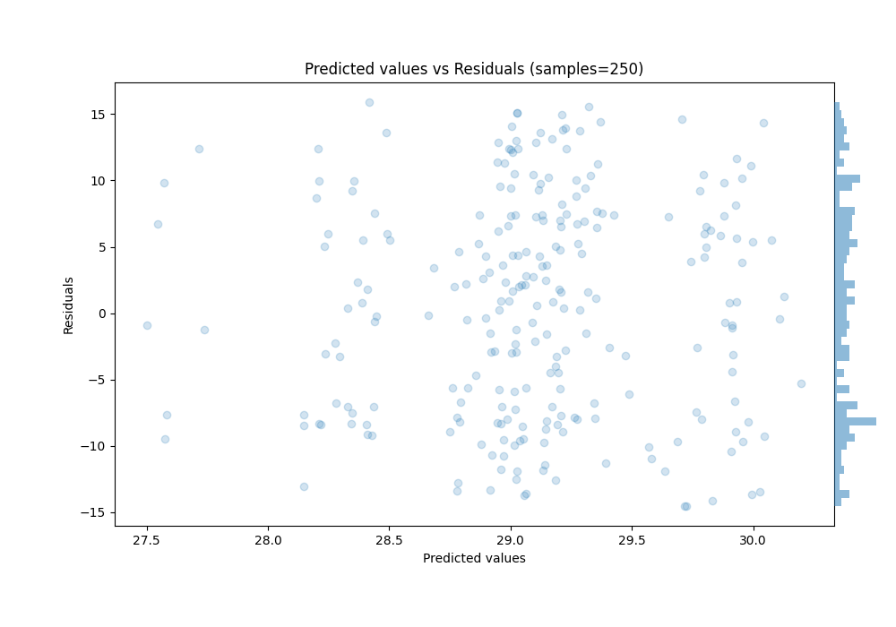

# Summary of Ensemble

[<< Go back](../README.md)

## Ensemble structure
| Model          |   Weight |
|:---------------|---------:|
| 1_Baseline     |        4 |
| 2_DecisionTree |        1 |
| 3_Linear       |        1 |

### Metric details:
| Metric   |       Score |
|:---------|------------:|
| MAE      |  7.10654    |
| MSE      | 67.4882     |
| RMSE     |  8.21512    |
| R2       |  0.00255132 |
| MAPE     |  0.268825   |

## Learning curves

## True vs Predicted

## Predicted vs Residuals

[<< Go back](../README.md)
