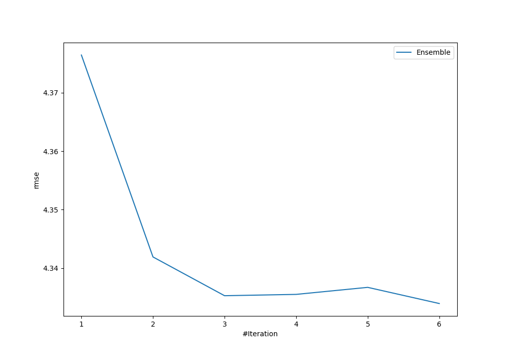
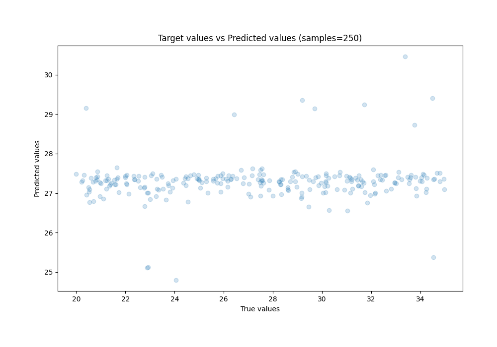
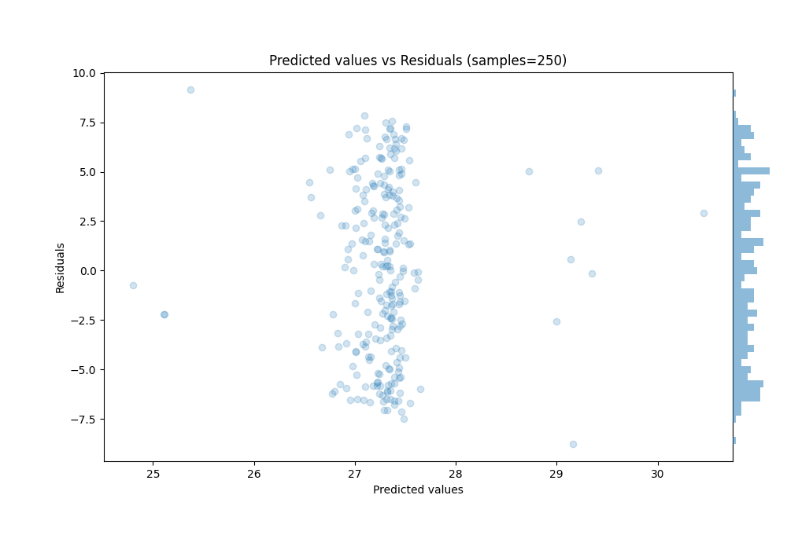

# Summary of Ensemble

[<< Go back](../README.md)

## Ensemble structure
| Model                  |   Weight |
|:-----------------------|---------:|
| 1_Baseline             |        1 |
| 2_DecisionTree         |        3 |
| 6_Default_RandomForest |        2 |

### Metric details:
| Metric   |      Score |
|:---------|-----------:|
| MAE      |  3.74868   |
| MSE      | 18.783     |
| RMSE     |  4.33394   |
| R2       |  0.0166176 |
| MAPE     |  0.142441  |

## Learning curves

## True vs Predicted

## Predicted vs Residuals

[<< Go back](../README.md)
