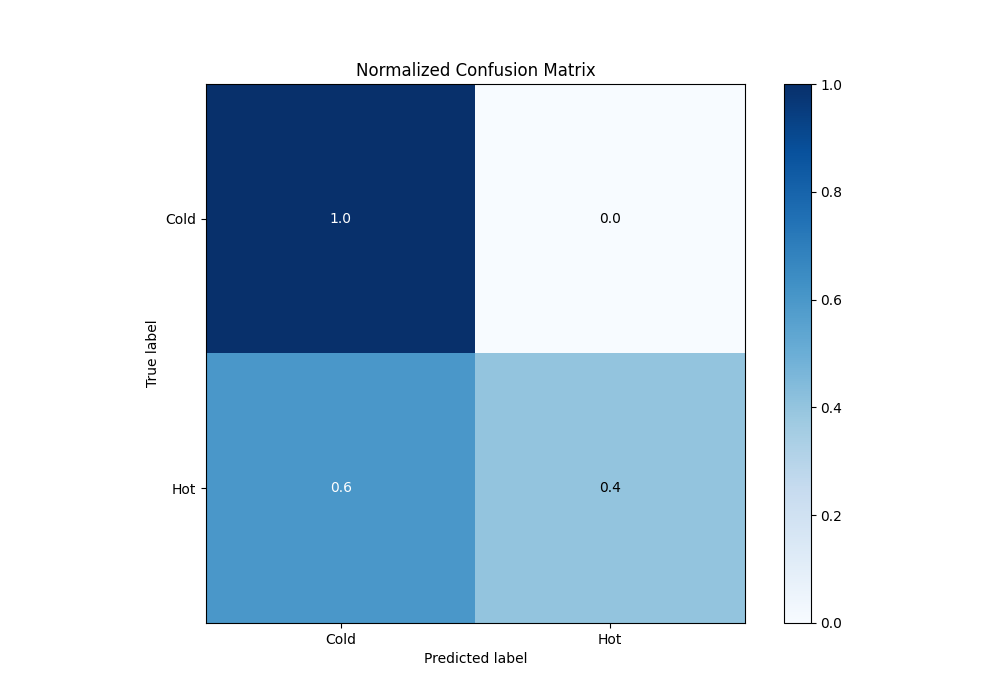

# Summary of 3_Linear

[<< Go back](../README.md)

## Logistic Regression (Linear)
- **n_jobs**: -1
- **explain_level**: 2

## Validation
 - **validation_type**: split
 - **train_ratio**: 0.75
 - **shuffle**: True
 - **stratify**: True

## Optimized metric
logloss

## Training time

3.1 seconds

## Metric details
|           |    score |   threshold |
|:----------|---------:|------------:|
| logloss   | 0.891185 | nan         |
| auc       | 0.4      | nan         |
| f1        | 0.666667 |   0.0834537 |
| accuracy  | 0.7      |   0.495343  |
| precision | 1        |   0.495343  |
| recall    | 1        |   0.0834537 |
| mcc       | 0.5      |   0.495343  |

## Metric details with threshold from accuracy metric
|           |    score |   threshold |
|:----------|---------:|------------:|
| logloss   | 0.891185 |  nan        |
| auc       | 0.4      |  nan        |
| f1        | 0.571429 |    0.495343 |
| accuracy  | 0.7      |    0.495343 |
| precision | 1        |    0.495343 |
| recall    | 0.4      |    0.495343 |
| mcc       | 0.5      |    0.495343 |

## Confusion matrix (at threshold=0.495343)
|                 |   Predicted as Cold |   Predicted as Hot |
|:----------------|--------------------:|-------------------:|
| Labeled as Cold |                   5 |                  0 |
| Labeled as Hot  |                   3 |                  2 |

## Learning curves

## Coefficients
| feature    |   Learner_1 |
|:-----------|------------:|
| Outlook    |   0.623359  |
| intercept  |  -0.0063323 |
| PlayTennis |  -0.336054  |
| Windy      |  -0.435705  |

## Permutation-based Importance

## Confusion Matrix

## Normalized Confusion Matrix

## ROC Curve

## Kolmogorov-Smirnov Statistic

## Precision-Recall Curve

## Calibration Curve

## Cumulative Gains Curve

## Lift Curve

## SHAP Importance

## SHAP Dependence plots

### Dependence (Fold 1)

## SHAP Decision plots

### Top-10 Worst decisions for class 0 (Fold 1)

### Top-10 Best decisions for class 0 (Fold 1)

### Top-10 Worst decisions for class 1 (Fold 1)

### Top-10 Best decisions for class 1 (Fold 1)

[<< Go back](../README.md)
