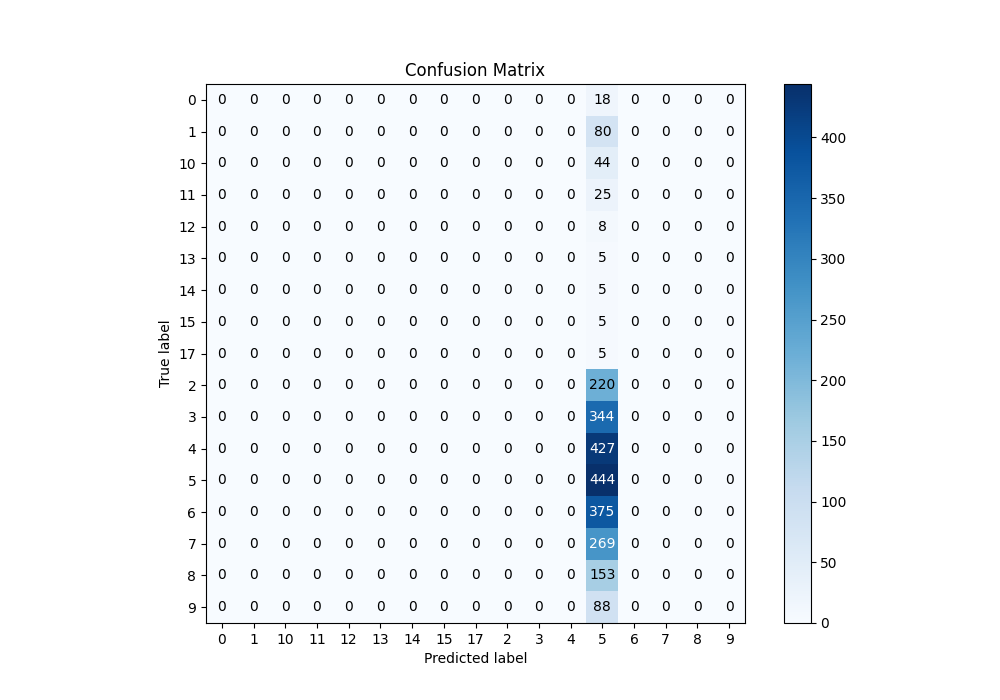
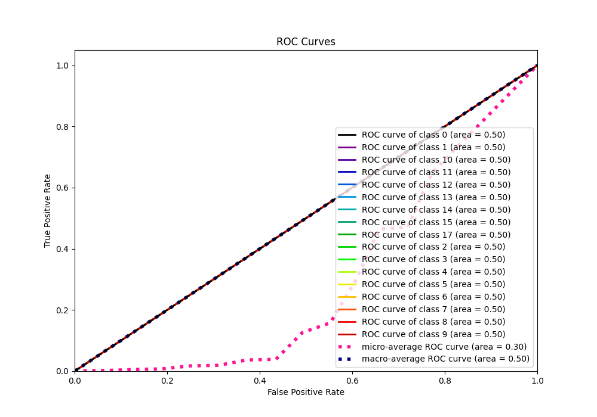

# Summary of 1_Baseline

[<< Go back](../README.md)

## Baseline Classifier (Baseline)
- **n_jobs**: -1
- **num_class**: 17
- **explain_level**: 2

## Validation
 - **validation_type**: split
 - **train_ratio**: 0.75
 - **shuffle**: True
 - **stratify**: True

## Optimized metric
logloss

## Training time

0.9 seconds

### Metric details
|           |   0 |   1 |   2 |   3 |   4 |          5 |   6 |   7 |   8 |   9 |   10 |   11 |   12 |   13 |   14 |   15 |   17 |   accuracy |    macro avg |   weighted avg |   logloss |
|:----------|----:|----:|----:|----:|----:|-----------:|----:|----:|----:|----:|-----:|-----:|-----:|-----:|-----:|-----:|-----:|-----------:|-------------:|---------------:|----------:|
| precision |   0 |   0 |   0 |   0 |   0 |   0.176541 |   0 |   0 |   0 |   0 |    0 |    0 |    0 |    0 |    0 |    0 |    0 |   0.176541 |    0.0103848 |      0.0311666 |   2.23235 |
| recall    |   0 |   0 |   0 |   0 |   0 |   1        |   0 |   0 |   0 |   0 |    0 |    0 |    0 |    0 |    0 |    0 |    0 |   0.176541 |    0.0588235 |      0.176541  |   2.23235 |
| f1-score  |   0 |   0 |   0 |   0 |   0 |   0.300101 |   0 |   0 |   0 |   0 |    0 |    0 |    0 |    0 |    0 |    0 |    0 |   0.176541 |    0.017653  |      0.0529801 |   2.23235 |
| support   |  18 |  80 | 220 | 344 | 427 | 444        | 375 | 269 | 153 |  88 |   44 |   25 |    8 |    5 |    5 |    5 |    5 |   0.176541 | 2515         |   2515         |   2.23235 |

## Confusion matrix
|               |   Predicted as 0 |   Predicted as 1 |   Predicted as 2 |   Predicted as 3 |   Predicted as 4 |   Predicted as 5 |   Predicted as 6 |   Predicted as 7 |   Predicted as 8 |   Predicted as 9 |   Predicted as 10 |   Predicted as 11 |   Predicted as 12 |   Predicted as 13 |   Predicted as 14 |   Predicted as 15 |   Predicted as 17 |
|:--------------|-----------------:|-----------------:|-----------------:|-----------------:|-----------------:|-----------------:|-----------------:|-----------------:|-----------------:|-----------------:|------------------:|------------------:|------------------:|------------------:|------------------:|------------------:|------------------:|
| Labeled as 0  |                0 |                0 |                0 |                0 |                0 |               18 |                0 |                0 |                0 |                0 |                 0 |                 0 |                 0 |                 0 |                 0 |                 0 |                 0 |
| Labeled as 1  |                0 |                0 |                0 |                0 |                0 |               80 |                0 |                0 |                0 |                0 |                 0 |                 0 |                 0 |                 0 |                 0 |                 0 |                 0 |
| Labeled as 2  |                0 |                0 |                0 |                0 |                0 |              220 |                0 |                0 |                0 |                0 |                 0 |                 0 |                 0 |                 0 |                 0 |                 0 |                 0 |
| Labeled as 3  |                0 |                0 |                0 |                0 |                0 |              344 |                0 |                0 |                0 |                0 |                 0 |                 0 |                 0 |                 0 |                 0 |                 0 |                 0 |
| Labeled as 4  |                0 |                0 |                0 |                0 |                0 |              427 |                0 |                0 |                0 |                0 |                 0 |                 0 |                 0 |                 0 |                 0 |                 0 |                 0 |
| Labeled as 5  |                0 |                0 |                0 |                0 |                0 |              444 |                0 |                0 |                0 |                0 |                 0 |                 0 |                 0 |                 0 |                 0 |                 0 |                 0 |
| Labeled as 6  |                0 |                0 |                0 |                0 |                0 |              375 |                0 |                0 |                0 |                0 |                 0 |                 0 |                 0 |                 0 |                 0 |                 0 |                 0 |
| Labeled as 7  |                0 |                0 |                0 |                0 |                0 |              269 |                0 |                0 |                0 |                0 |                 0 |                 0 |                 0 |                 0 |                 0 |                 0 |                 0 |
| Labeled as 8  |                0 |                0 |                0 |                0 |                0 |              153 |                0 |                0 |                0 |                0 |                 0 |                 0 |                 0 |                 0 |                 0 |                 0 |                 0 |
| Labeled as 9  |                0 |                0 |                0 |                0 |                0 |               88 |                0 |                0 |                0 |                0 |                 0 |                 0 |                 0 |                 0 |                 0 |                 0 |                 0 |
| Labeled as 10 |                0 |                0 |                0 |                0 |                0 |               44 |                0 |                0 |                0 |                0 |                 0 |                 0 |                 0 |                 0 |                 0 |                 0 |                 0 |
| Labeled as 11 |                0 |                0 |                0 |                0 |                0 |               25 |                0 |                0 |                0 |                0 |                 0 |                 0 |                 0 |                 0 |                 0 |                 0 |                 0 |
| Labeled as 12 |                0 |                0 |                0 |                0 |                0 |                8 |                0 |                0 |                0 |                0 |                 0 |                 0 |                 0 |                 0 |                 0 |                 0 |                 0 |
| Labeled as 13 |                0 |                0 |                0 |                0 |                0 |                5 |                0 |                0 |                0 |                0 |                 0 |                 0 |                 0 |                 0 |                 0 |                 0 |                 0 |
| Labeled as 14 |                0 |                0 |                0 |                0 |                0 |                5 |                0 |                0 |                0 |                0 |                 0 |                 0 |                 0 |                 0 |                 0 |                 0 |                 0 |
| Labeled as 15 |                0 |                0 |                0 |                0 |                0 |                5 |                0 |                0 |                0 |                0 |                 0 |                 0 |                 0 |                 0 |                 0 |                 0 |                 0 |
| Labeled as 17 |                0 |                0 |                0 |                0 |                0 |                5 |                0 |                0 |                0 |                0 |                 0 |                 0 |                 0 |                 0 |                 0 |                 0 |                 0 |

## Learning curves

## Confusion Matrix

## Normalized Confusion Matrix

## ROC Curve

## Precision Recall Curve

[<< Go back](../README.md)
