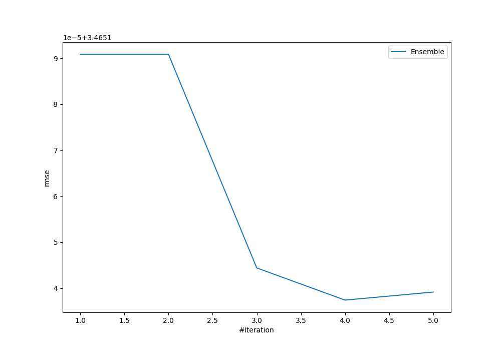
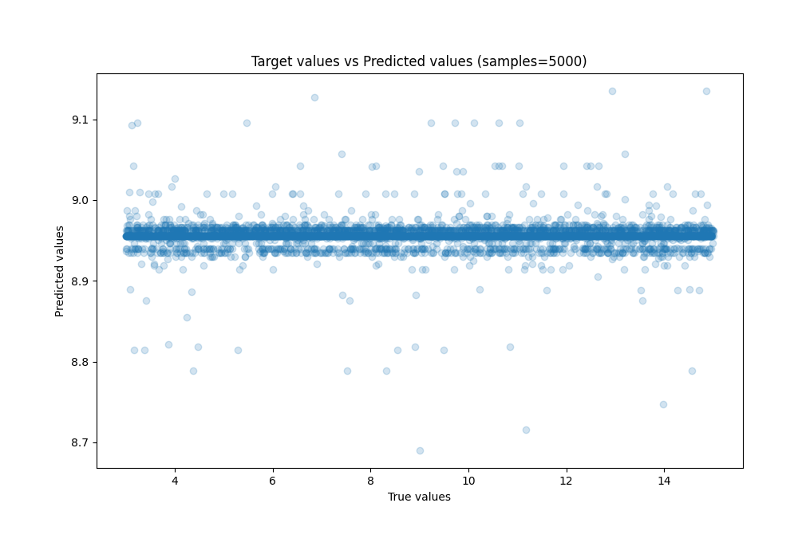
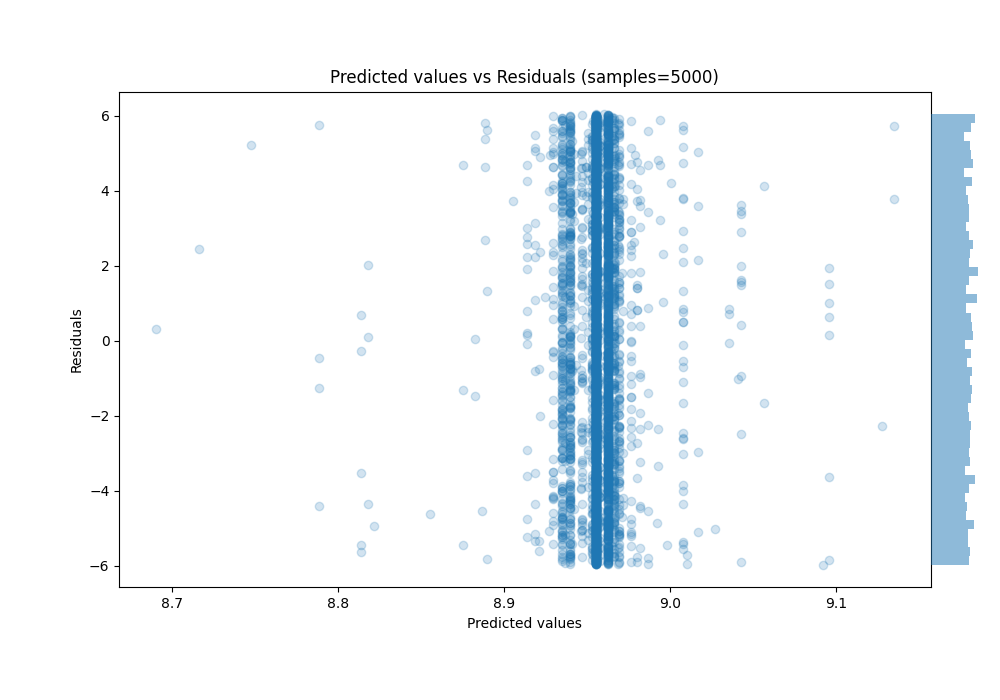

# Summary of Ensemble

[<< Go back](../README.md)

## Ensemble structure
| Model                   |   Weight |
|:------------------------|---------:|
| 4_Default_NeuralNetwork |        3 |
| 5_Default_RandomForest  |        1 |

### Metric details:
| Metric   |       Score |
|:---------|------------:|
| MAE      |  3.00073    |
| MSE      | 12.0072     |
| RMSE     |  3.46514    |
| R2       |  2.4921e-05 |
| MAPE     |  0.443032   |

## Learning curves

## True vs Predicted

## Predicted vs Residuals

[<< Go back](../README.md)
