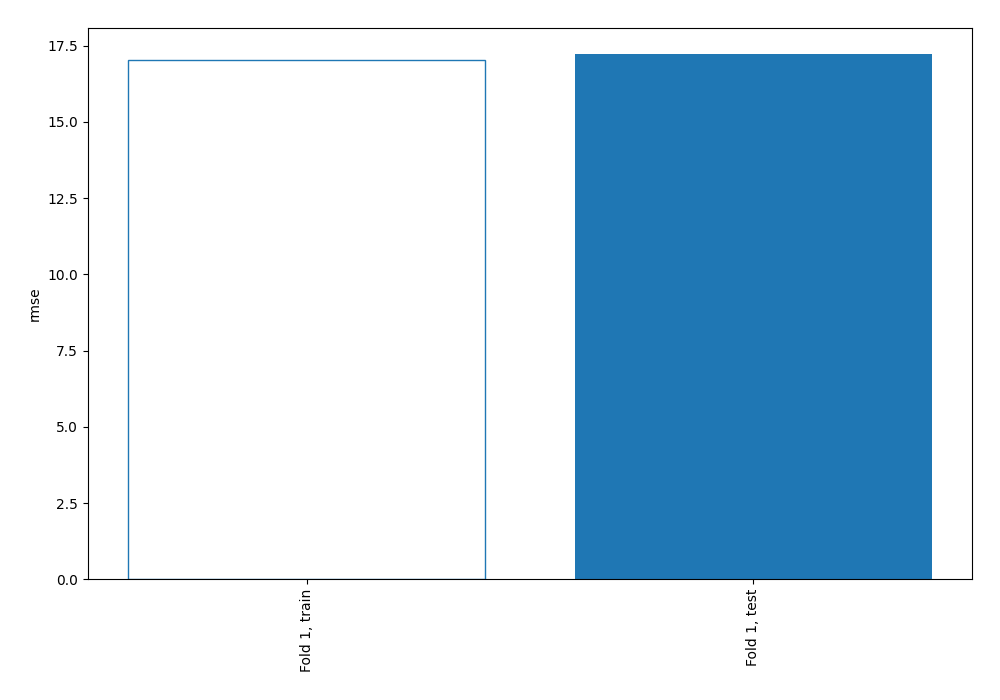
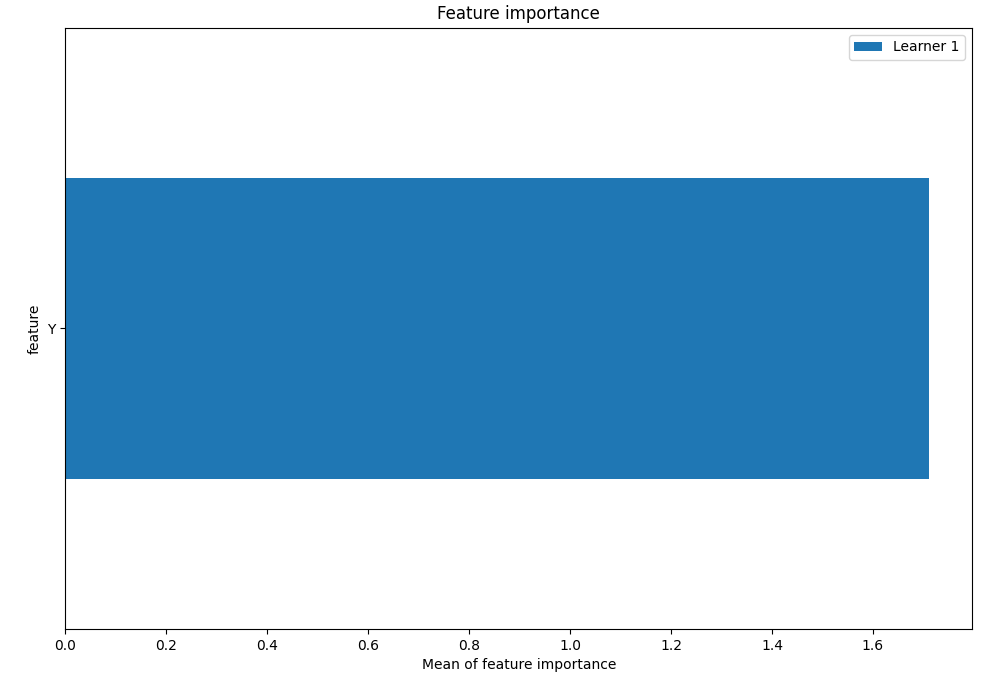
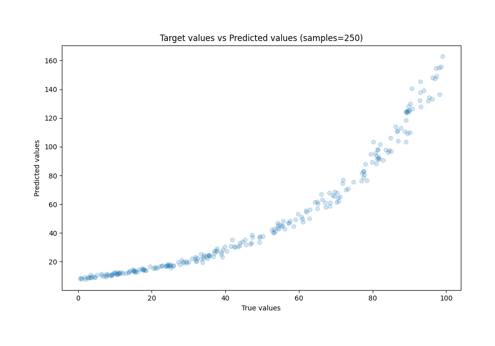
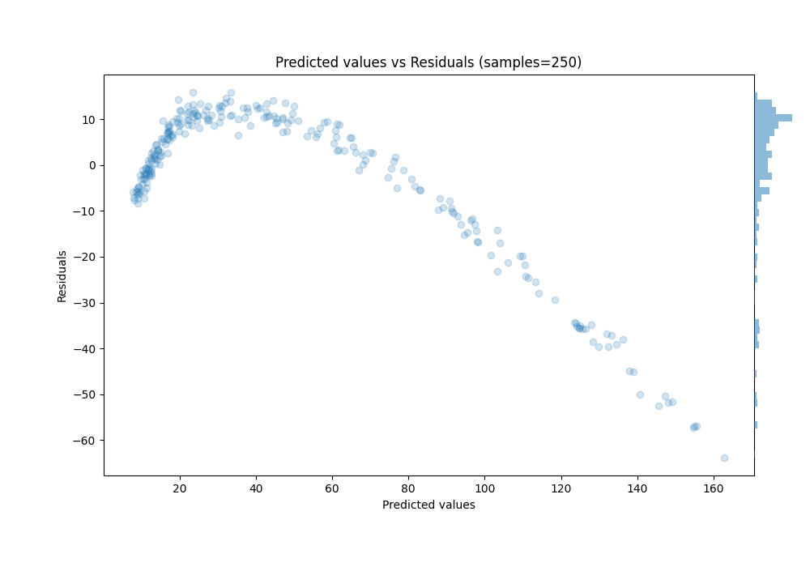
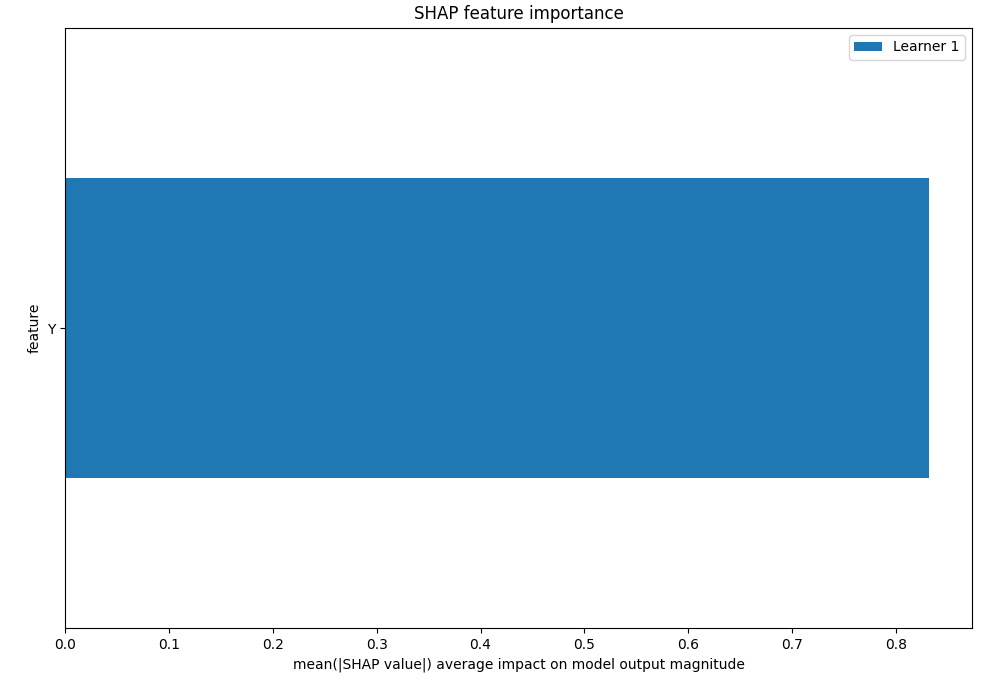
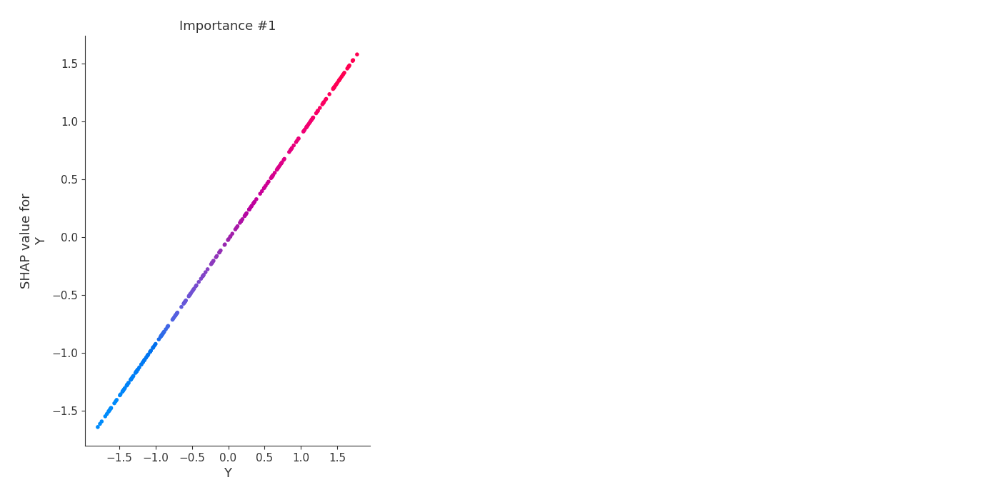
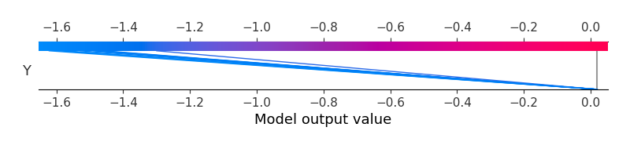
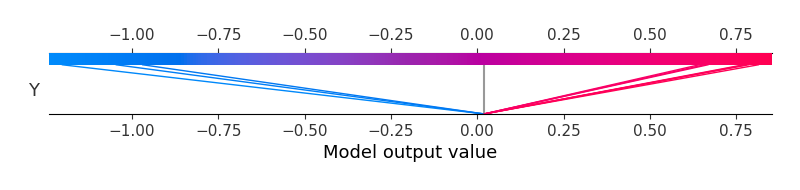

# Summary of 3_Linear

[<< Go back](../README.md)

## Linear Regression (Linear)
- **n_jobs**: -1
- **explain_level**: 2

## Validation
 - **validation_type**: split
 - **train_ratio**: 0.75
 - **shuffle**: True

## Optimized metric
rmse

## Training time

1.2 seconds

### Metric details:
| Metric   |      Score |
|:---------|-----------:|
| MAE      |  11.9951   |
| MSE      | 296.829    |
| RMSE     |  17.2287   |
| R2       |   0.6653   |
| MAPE     |   0.450342 |

## Learning curves

## Coefficients
| feature   |    Learner_1 |
|:----------|-------------:|
| Y         |  0.902238    |
| intercept | -4.05207e-16 |

## Permutation-based Importance

## True vs Predicted

## Predicted vs Residuals

## SHAP Importance

## SHAP Dependence plots

### Dependence (Fold 1)

## SHAP Decision plots

### Top-10 Worst decisions (Fold 1)

### Top-10 Best decisions (Fold 1)

[<< Go back](../README.md)
