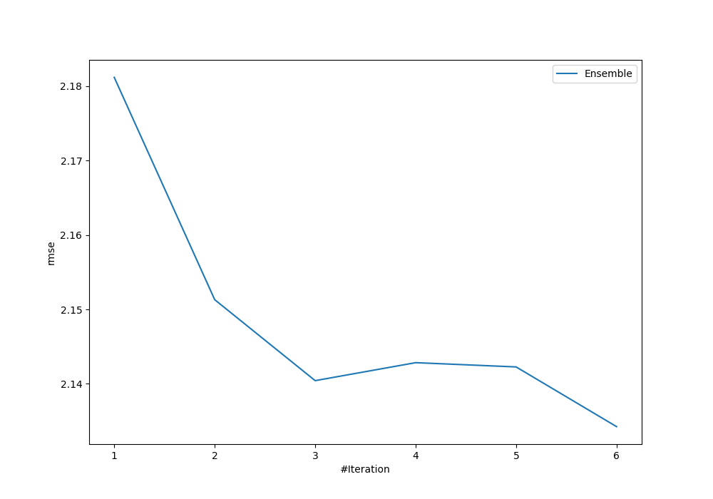
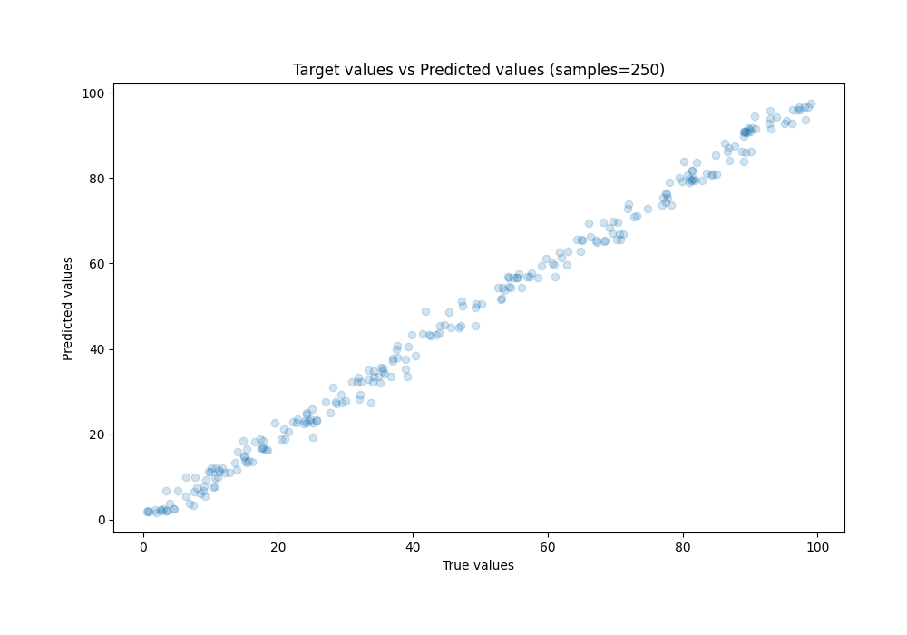
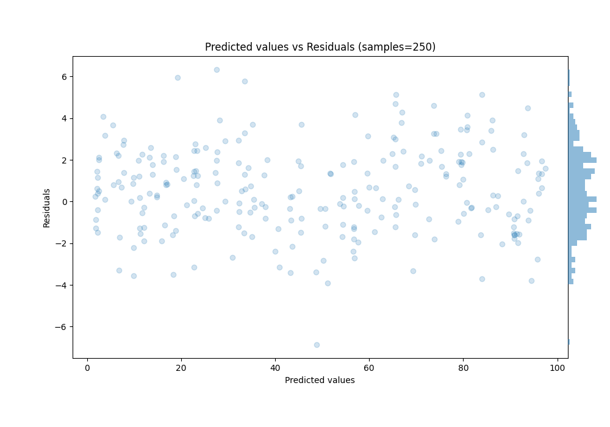

# Summary of Ensemble

[<< Go back](../README.md)

## Ensemble structure
| Model                   |   Weight |
|:------------------------|---------:|
| 4_Default_Xgboost       |        3 |
| 5_Default_NeuralNetwork |        2 |
| 6_Default_RandomForest  |        1 |

### Metric details:
| Metric   |    Score |
|:---------|---------:|
| MAE      | 1.69705  |
| MSE      | 4.55502  |
| RMSE     | 2.13425  |
| R2       | 0.994864 |
| MAPE     | 0.090717 |

## Learning curves

## True vs Predicted

## Predicted vs Residuals

[<< Go back](../README.md)
