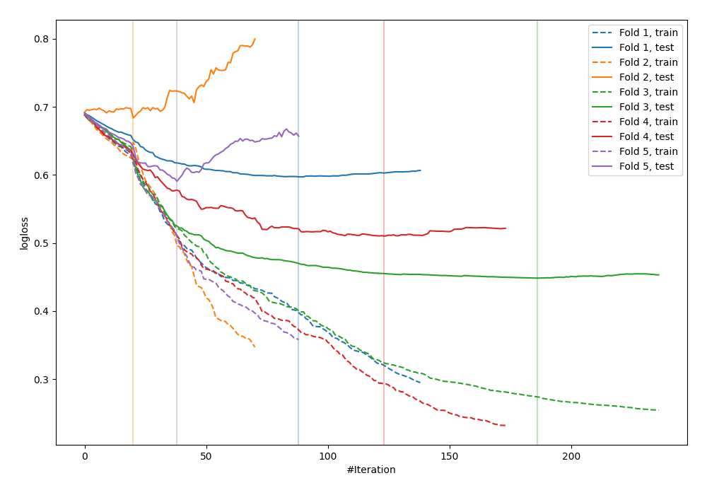
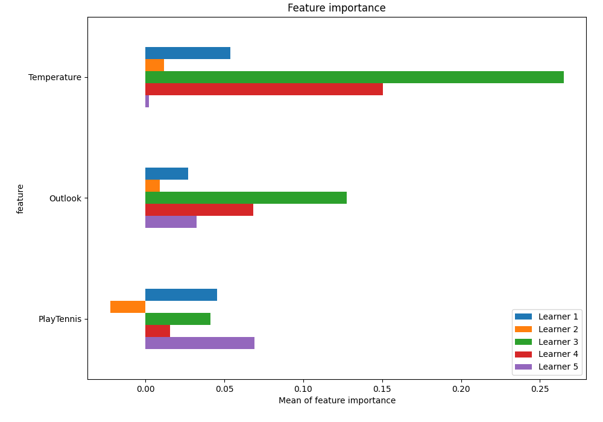
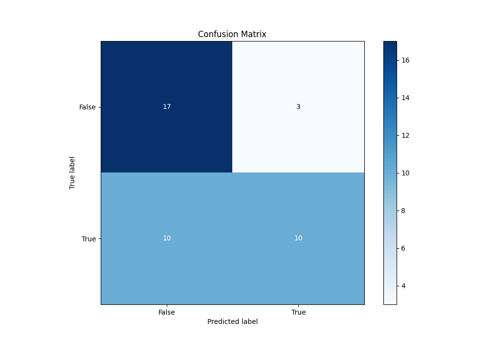
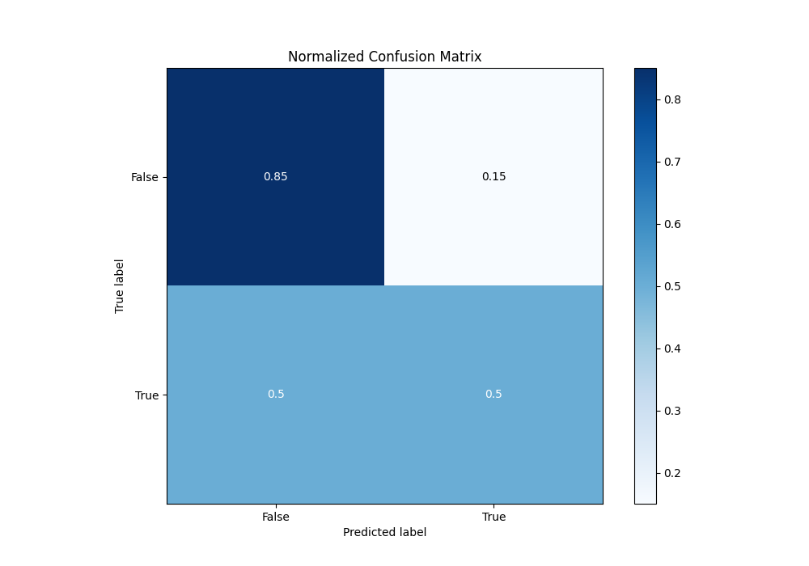
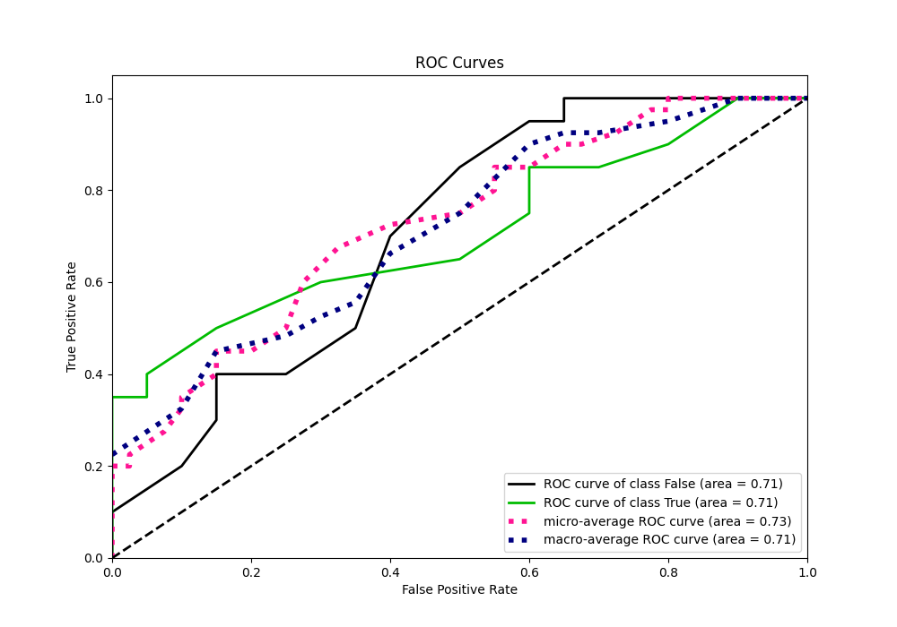
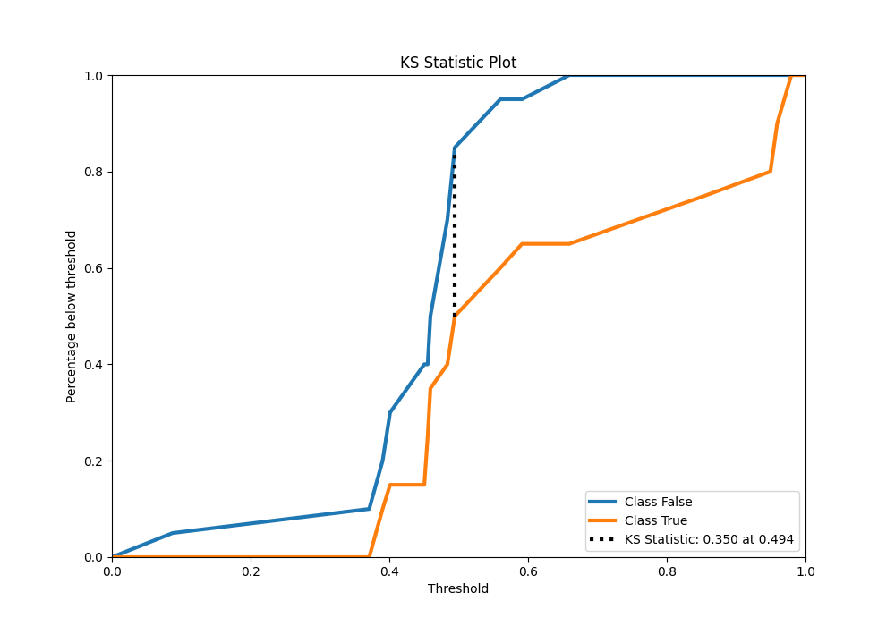
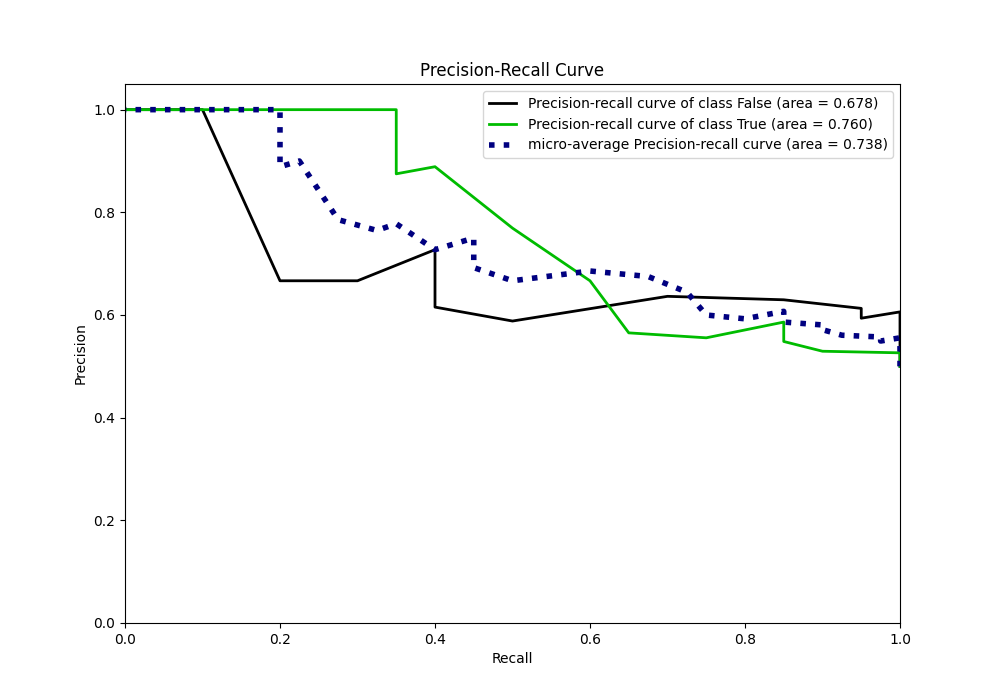
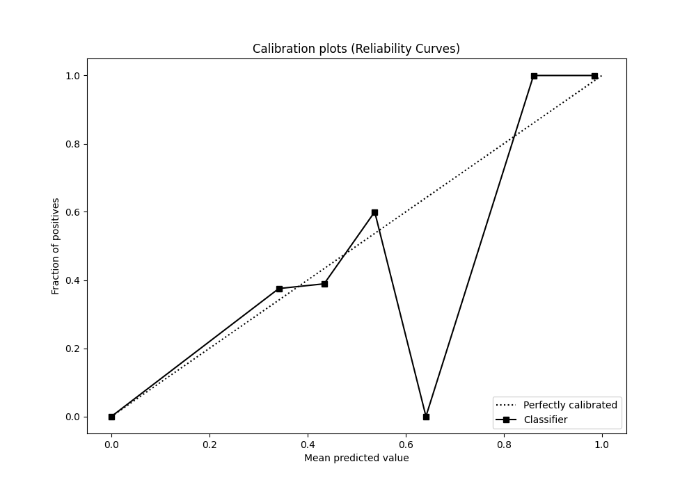
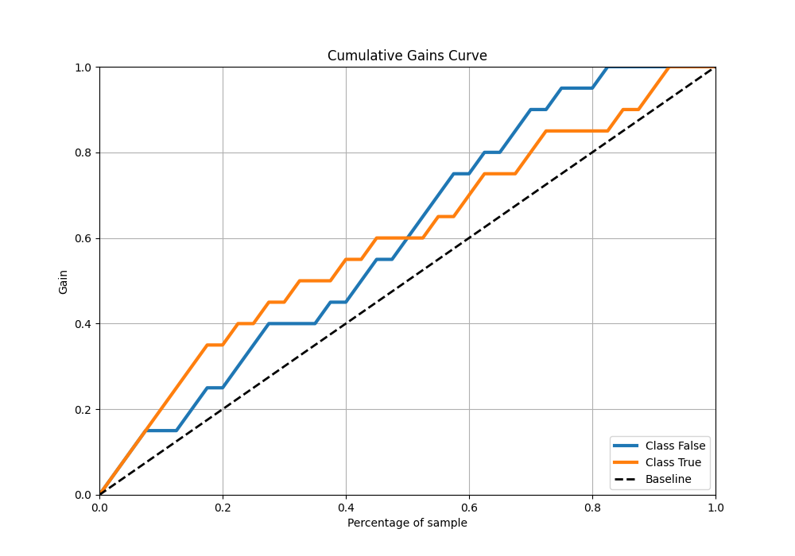
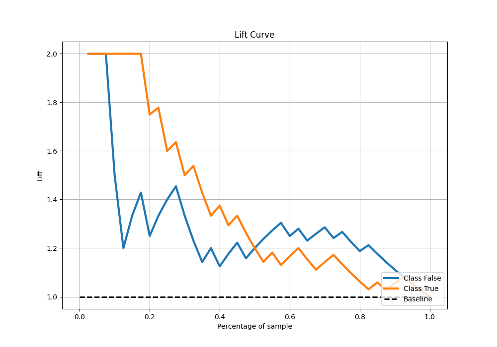

# Summary of 15_CatBoost

[<< Go back](../README.md)

## CatBoost
- **n_jobs**: -1
- **learning_rate**: 0.05
- **depth**: 8
- **rsm**: 0.8
- **loss_function**: Logloss
- **eval_metric**: Logloss
- **explain_level**: 1

## Validation
 - **validation_type**: kfold
 - **k_folds**: 5
 - **shuffle**: True
 - **stratify**: True

## Optimized metric
logloss

## Training time

25.7 seconds

## Metric details
|           |    score |   threshold |
|:----------|---------:|------------:|
| logloss   | 0.566036 | nan         |
| auc       | 0.7075   | nan         |
| f1        | 0.693878 |   0.450432  |
| accuracy  | 0.675    |   0.494389  |
| precision | 1        |   0.757416  |
| recall    | 1        |   0.0788478 |
| mcc       | 0.460566 |   0.757416  |

## Metric details with threshold from accuracy metric
|           |    score |   threshold |
|:----------|---------:|------------:|
| logloss   | 0.566036 |  nan        |
| auc       | 0.7075   |  nan        |
| f1        | 0.606061 |    0.494389 |
| accuracy  | 0.675    |    0.494389 |
| precision | 0.769231 |    0.494389 |
| recall    | 0.5      |    0.494389 |
| mcc       | 0.373632 |    0.494389 |

## Confusion matrix (at threshold=0.494389)
|              |   Predicted as 0 |   Predicted as 1 |
|:-------------|-----------------:|-----------------:|
| Labeled as 0 |               17 |                3 |
| Labeled as 1 |               10 |               10 |

## Learning curves

## Permutation-based Importance

## Confusion Matrix

## Normalized Confusion Matrix

## ROC Curve

## Kolmogorov-Smirnov Statistic

## Precision-Recall Curve

## Calibration Curve

## Cumulative Gains Curve

## Lift Curve

[<< Go back](../README.md)
