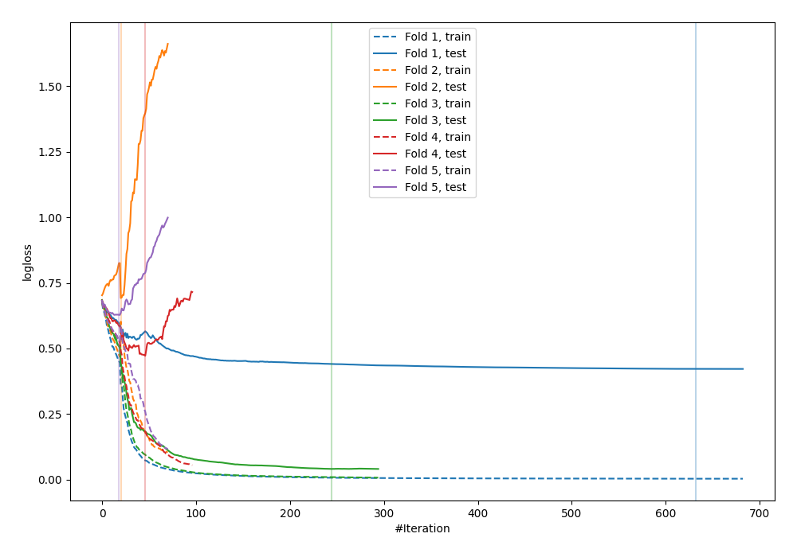
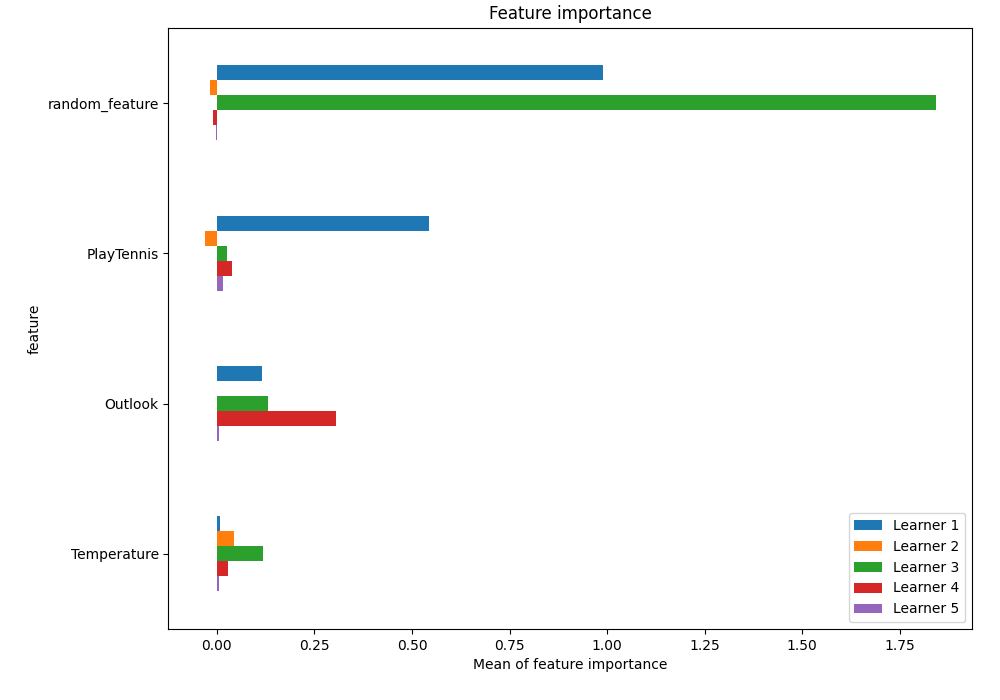
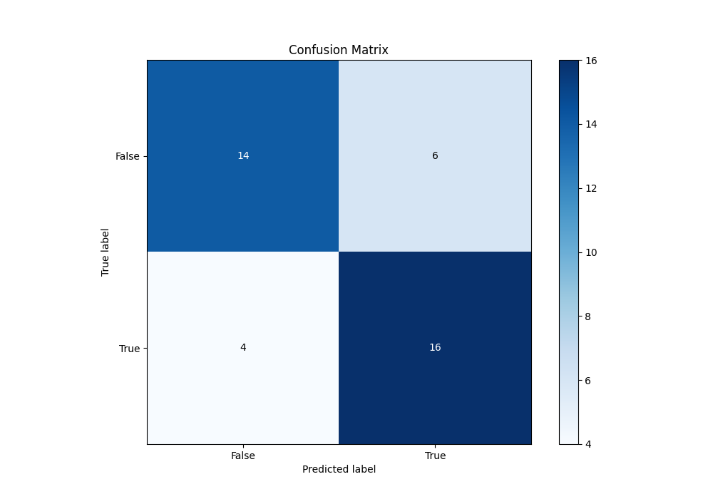
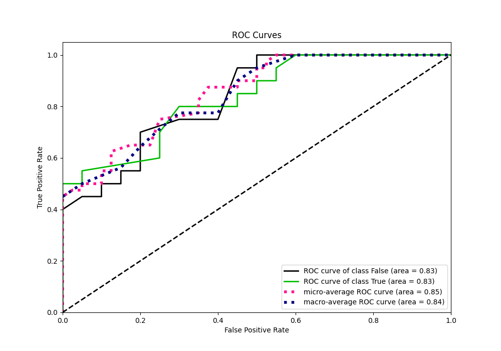
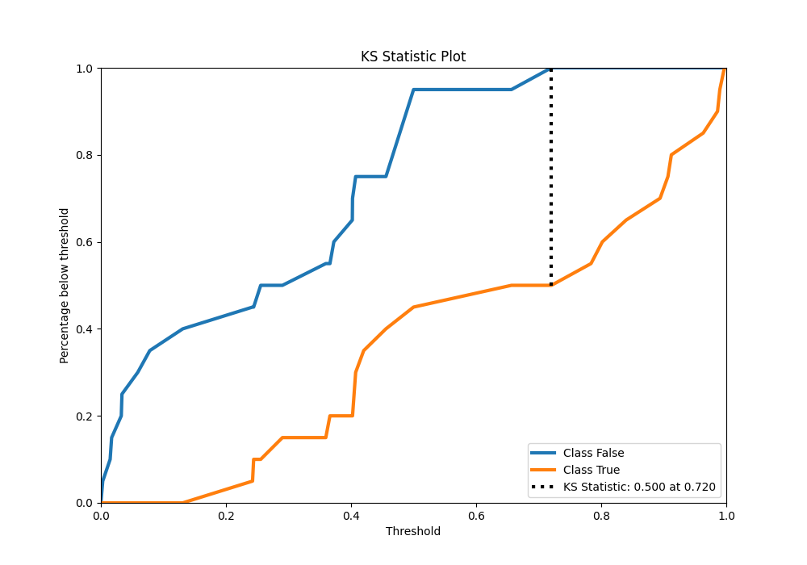
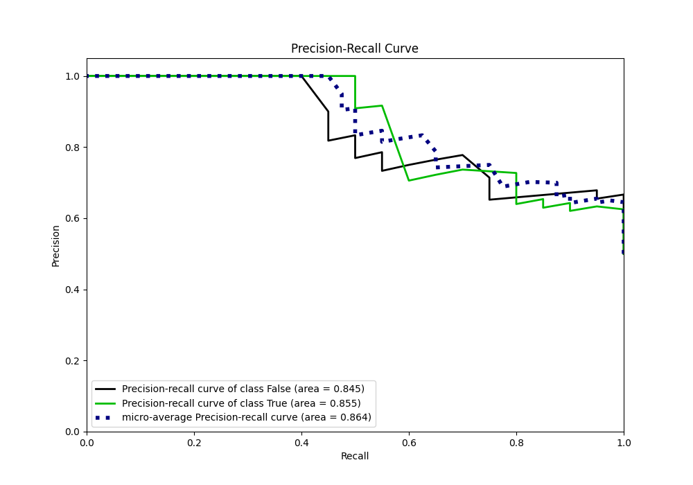
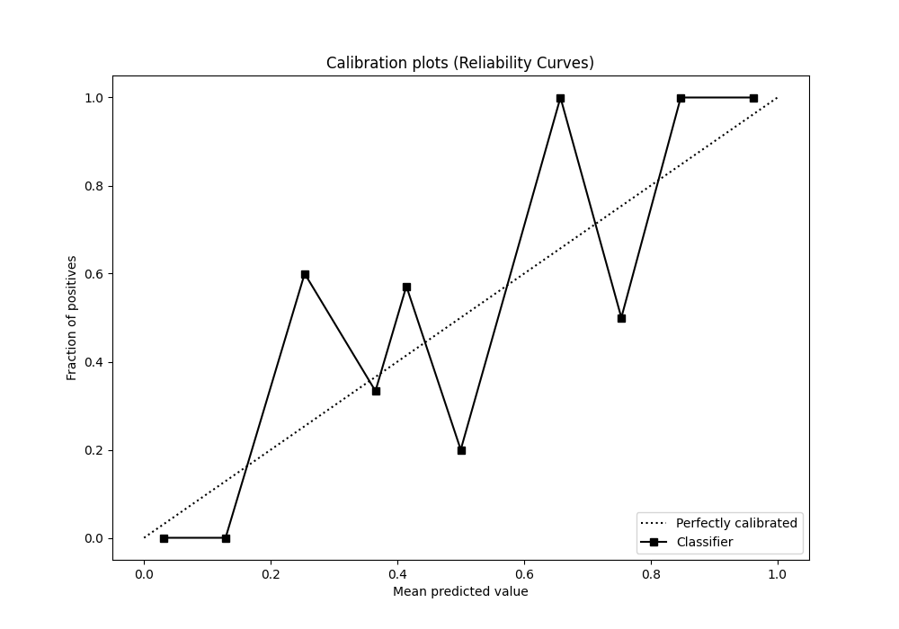
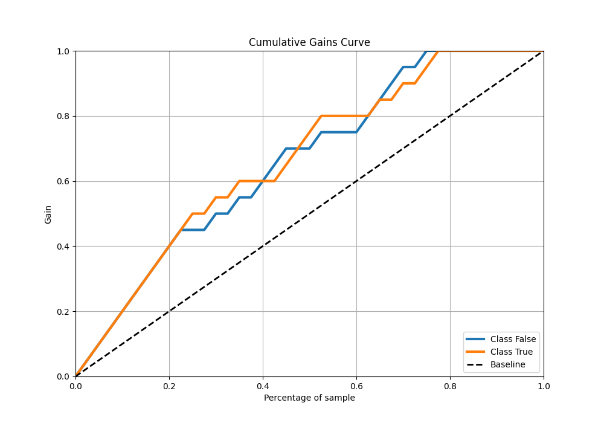
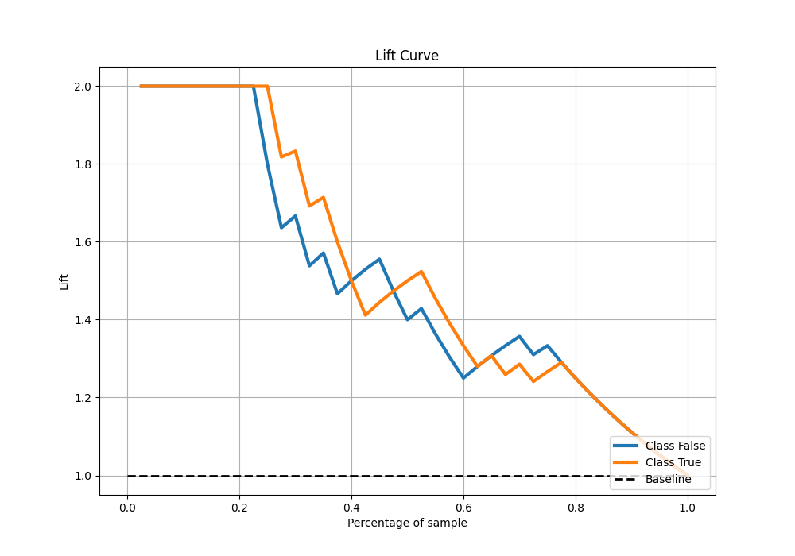

# Summary of 18_CatBoost_RandomFeature

[<< Go back](../README.md)

## CatBoost
- **n_jobs**: -1
- **learning_rate**: 0.2
- **depth**: 8
- **rsm**: 1.0
- **loss_function**: Logloss
- **eval_metric**: Logloss
- **explain_level**: 1

## Validation
 - **validation_type**: kfold
 - **k_folds**: 5
 - **shuffle**: True
 - **stratify**: True

## Optimized metric
logloss

## Training time

93.7 seconds

## Metric details
|           |    score |   threshold |
|:----------|---------:|------------:|
| logloss   | 0.452628 | nan         |
| auc       | 0.83375  | nan         |
| f1        | 0.769231 |   0.186731  |
| accuracy  | 0.75     |   0.404876  |
| precision | 1        |   0.75202   |
| recall    | 1        |   0.0026778 |
| mcc       | 0.57735  |   0.75202   |

## Metric details with threshold from accuracy metric
|           |    score |   threshold |
|:----------|---------:|------------:|
| logloss   | 0.452628 |  nan        |
| auc       | 0.83375  |  nan        |
| f1        | 0.761905 |    0.404876 |
| accuracy  | 0.75     |    0.404876 |
| precision | 0.727273 |    0.404876 |
| recall    | 0.8      |    0.404876 |
| mcc       | 0.502519 |    0.404876 |

## Confusion matrix (at threshold=0.404876)
|              |   Predicted as 0 |   Predicted as 1 |
|:-------------|-----------------:|-----------------:|
| Labeled as 0 |               14 |                6 |
| Labeled as 1 |                4 |               16 |

## Learning curves

## Permutation-based Importance

## Confusion Matrix

## Normalized Confusion Matrix

## ROC Curve

## Kolmogorov-Smirnov Statistic

## Precision-Recall Curve

## Calibration Curve

## Cumulative Gains Curve

## Lift Curve

[<< Go back](../README.md)
