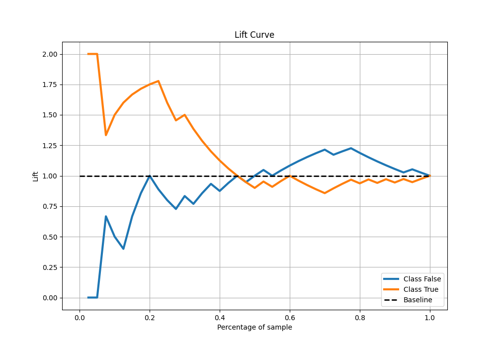

# Summary of 1_Linear

[<< Go back](../README.md)

## Logistic Regression (Linear)
- **n_jobs**: -1
- **explain_level**: 1

## Validation
 - **validation_type**: kfold
 - **k_folds**: 5
 - **shuffle**: True
 - **stratify**: True

## Optimized metric
logloss

## Training time

12.2 seconds

## Metric details
|           |    score |   threshold |
|:----------|---------:|------------:|
| logloss   | 0.648261 |  nan        |
| auc       | 0.53     |  nan        |
| f1        | 0.666667 |    0.219803 |
| accuracy  | 0.675    |    0.470519 |
| precision | 1        |    0.915479 |
| recall    | 1        |    0.219803 |
| mcc       | 0.419079 |    0.470519 |

## Metric details with threshold from accuracy metric
|           |    score |   threshold |
|:----------|---------:|------------:|
| logloss   | 0.648261 |  nan        |
| auc       | 0.53     |  nan        |
| f1        | 0.551724 |    0.470519 |
| accuracy  | 0.675    |    0.470519 |
| precision | 0.888889 |    0.470519 |
| recall    | 0.4      |    0.470519 |
| mcc       | 0.419079 |    0.470519 |

## Confusion matrix (at threshold=0.470519)
|              |   Predicted as 0 |   Predicted as 1 |
|:-------------|-----------------:|-----------------:|
| Labeled as 0 |               19 |                1 |
| Labeled as 1 |               12 |                8 |

## Learning curves

## Coefficients
| feature     |   Learner_1 |   Learner_2 |   Learner_3 |   Learner_4 |   Learner_5 |
|:------------|------------:|------------:|------------:|------------:|------------:|
| intercept   |    0.103902 |   0.0855683 |   0.0710718 |   0.0694422 |    0.157292 |
| Outlook     |   -0.672142 |  -0.485528  |  -0.744725  |  -0.836331  |   -0.306735 |
| PlayTennis  |   -0.887215 |  -0.962038  |  -0.768351  |  -0.73087   |   -0.170503 |
| Temperature |   -0.679093 |  -0.708854  |  -0.578125  |  -0.563001  |   -1.0734   |

## Permutation-based Importance

## Confusion Matrix

## Normalized Confusion Matrix

## ROC Curve

## Kolmogorov-Smirnov Statistic

## Precision-Recall Curve

## Calibration Curve

## Cumulative Gains Curve

## Lift Curve

[<< Go back](../README.md)
