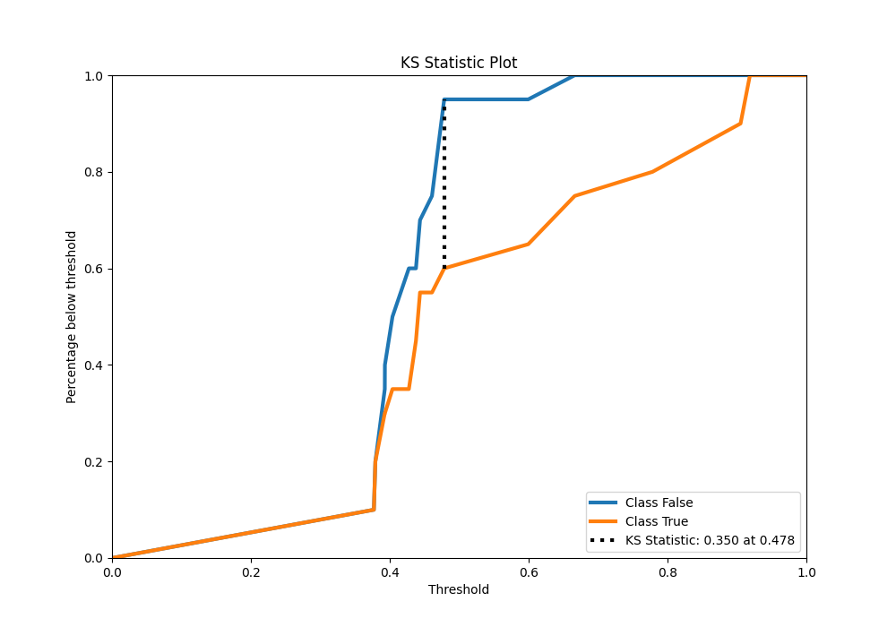

# Summary of 33_Xgboost

[<< Go back](../README.md)

## Extreme Gradient Boosting (Xgboost)
- **n_jobs**: -1
- **objective**: binary:logistic
- **eta**: 0.1
- **max_depth**: 8
- **min_child_weight**: 1
- **subsample**: 0.9
- **colsample_bytree**: 1.0
- **eval_metric**: logloss
- **explain_level**: 1

## Validation
 - **validation_type**: kfold
 - **k_folds**: 5
 - **shuffle**: True
 - **stratify**: True

## Optimized metric
logloss

## Training time

6.5 seconds

## Metric details
|           |    score |   threshold |
|:----------|---------:|------------:|
| logloss   | 0.604031 |  nan        |
| auc       | 0.6325   |  nan        |
| f1        | 0.666667 |    0.339408 |
| accuracy  | 0.675    |    0.478402 |
| precision | 1        |    0.666381 |
| recall    | 1        |    0.339408 |
| mcc       | 0.419079 |    0.478402 |

## Metric details with threshold from accuracy metric
|           |    score |   threshold |
|:----------|---------:|------------:|
| logloss   | 0.604031 |  nan        |
| auc       | 0.6325   |  nan        |
| f1        | 0.551724 |    0.478402 |
| accuracy  | 0.675    |    0.478402 |
| precision | 0.888889 |    0.478402 |
| recall    | 0.4      |    0.478402 |
| mcc       | 0.419079 |    0.478402 |

## Confusion matrix (at threshold=0.478402)
|              |   Predicted as 0 |   Predicted as 1 |
|:-------------|-----------------:|-----------------:|
| Labeled as 0 |               19 |                1 |
| Labeled as 1 |               12 |                8 |

## Learning curves

## Permutation-based Importance

## Confusion Matrix

## Normalized Confusion Matrix

## ROC Curve

## Kolmogorov-Smirnov Statistic

## Precision-Recall Curve

## Calibration Curve

## Cumulative Gains Curve

## Lift Curve

[<< Go back](../README.md)
