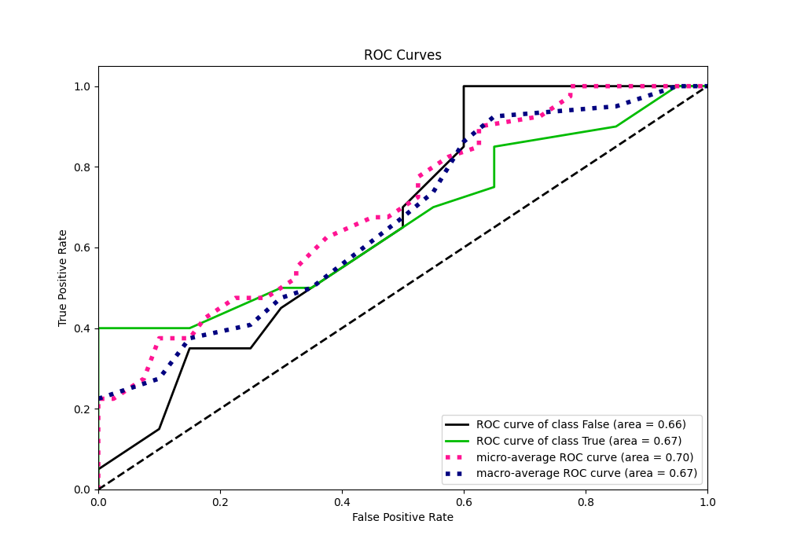

# Summary of 4_Default_CatBoost

[<< Go back](../README.md)

## CatBoost
- **n_jobs**: -1
- **learning_rate**: 0.1
- **depth**: 6
- **rsm**: 1
- **loss_function**: Logloss
- **eval_metric**: Logloss
- **explain_level**: 1

## Validation
 - **validation_type**: kfold
 - **k_folds**: 5
 - **shuffle**: True
 - **stratify**: True

## Optimized metric
logloss

## Training time

23.4 seconds

## Metric details
|           |    score |   threshold |
|:----------|---------:|------------:|
| logloss   | 0.585846 | nan         |
| auc       | 0.665    | nan         |
| f1        | 0.68     |   0.327585  |
| accuracy  | 0.7      |   0.774232  |
| precision | 1        |   0.774232  |
| recall    | 1        |   0.0353876 |
| mcc       | 0.5      |   0.774232  |

## Metric details with threshold from accuracy metric
|           |    score |   threshold |
|:----------|---------:|------------:|
| logloss   | 0.585846 |  nan        |
| auc       | 0.665    |  nan        |
| f1        | 0.571429 |    0.774232 |
| accuracy  | 0.7      |    0.774232 |
| precision | 1        |    0.774232 |
| recall    | 0.4      |    0.774232 |
| mcc       | 0.5      |    0.774232 |

## Confusion matrix (at threshold=0.774232)
|              |   Predicted as 0 |   Predicted as 1 |
|:-------------|-----------------:|-----------------:|
| Labeled as 0 |               20 |                0 |
| Labeled as 1 |               12 |                8 |

## Learning curves

## Permutation-based Importance

## Confusion Matrix

## Normalized Confusion Matrix

## ROC Curve

## Kolmogorov-Smirnov Statistic

## Precision-Recall Curve

## Calibration Curve

## Cumulative Gains Curve

## Lift Curve

[<< Go back](../README.md)
