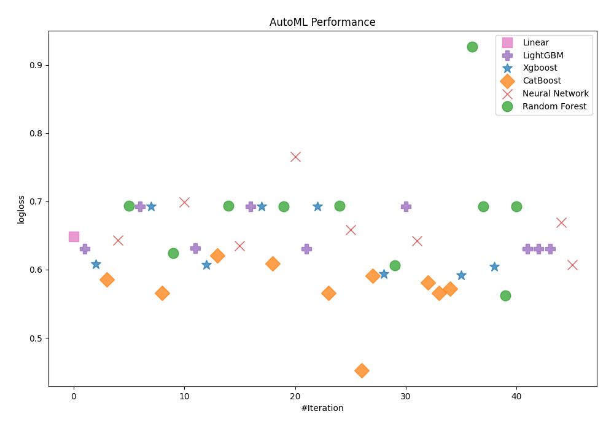
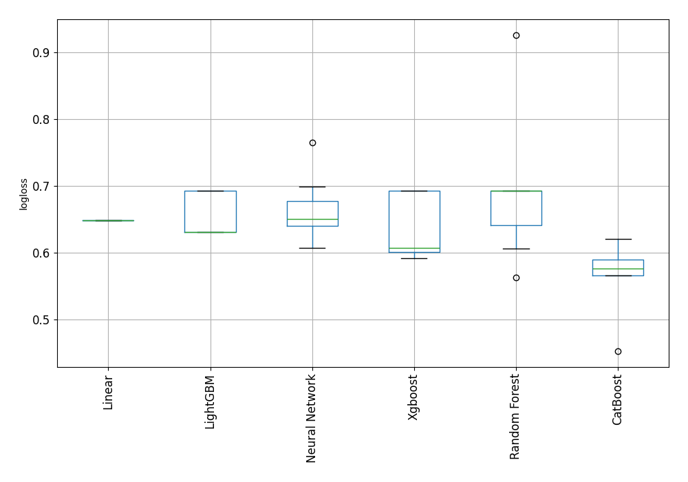

# AutoML Leaderboard

| Best model   | name                                                                                 | model_type     | metric_type   |   metric_value |   train_time |   single_prediction_time |
|:-------------|:-------------------------------------------------------------------------------------|:---------------|:--------------|---------------:|-------------:|-------------------------:|
|              | [1_Linear](1_Linear/README.md)                                                       | Linear         | logloss       |       0.648261 |        13.36 |                   0.0639 |
|              | [2_Default_LightGBM](2_Default_LightGBM/README.md)                                   | LightGBM       | logloss       |       0.630565 |         9.77 |                   0.0278 |
|              | [3_Default_Xgboost](3_Default_Xgboost/README.md)                                     | Xgboost        | logloss       |       0.60762  |        12.26 |                   0.025  |
|              | [4_Default_CatBoost](4_Default_CatBoost/README.md)                                   | CatBoost       | logloss       |       0.585846 |        24.54 |                   0.014  |
|              | [5_Default_NeuralNetwork](5_Default_NeuralNetwork/README.md)                         | Neural Network | logloss       |       0.642735 |         4.24 |                   0.0428 |
|              | [6_Default_RandomForest](6_Default_RandomForest/README.md)                           | Random Forest  | logloss       |       0.693149 |         8.97 |                   0.1562 |
|              | [11_LightGBM](11_LightGBM/README.md)                                                 | LightGBM       | logloss       |       0.693147 |         4.37 |                   0.0544 |
|              | [7_Xgboost](7_Xgboost/README.md)                                                     | Xgboost        | logloss       |       0.693147 |         4.12 |                   0.0274 |
|              | [15_CatBoost](15_CatBoost/README.md)                                                 | CatBoost       | logloss       |       0.566036 |        26.94 |                   0.019  |
|              | [19_RandomForest](19_RandomForest/README.md)                                         | Random Forest  | logloss       |       0.623856 |        16.1  |                   0.1586 |
|              | [23_NeuralNetwork](23_NeuralNetwork/README.md)                                       | Neural Network | logloss       |       0.699207 |         4.46 |                   0.0294 |
|              | [12_LightGBM](12_LightGBM/README.md)                                                 | LightGBM       | logloss       |       0.631207 |         8.64 |                   0.0223 |
|              | [8_Xgboost](8_Xgboost/README.md)                                                     | Xgboost        | logloss       |       0.607589 |        13.37 |                   0.0334 |
|              | [16_CatBoost](16_CatBoost/README.md)                                                 | CatBoost       | logloss       |       0.620691 |        16.99 |                   0.0183 |
|              | [20_RandomForest](20_RandomForest/README.md)                                         | Random Forest  | logloss       |       0.693163 |        10.21 |                   0.1902 |
|              | [24_NeuralNetwork](24_NeuralNetwork/README.md)                                       | Neural Network | logloss       |       0.635163 |         4.32 |                   0.066  |
|              | [13_LightGBM](13_LightGBM/README.md)                                                 | LightGBM       | logloss       |       0.693147 |         3.58 |                   0.0213 |
|              | [9_Xgboost](9_Xgboost/README.md)                                                     | Xgboost        | logloss       |       0.693147 |         4.17 |                   0.0274 |
|              | [17_CatBoost](17_CatBoost/README.md)                                                 | CatBoost       | logloss       |       0.609271 |        16.78 |                   0.0145 |
|              | [21_RandomForest](21_RandomForest/README.md)                                         | Random Forest  | logloss       |       0.693147 |        10.26 |                   0.1555 |
|              | [25_NeuralNetwork](25_NeuralNetwork/README.md)                                       | Neural Network | logloss       |       0.765638 |         7.52 |                   0.1349 |
|              | [14_LightGBM](14_LightGBM/README.md)                                                 | LightGBM       | logloss       |       0.630565 |         7.71 |                   0.017  |
|              | [10_Xgboost](10_Xgboost/README.md)                                                   | Xgboost        | logloss       |       0.693147 |         7.27 |                   0.029  |
|              | [18_CatBoost](18_CatBoost/README.md)                                                 | CatBoost       | logloss       |       0.565827 |        35.64 |                   0.0166 |
|              | [22_RandomForest](22_RandomForest/README.md)                                         | Random Forest  | logloss       |       0.693153 |        13.14 |                   0.2999 |
|              | [26_NeuralNetwork](26_NeuralNetwork/README.md)                                       | Neural Network | logloss       |       0.658717 |        11.03 |                   0.0892 |
| **the best** | [18_CatBoost_RandomFeature](18_CatBoost_RandomFeature/README.md)                     | CatBoost       | logloss       |       0.452628 |        95.13 |                   0.016  |
|              | [18_CatBoost_SelectedFeatures](18_CatBoost_SelectedFeatures/README.md)               | CatBoost       | logloss       |       0.591235 |         7.91 |                   0.013  |
|              | [8_Xgboost_SelectedFeatures](8_Xgboost_SelectedFeatures/README.md)                   | Xgboost        | logloss       |       0.593706 |         6.44 |                   0.0333 |
|              | [19_RandomForest_SelectedFeatures](19_RandomForest_SelectedFeatures/README.md)       | Random Forest  | logloss       |       0.6063   |        10.76 |                   0.1551 |
|              | [2_Default_LightGBM_SelectedFeatures](2_Default_LightGBM_SelectedFeatures/README.md) | LightGBM       | logloss       |       0.693147 |         5.16 |                   0.0242 |
|              | [24_NeuralNetwork_SelectedFeatures](24_NeuralNetwork_SelectedFeatures/README.md)     | Neural Network | logloss       |       0.642463 |        10.98 |                   0.038  |
|              | [27_CatBoost](27_CatBoost/README.md)                                                 | CatBoost       | logloss       |       0.581343 |        42.15 |                   0.0294 |
|              | [28_CatBoost](28_CatBoost/README.md)                                                 | CatBoost       | logloss       |       0.565726 |        33.06 |                   0.021  |
|              | [29_CatBoost](29_CatBoost/README.md)                                                 | CatBoost       | logloss       |       0.571644 |        54.9  |                   0.0194 |
|              | [30_Xgboost_SelectedFeatures](30_Xgboost_SelectedFeatures/README.md)                 | Xgboost        | logloss       |       0.59186  |         7.59 |                   0.0264 |
|              | [31_RandomForest_SelectedFeatures](31_RandomForest_SelectedFeatures/README.md)       | Random Forest  | logloss       |       0.926415 |        12.36 |                   0.1586 |
|              | [32_RandomForest_SelectedFeatures](32_RandomForest_SelectedFeatures/README.md)       | Random Forest  | logloss       |       0.693147 |        19.41 |                   0.1565 |
|              | [33_Xgboost](33_Xgboost/README.md)                                                   | Xgboost        | logloss       |       0.604031 |         7.85 |                   0.0287 |
|              | [34_RandomForest](34_RandomForest/README.md)                                         | Random Forest  | logloss       |       0.562593 |        10.34 |                   0.1544 |
|              | [35_RandomForest](35_RandomForest/README.md)                                         | Random Forest  | logloss       |       0.693147 |        24.46 |                   0.1737 |
|              | [36_LightGBM](36_LightGBM/README.md)                                                 | LightGBM       | logloss       |       0.630565 |        17.24 |                   0.0299 |
|              | [37_LightGBM](37_LightGBM/README.md)                                                 | LightGBM       | logloss       |       0.630565 |        11.35 |                   0.0254 |
|              | [38_LightGBM](38_LightGBM/README.md)                                                 | LightGBM       | logloss       |       0.630565 |        11.68 |                   0.0229 |
|              | [39_NeuralNetwork](39_NeuralNetwork/README.md)                                       | Neural Network | logloss       |       0.669545 |         9.28 |                   0.0769 |
|              | [40_NeuralNetwork_SelectedFeatures](40_NeuralNetwork_SelectedFeatures/README.md)     | Neural Network | logloss       |       0.607548 |         8.43 |                   0.1318 |

### AutoML Performance

### AutoML Performance Boxplot
