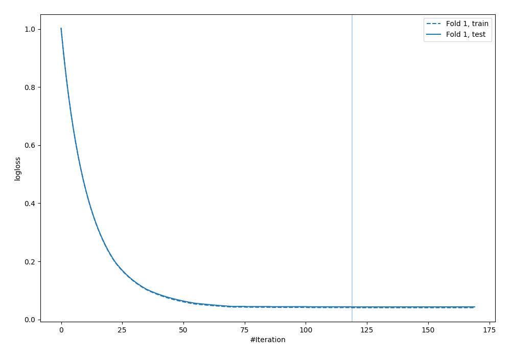
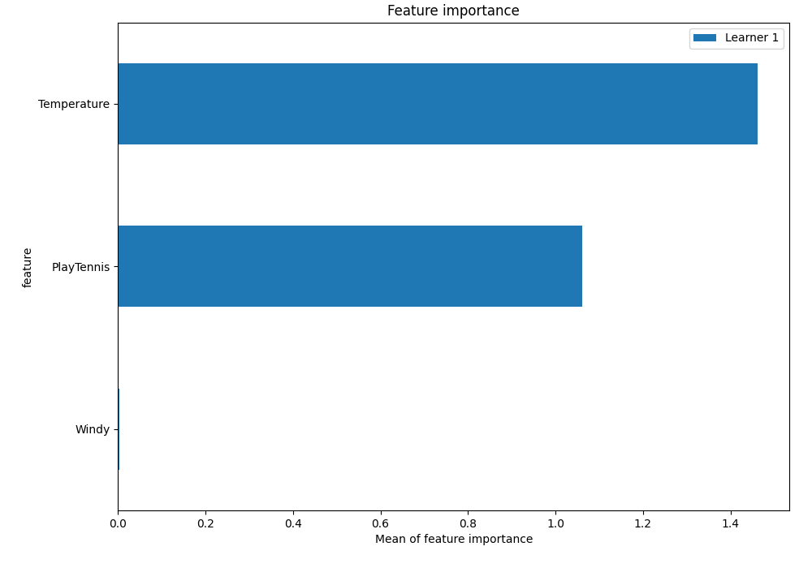
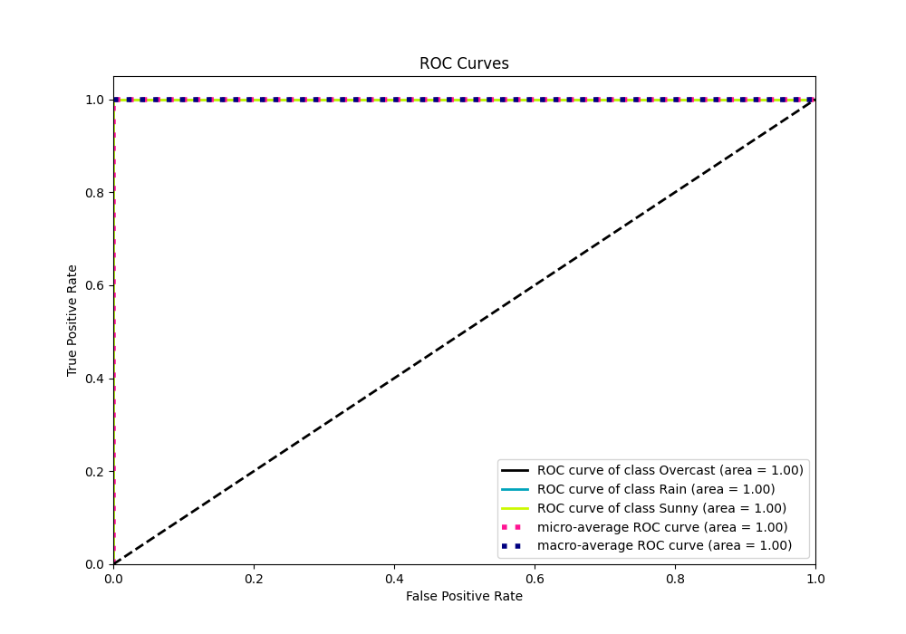
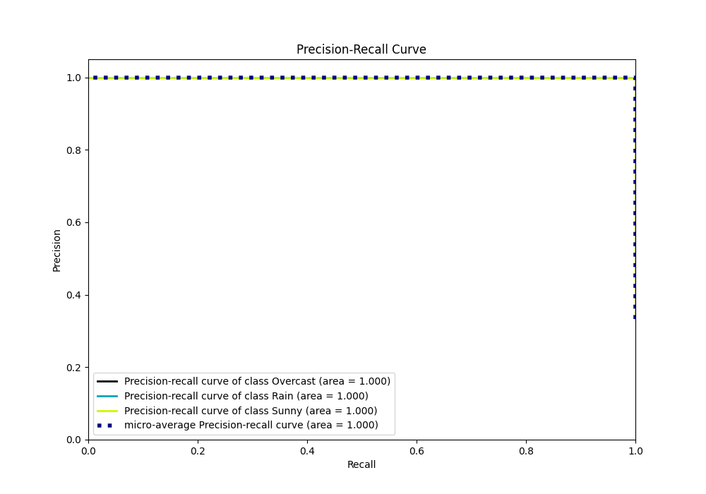

# Summary of 4_Default_Xgboost

[<< Go back](../README.md)

## Extreme Gradient Boosting (Xgboost)
- **n_jobs**: -1
- **objective**: multi:softprob
- **eta**: 0.075
- **max_depth**: 6
- **min_child_weight**: 1
- **subsample**: 1.0
- **colsample_bytree**: 1.0
- **eval_metric**: mlogloss
- **num_class**: 3
- **explain_level**: 2

## Validation
 - **validation_type**: split
 - **train_ratio**: 0.75
 - **shuffle**: True
 - **stratify**: True

## Optimized metric
logloss

## Training time

9.0 seconds

### Metric details
|           |   Overcast |   Rain |   Sunny |   accuracy |   macro avg |   weighted avg |   logloss |
|:----------|-----------:|-------:|--------:|-----------:|------------:|---------------:|----------:|
| precision |          1 |      1 |       1 |          1 |           1 |              1 | 0.0431962 |
| recall    |          1 |      1 |       1 |          1 |           1 |              1 | 0.0431962 |
| f1-score  |          1 |      1 |       1 |          1 |           1 |              1 | 0.0431962 |
| support   |          5 |      5 |       5 |          1 |          15 |             15 | 0.0431962 |

## Confusion matrix
|                     |   Predicted as Overcast |   Predicted as Rain |   Predicted as Sunny |
|:--------------------|------------------------:|--------------------:|---------------------:|
| Labeled as Overcast |                       5 |                   0 |                    0 |
| Labeled as Rain     |                       0 |                   5 |                    0 |
| Labeled as Sunny    |                       0 |                   0 |                    5 |

## Learning curves

## Permutation-based Importance

## Confusion Matrix

## Normalized Confusion Matrix

## ROC Curve

## Precision Recall Curve

[<< Go back](../README.md)
