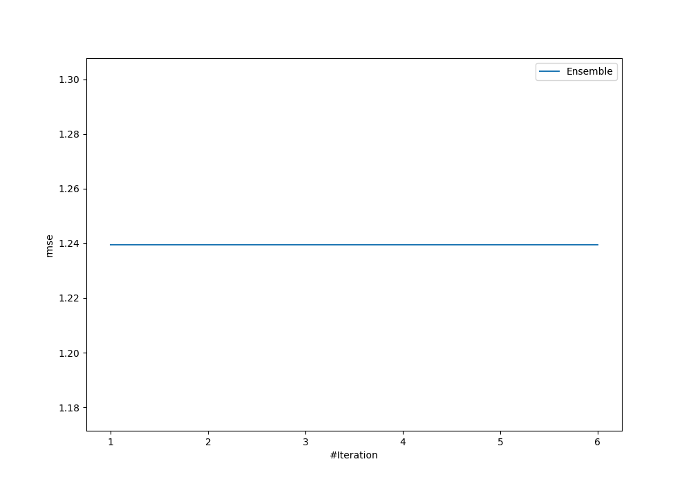
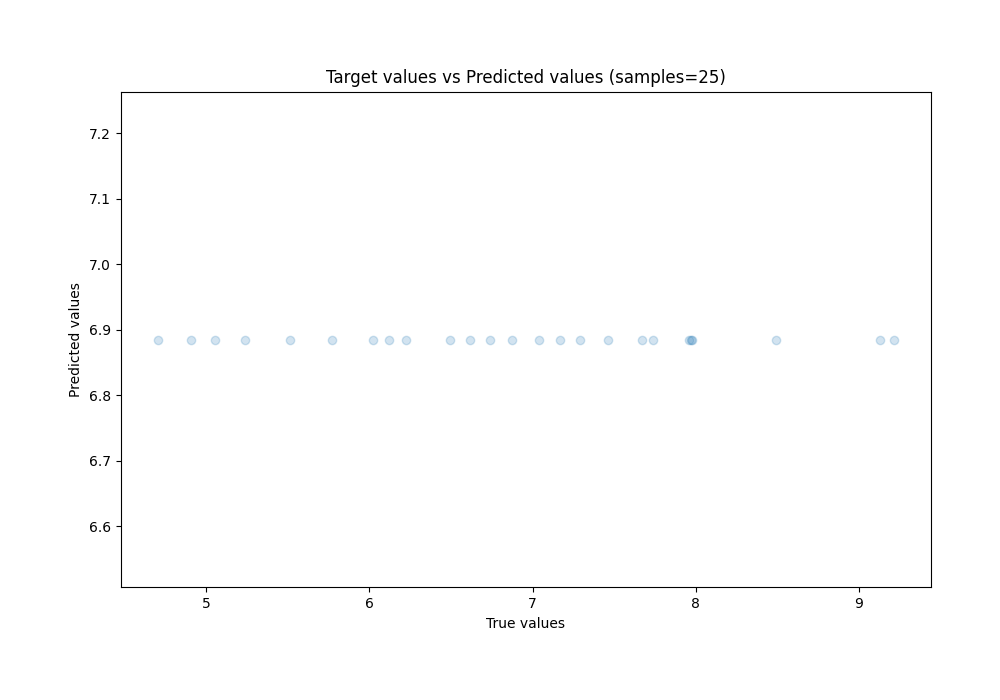
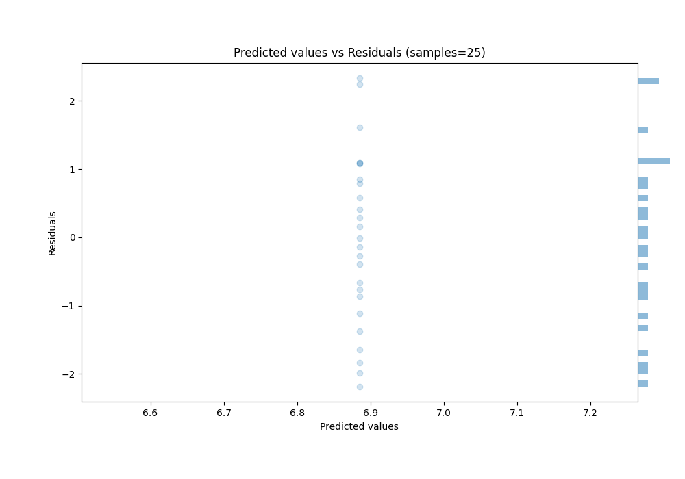

# Summary of Ensemble

[<< Go back](../README.md)

## Ensemble structure
| Model      |   Weight |
|:-----------|---------:|
| 1_Baseline |        1 |

### Metric details:
| Metric   |        Score |
|:---------|-------------:|
| MAE      |  1.02911     |
| MSE      |  1.5366      |
| RMSE     |  1.2396      |
| R2       | -0.000532584 |
| MAPE     |  0.159507    |

## Learning curves

## True vs Predicted

## Predicted vs Residuals

[<< Go back](../README.md)
