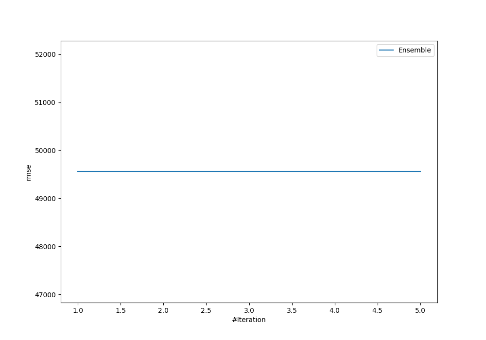
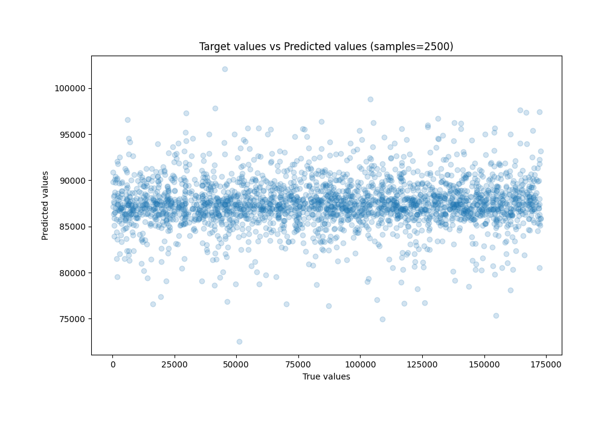
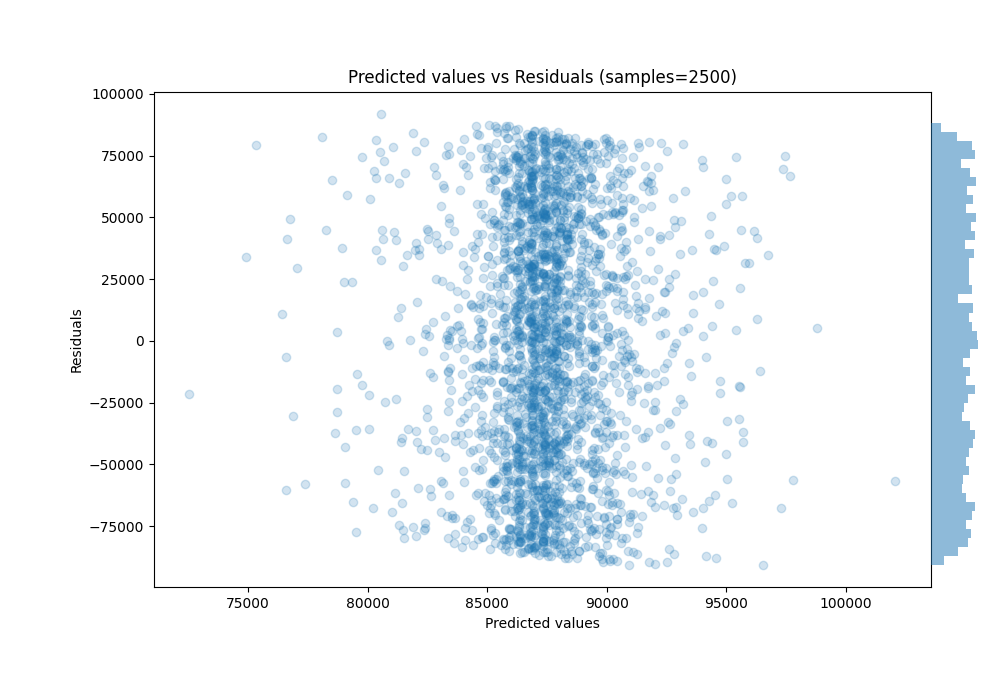

# Summary of Ensemble

[<< Go back](../README.md)

## Ensemble structure
| Model                  |   Weight |
|:-----------------------|---------:|
| 5_Default_RandomForest |        1 |

### Metric details:
| Metric   |           Score |
|:---------|----------------:|
| MAE      | 42759.2         |
| MSE      |     2.45561e+09 |
| RMSE     | 49554.1         |
| R2       |     0.00240879  |
| MAPE     |     2.94343     |

## Learning curves

## True vs Predicted

## Predicted vs Residuals

[<< Go back](../README.md)
