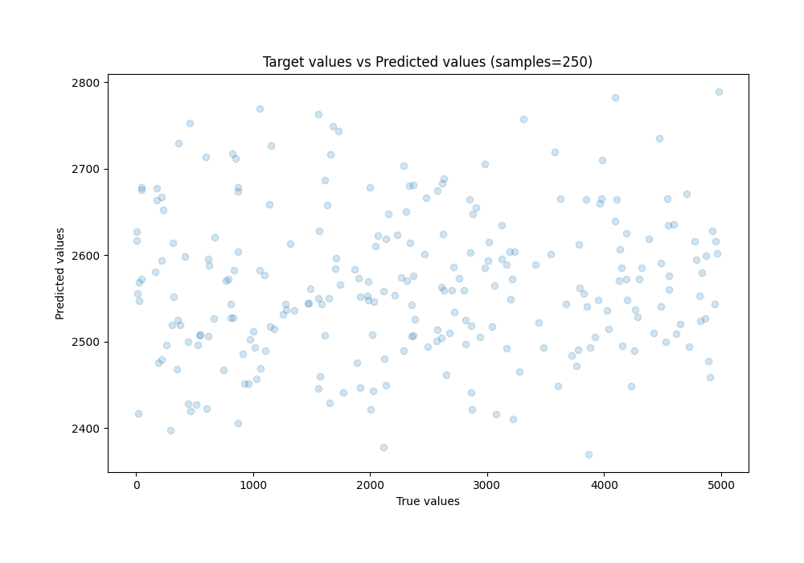

# Summary of Ensemble

[<< Go back](../README.md)

## Ensemble structure
| Model                  |   Weight |
|:-----------------------|---------:|
| 1_Baseline             |        3 |
| 6_Default_RandomForest |        2 |

### Metric details:
| Metric   |          Score |
|:---------|---------------:|
| MAE      | 1261.48        |
| MSE      |    2.17196e+06 |
| RMSE     | 1473.76        |
| R2       |   -0.0150699   |
| MAPE     |    6.90557     |

## Learning curves

## True vs Predicted

## Predicted vs Residuals

[<< Go back](../README.md)
