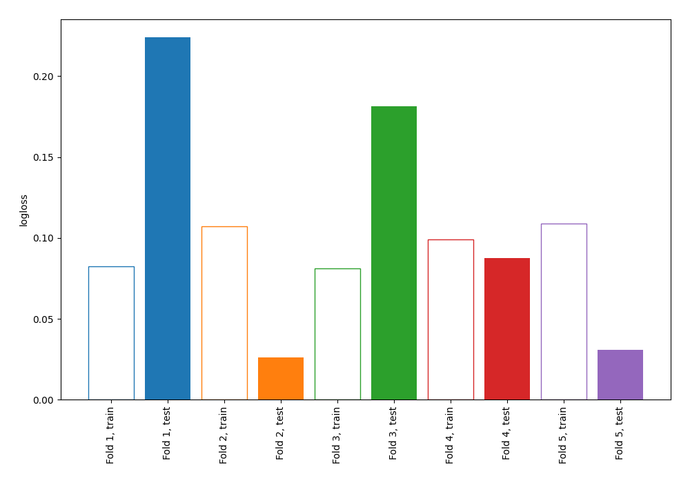
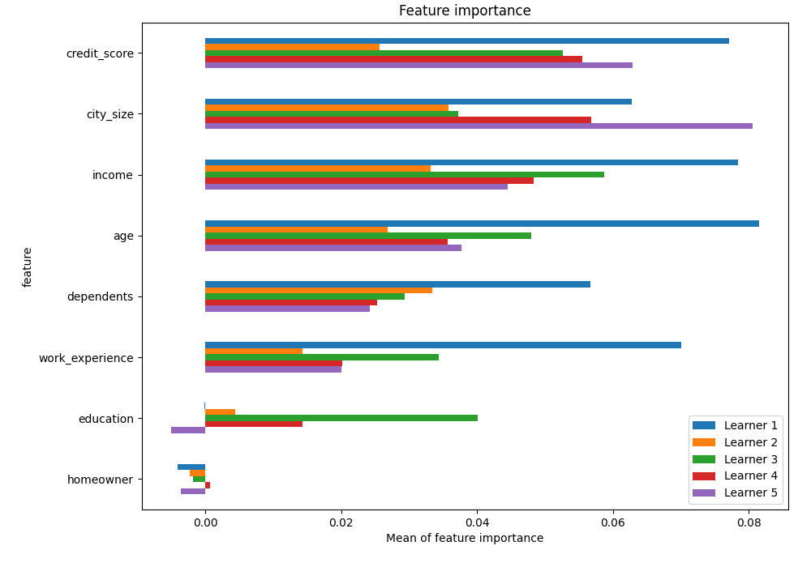
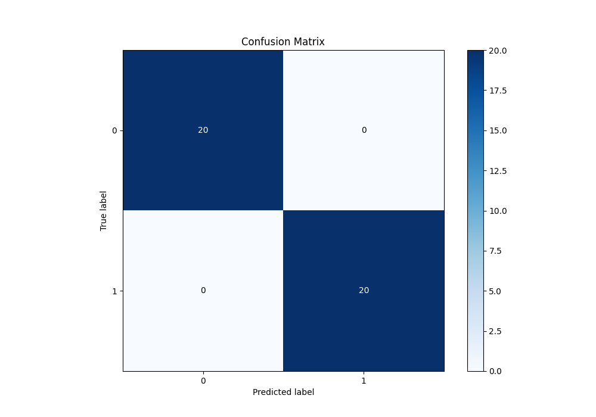
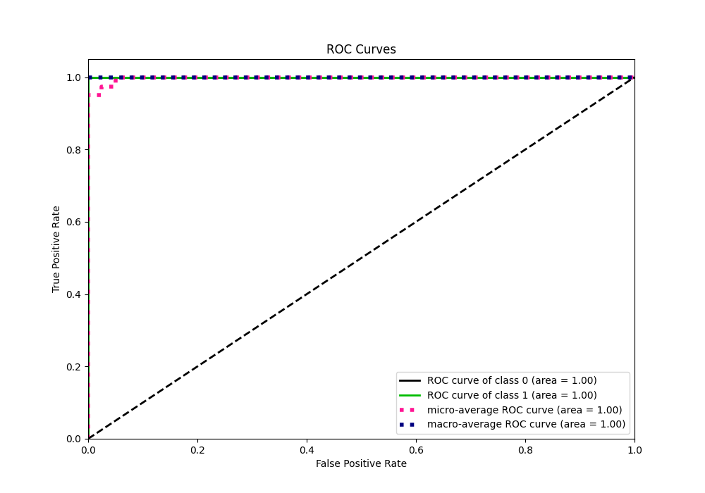
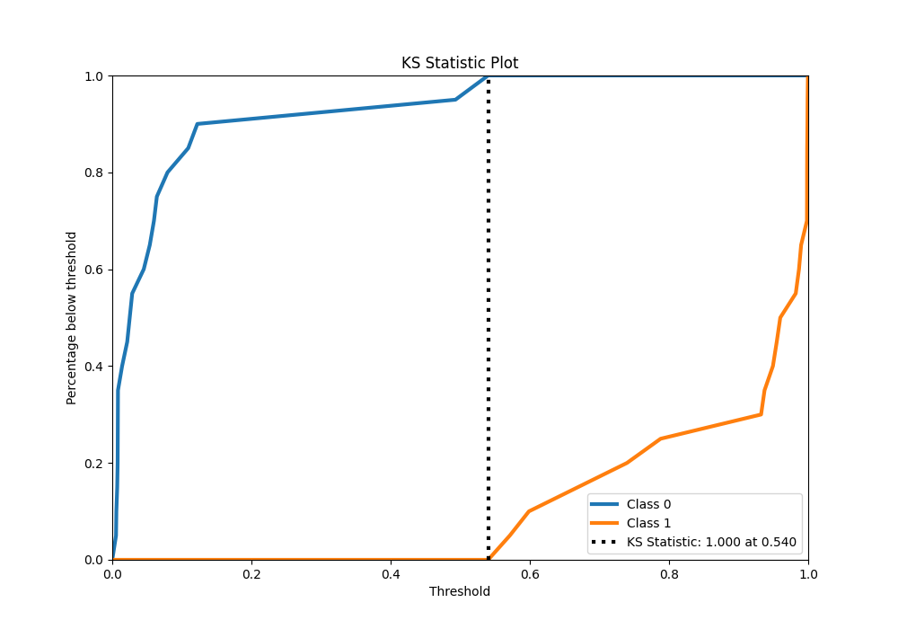
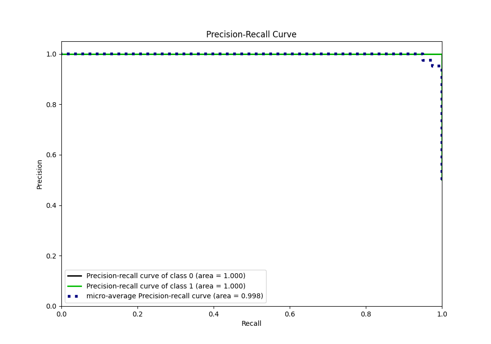
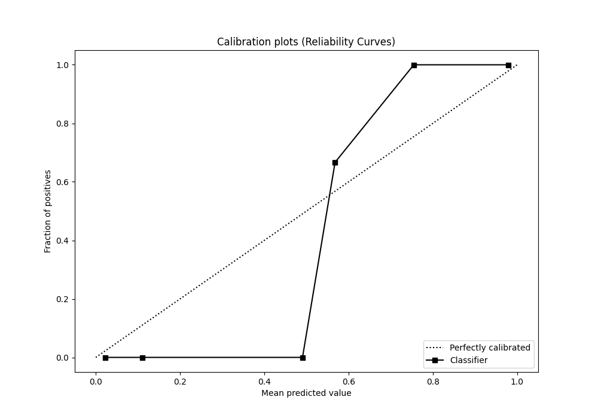
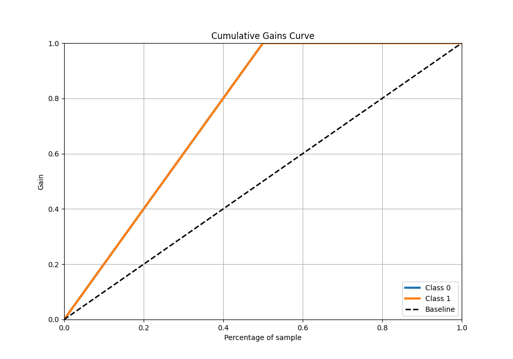
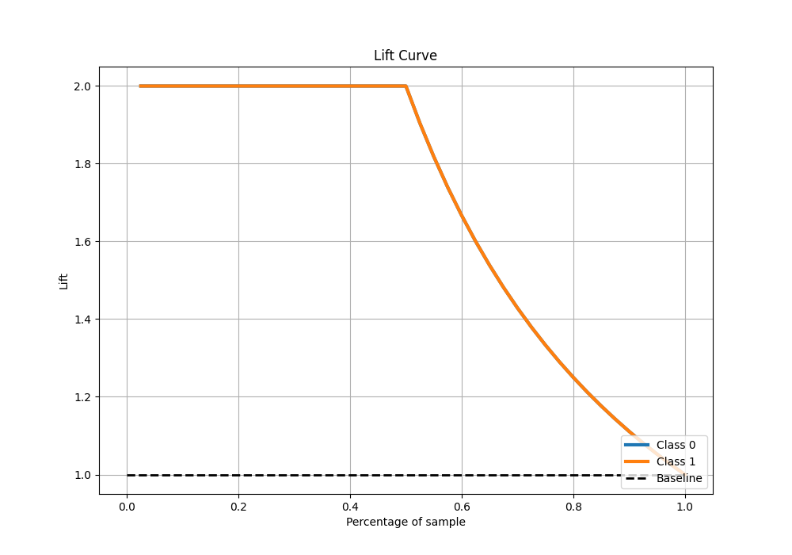

# Summary of 1_Linear

[<< Go back](../README.md)

## Logistic Regression (Linear)
- **n_jobs**: -1
- **explain_level**: 1

## Validation
 - **validation_type**: kfold
 - **k_folds**: 5
 - **shuffle**: True
 - **stratify**: True

## Optimized metric
logloss

## Training time

18.9 seconds

## Metric details
|           |    score |    threshold |
|:----------|---------:|-------------:|
| logloss   | 0.109987 | nan          |
| auc       | 1        | nan          |
| f1        | 1        |   0.555644   |
| accuracy  | 1        |   0.555644   |
| precision | 1        |   0.555644   |
| recall    | 1        |   0.00487677 |
| mcc       | 1        |   0.555644   |

## Metric details with threshold from accuracy metric
|           |    score |   threshold |
|:----------|---------:|------------:|
| logloss   | 0.109987 |  nan        |
| auc       | 1        |  nan        |
| f1        | 1        |    0.555644 |
| accuracy  | 1        |    0.555644 |
| precision | 1        |    0.555644 |
| recall    | 1        |    0.555644 |
| mcc       | 1        |    0.555644 |

## Confusion matrix (at threshold=0.555644)
|              |   Predicted as 0 |   Predicted as 1 |
|:-------------|-----------------:|-----------------:|
| Labeled as 0 |               20 |                0 |
| Labeled as 1 |                0 |               20 |

## Learning curves

## Coefficients
| feature         |   Learner_1 |   Learner_2 |   Learner_3 |   Learner_4 |   Learner_5 |
|:----------------|------------:|------------:|------------:|------------:|------------:|
| credit_score    |    0.783338 |    0.862392 |   0.712716  |   0.840907  |    0.857799 |
| income          |    0.720359 |    0.833007 |   0.752072  |   0.804181  |    0.830177 |
| age             |    0.661117 |    0.748212 |   0.717411  |   0.758596  |    0.745424 |
| dependents      |    0.454495 |    0.641339 |   0.683093  |   0.71608   |    0.643368 |
| work_experience |    0.566278 |    0.554425 |   0.637205  |   0.512335  |    0.561329 |
| intercept       |    0.316343 |    0.31429  |   0.366995  |   0.255763  |    0.329392 |
| homeowner       |    0.240224 |   -0.119338 |  -0.0521358 |   0.0817615 |   -0.123928 |
| education       |   -0.278081 |   -0.353965 |  -0.418087  |  -0.317901  |   -0.431236 |
| city_size       |   -0.797498 |   -0.806794 |  -0.91289   |  -0.679891  |   -0.77253  |

## Permutation-based Importance

## Confusion Matrix

## Normalized Confusion Matrix

## ROC Curve

## Kolmogorov-Smirnov Statistic

## Precision-Recall Curve

## Calibration Curve

## Cumulative Gains Curve

## Lift Curve

[<< Go back](../README.md)
