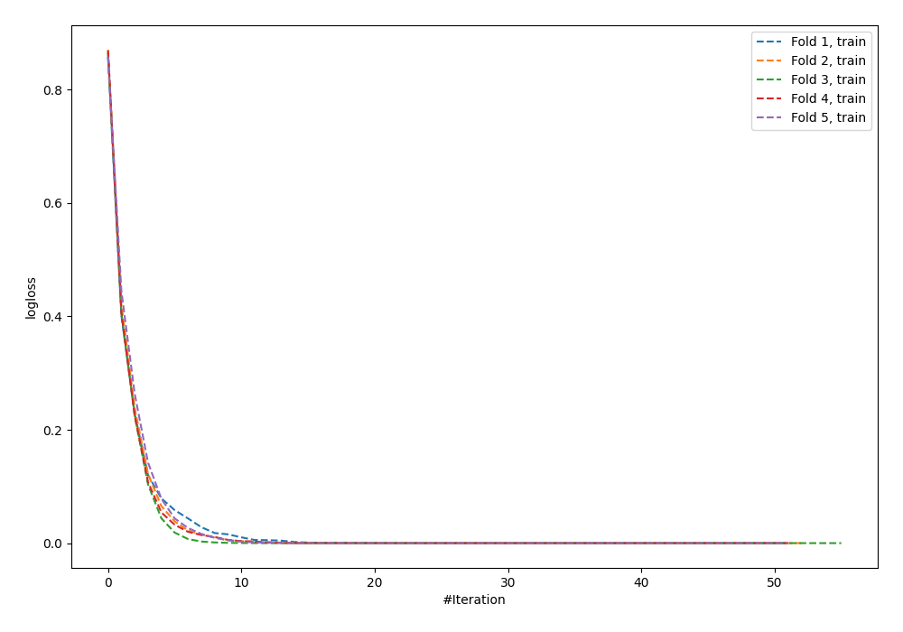
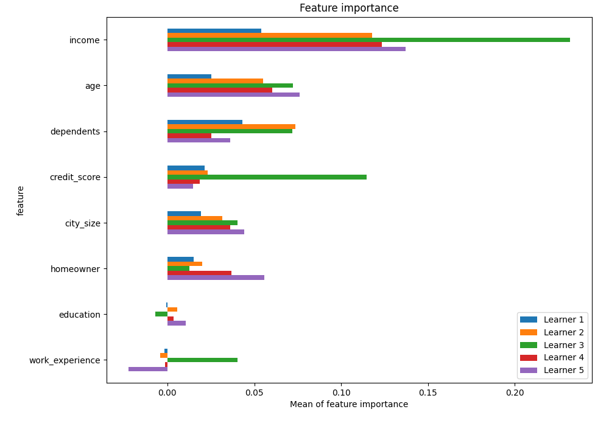
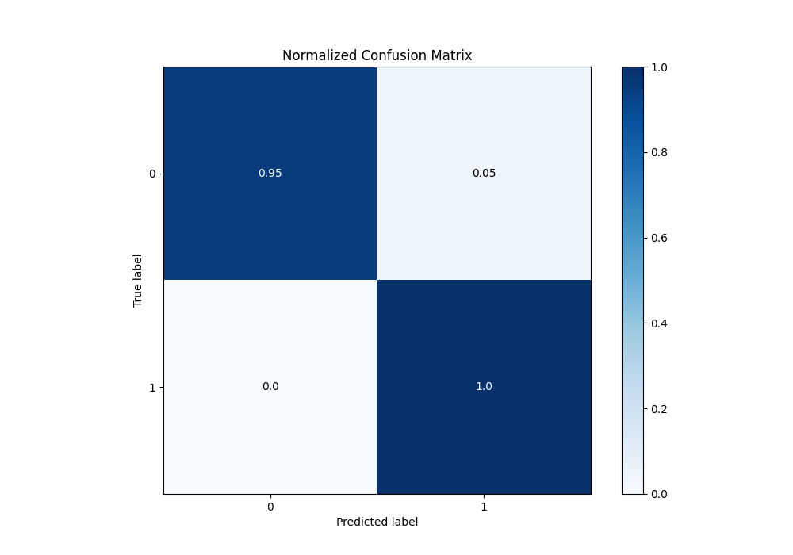
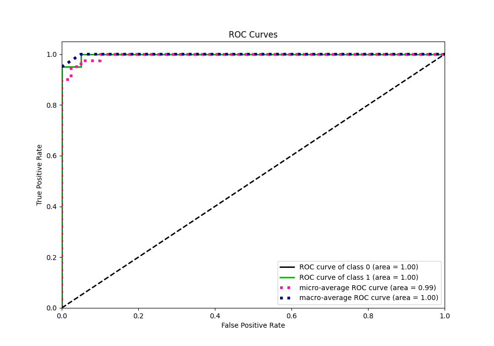
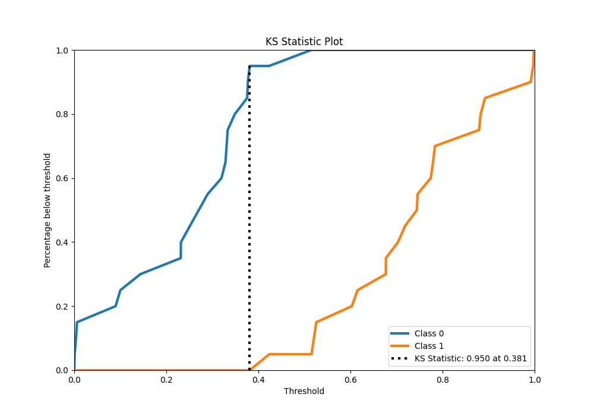
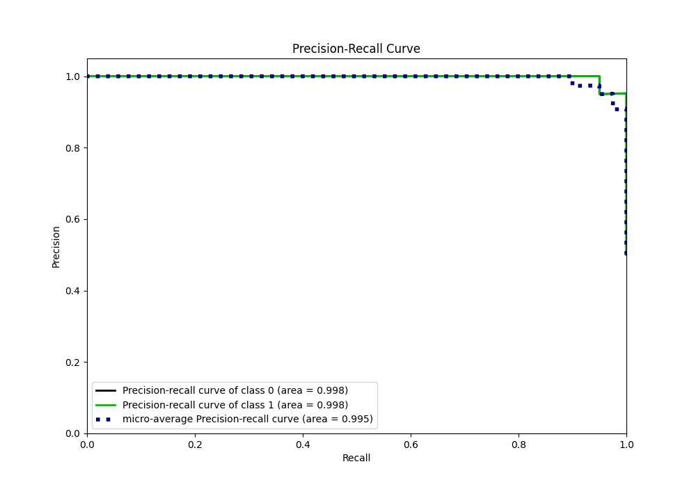
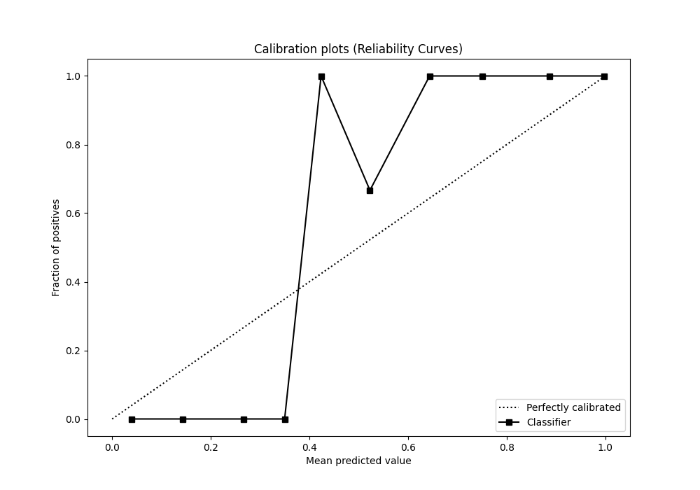
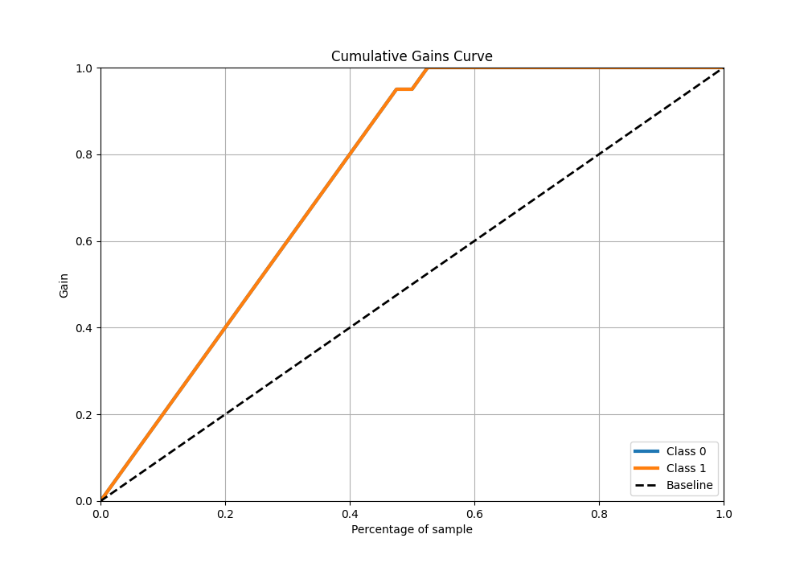
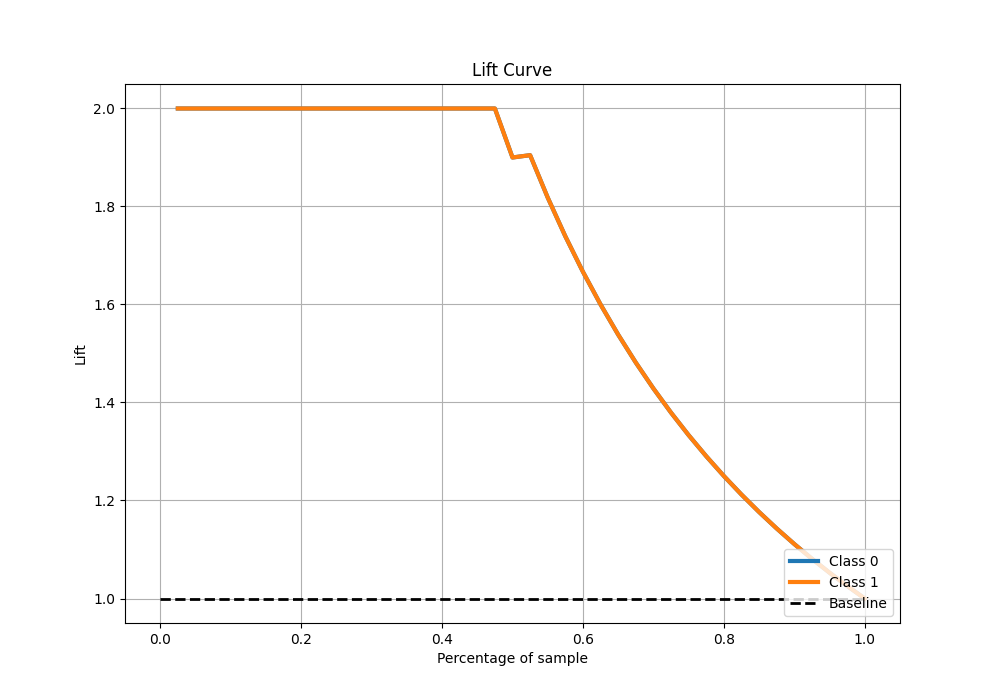

# Summary of 5_Default_NeuralNetwork

[<< Go back](../README.md)

## Neural Network
- **n_jobs**: -1
- **dense_1_size**: 32
- **dense_2_size**: 16
- **learning_rate**: 0.05
- **explain_level**: 1

## Validation
 - **validation_type**: kfold
 - **k_folds**: 5
 - **shuffle**: True
 - **stratify**: True

## Optimized metric
logloss

## Training time

13.4 seconds

## Metric details
|           |    score |     threshold |
|:----------|---------:|--------------:|
| logloss   | 0.310234 | nan           |
| auc       | 0.9975   | nan           |
| f1        | 0.97561  |   0.402283    |
| accuracy  | 0.975    |   0.402283    |
| precision | 1        |   0.520538    |
| recall    | 1        |   0.000770059 |
| mcc       | 0.95119  |   0.402283    |

## Metric details with threshold from accuracy metric
|           |    score |   threshold |
|:----------|---------:|------------:|
| logloss   | 0.310234 |  nan        |
| auc       | 0.9975   |  nan        |
| f1        | 0.97561  |    0.402283 |
| accuracy  | 0.975    |    0.402283 |
| precision | 0.952381 |    0.402283 |
| recall    | 1        |    0.402283 |
| mcc       | 0.95119  |    0.402283 |

## Confusion matrix (at threshold=0.402283)
|              |   Predicted as 0 |   Predicted as 1 |
|:-------------|-----------------:|-----------------:|
| Labeled as 0 |               19 |                1 |
| Labeled as 1 |                0 |               20 |

## Learning curves

## Permutation-based Importance

## Confusion Matrix

## Normalized Confusion Matrix

## ROC Curve

## Kolmogorov-Smirnov Statistic

## Precision-Recall Curve

## Calibration Curve

## Cumulative Gains Curve

## Lift Curve

[<< Go back](../README.md)
