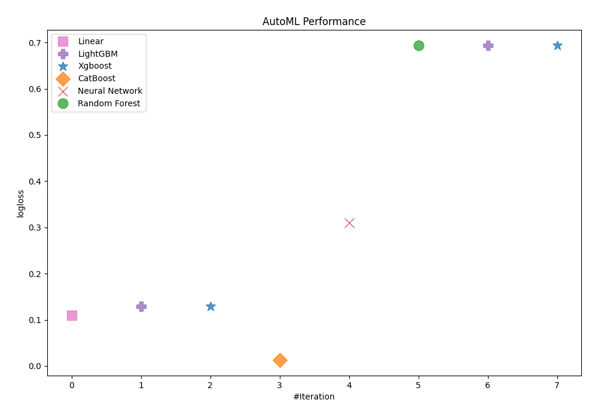
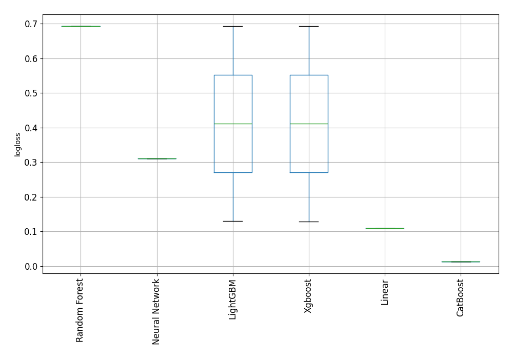

# AutoML Leaderboard

| Best model   | name                                                         | model_type     | metric_type   |   metric_value |   train_time |   single_prediction_time |
|:-------------|:-------------------------------------------------------------|:---------------|:--------------|---------------:|-------------:|-------------------------:|
|              | [1_Linear](1_Linear/README.md)                               | Linear         | logloss       |      0.109987  |        20.88 |                   0.1166 |
|              | [2_Default_LightGBM](2_Default_LightGBM/README.md)           | LightGBM       | logloss       |      0.129713  |         7.82 |                   0.0341 |
|              | [3_Default_Xgboost](3_Default_Xgboost/README.md)             | Xgboost        | logloss       |      0.12916   |         5.79 |                   0.0559 |
| **the best** | [4_Default_CatBoost](4_Default_CatBoost/README.md)           | CatBoost       | logloss       |      0.0133736 |       157.93 |                   0.0332 |
|              | [5_Default_NeuralNetwork](5_Default_NeuralNetwork/README.md) | Neural Network | logloss       |      0.310234  |        19.04 |                   0.3801 |
|              | [6_Default_RandomForest](6_Default_RandomForest/README.md)   | Random Forest  | logloss       |      0.693147  |        25.47 |                   0.2765 |
|              | [11_LightGBM](11_LightGBM/README.md)                         | LightGBM       | logloss       |      0.693147  |        11.06 |                   0.0689 |
|              | [7_Xgboost](7_Xgboost/README.md)                             | Xgboost        | logloss       |      0.693147  |         4.8  |                   0.0378 |

### AutoML Performance

### AutoML Performance Boxplot
