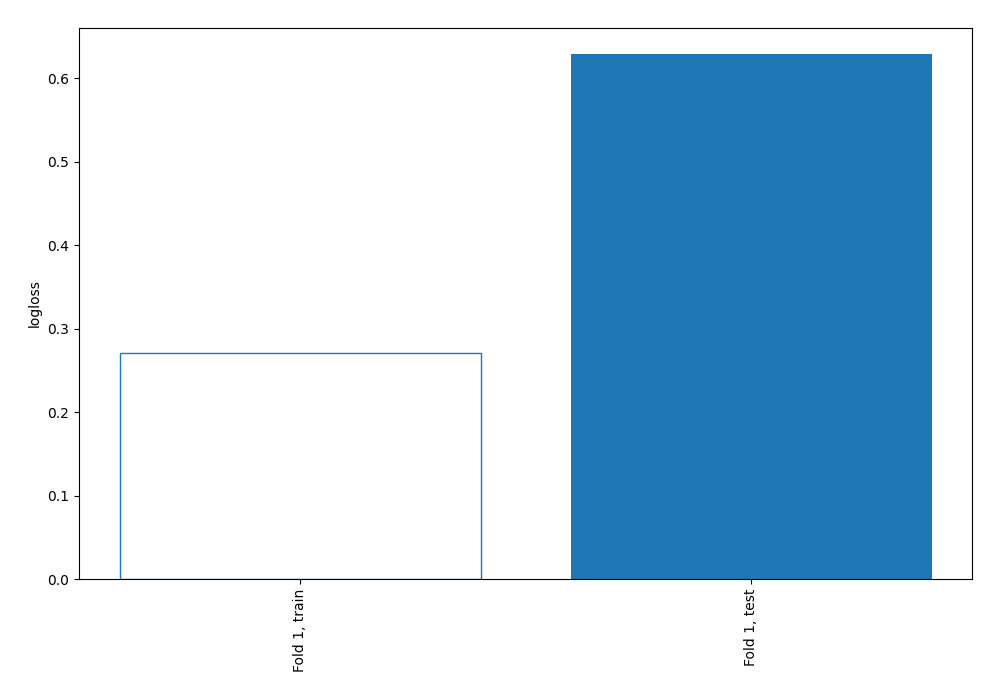
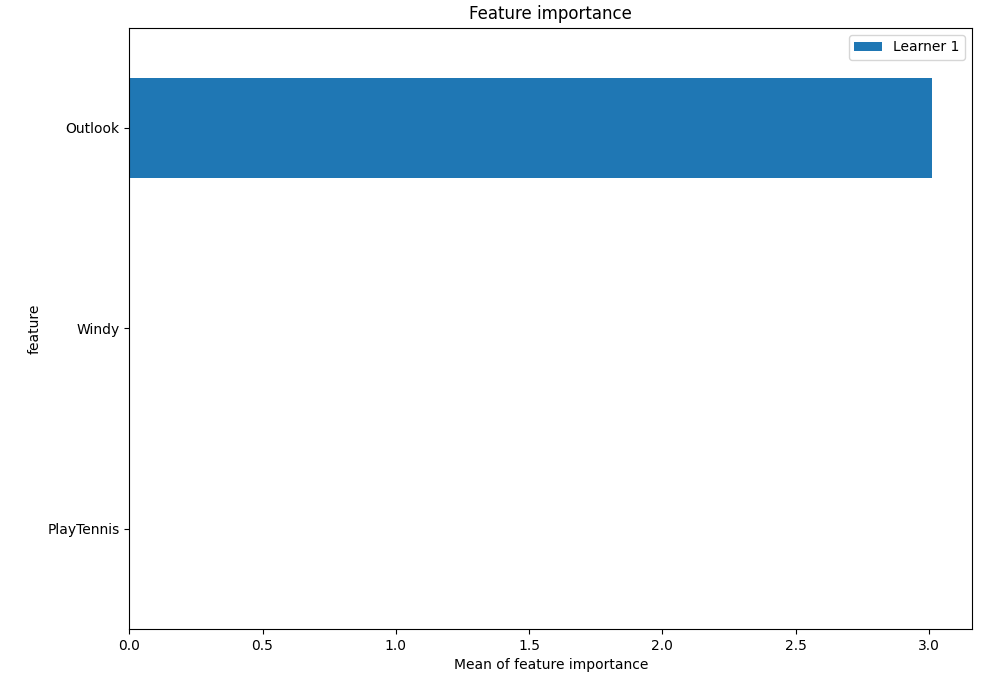
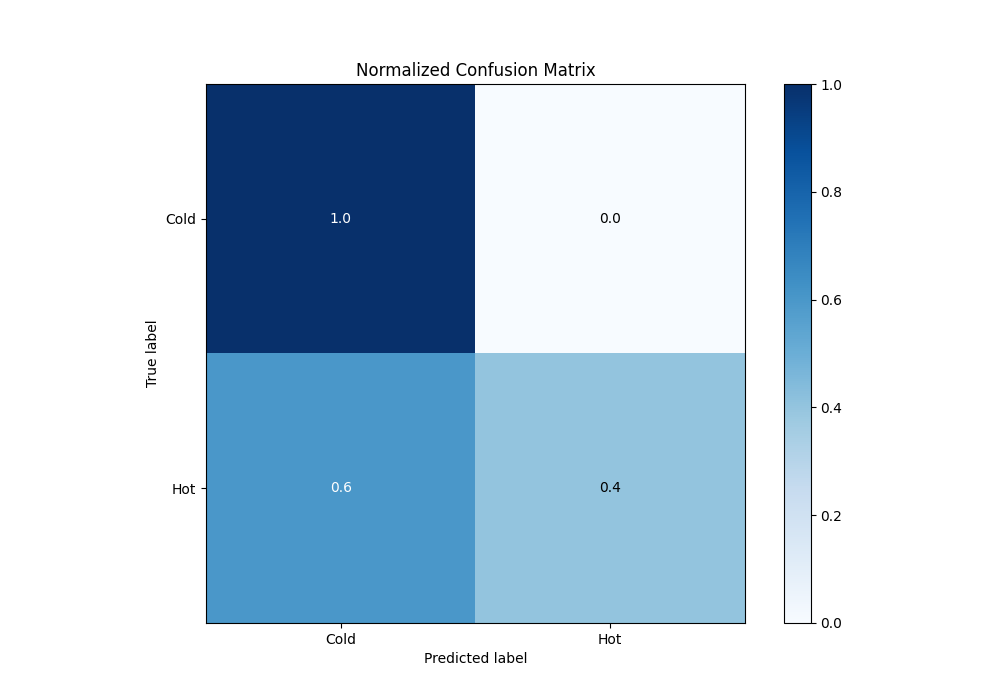
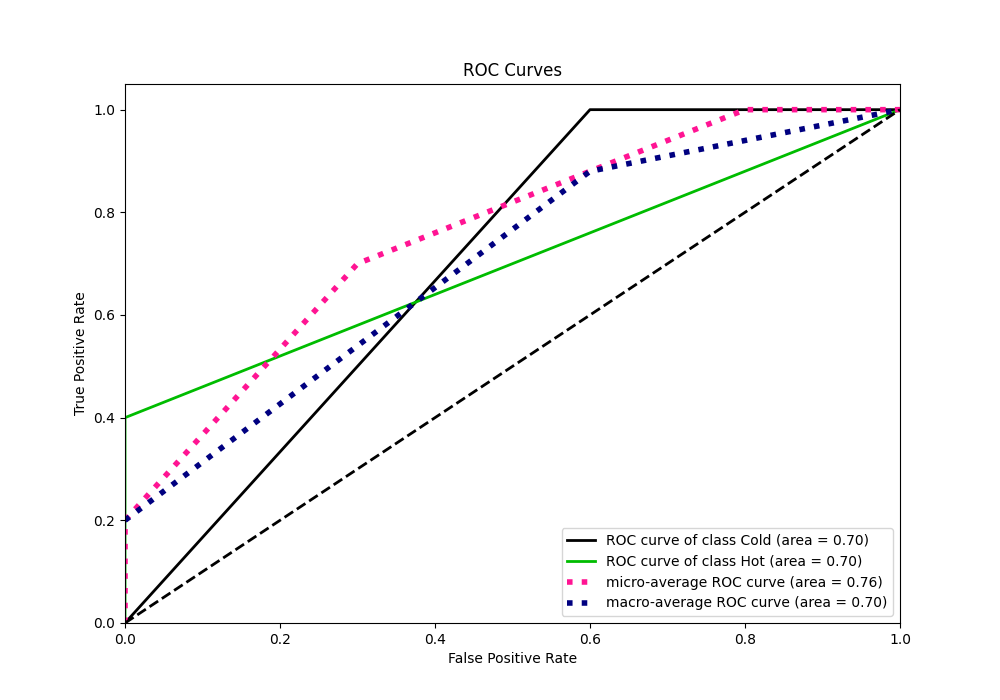
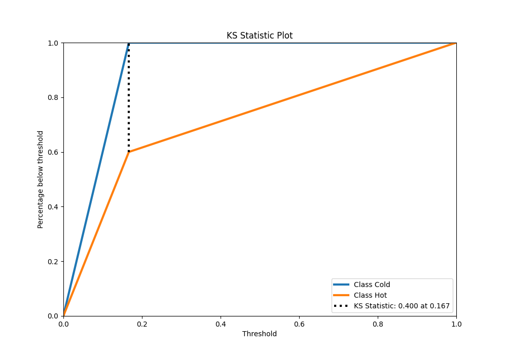
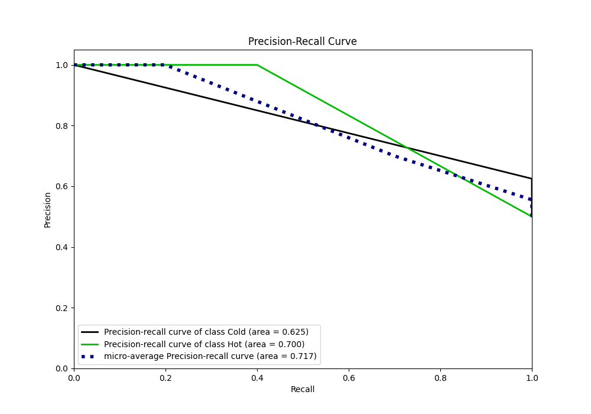
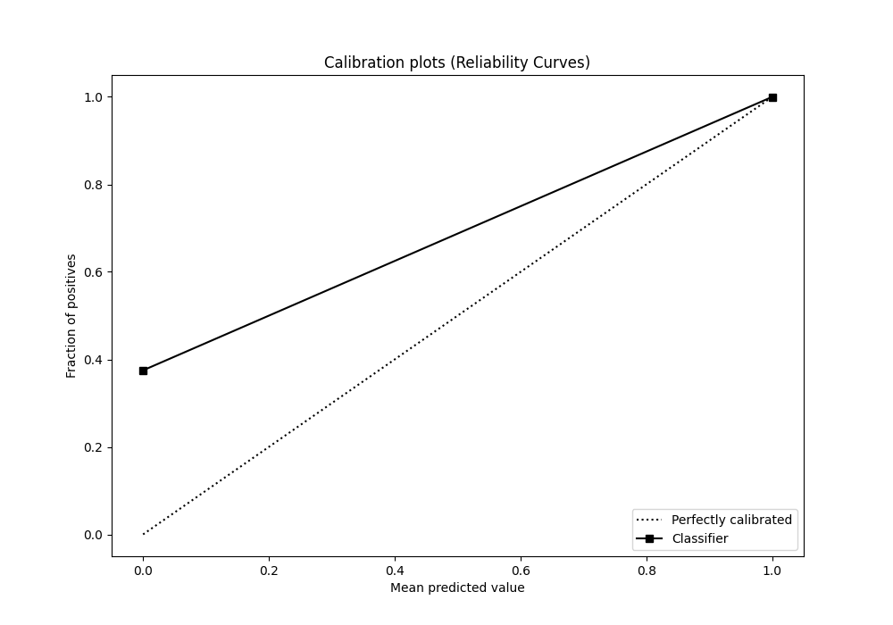
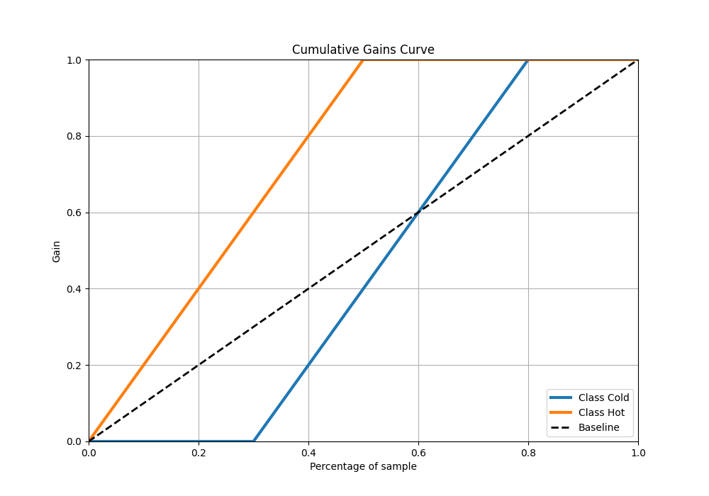
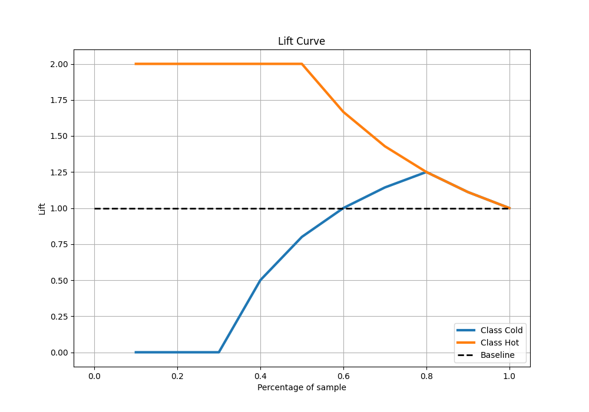

# Summary of 2_DecisionTree

[<< Go back](../README.md)

## Decision Tree
- **n_jobs**: -1
- **criterion**: gini
- **max_depth**: 3
- **min_samples_split**: 10
- **min_samples_leaf**: 10
- **min_impurity_decrease**: 0.01
- **explain_level**: 2

## Validation
 - **validation_type**: split
 - **train_ratio**: 0.75
 - **shuffle**: True
 - **stratify**: True

## Optimized metric
logloss

## Training time

11.2 seconds

## Metric details
|           |    score |   threshold |
|:----------|---------:|------------:|
| logloss   | 0.628689 |  nan        |
| auc       | 0.7      |  nan        |
| f1        | 0.666667 |    0.15     |
| accuracy  | 0.7      |    0.166667 |
| precision | 1        |    0.166667 |
| recall    | 1        |    0.15     |
| mcc       | 0.5      |    0.166667 |

## Metric details with threshold from accuracy metric
|           |    score |   threshold |
|:----------|---------:|------------:|
| logloss   | 0.628689 |  nan        |
| auc       | 0.7      |  nan        |
| f1        | 0.571429 |    0.166667 |
| accuracy  | 0.7      |    0.166667 |
| precision | 1        |    0.166667 |
| recall    | 0.4      |    0.166667 |
| mcc       | 0.5      |    0.166667 |

## Confusion matrix (at threshold=0.166667)
|                 |   Predicted as Cold |   Predicted as Hot |
|:----------------|--------------------:|-------------------:|
| Labeled as Cold |                   5 |                  0 |
| Labeled as Hot  |                   3 |                  2 |

## Learning curves

## Permutation-based Importance

## Confusion Matrix

## Normalized Confusion Matrix

## ROC Curve

## Kolmogorov-Smirnov Statistic

## Precision-Recall Curve

## Calibration Curve

## Cumulative Gains Curve

## Lift Curve

[<< Go back](../README.md)
