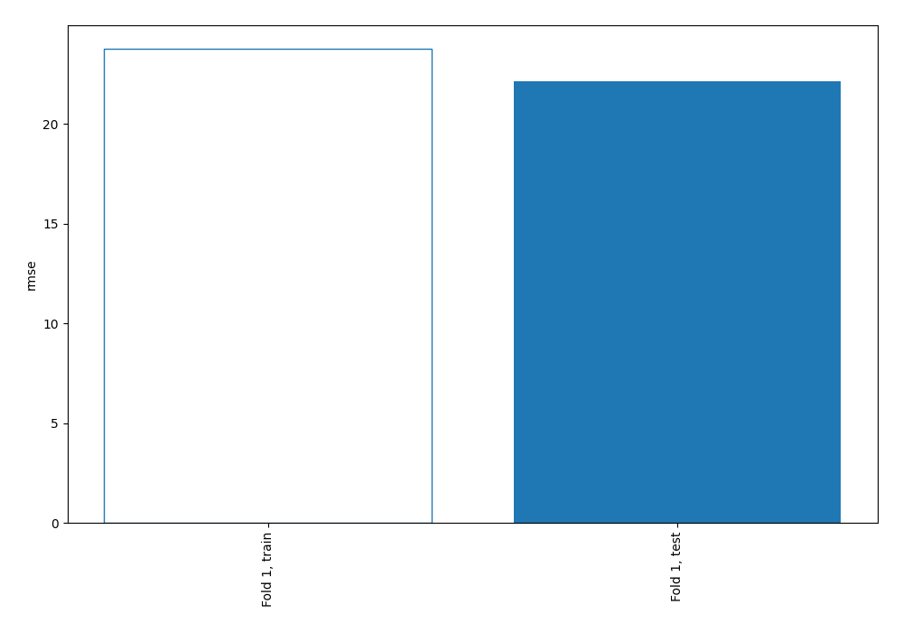
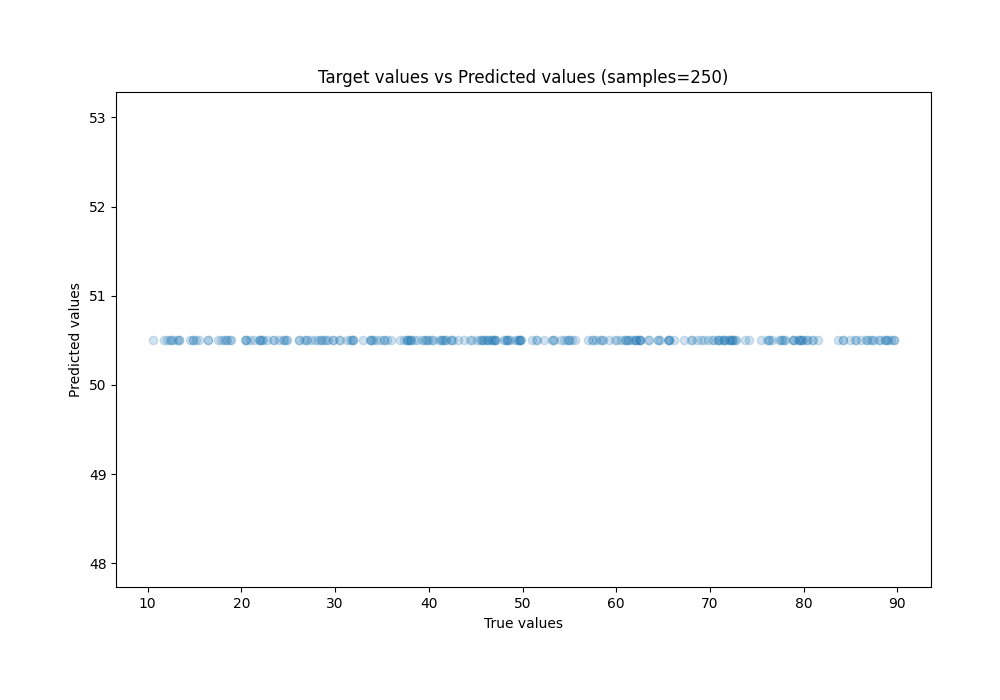
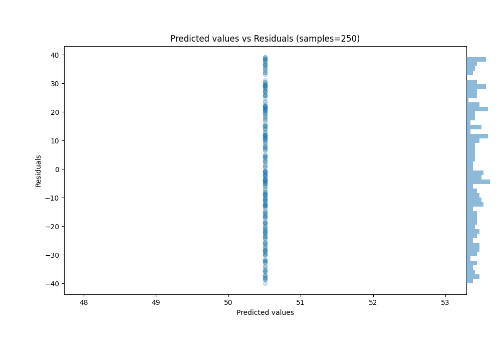

# Summary of 1_Baseline

[<< Go back](../README.md)

## Baseline Regressor (Baseline)
- **n_jobs**: -1
- **explain_level**: 2

## Validation
 - **validation_type**: split
 - **train_ratio**: 0.75
 - **shuffle**: True

## Optimized metric
rmse

## Training time

1.2 seconds

### Metric details:
| Metric   |         Score |
|:---------|--------------:|
| MAE      |  19.0011      |
| MSE      | 490.433       |
| RMSE     |  22.1457      |
| R2       |  -8.75632e-05 |
| MAPE     |   0.565174    |

## Learning curves

## True vs Predicted

## Predicted vs Residuals

[<< Go back](../README.md)
