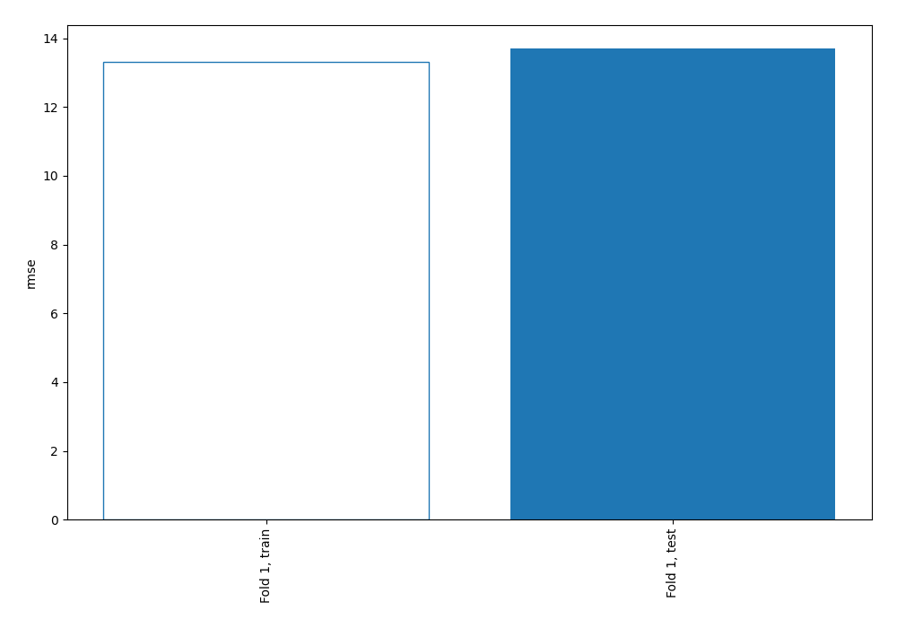
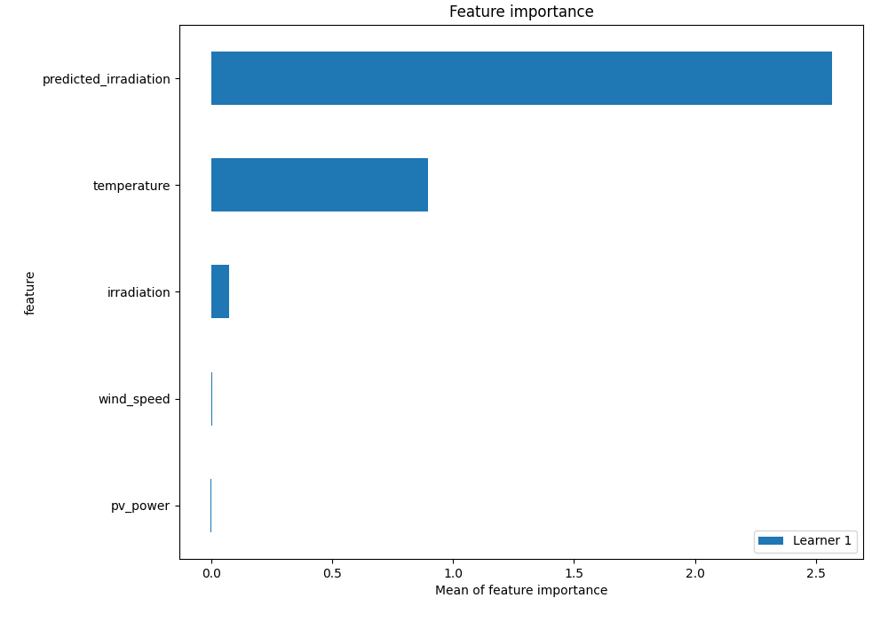
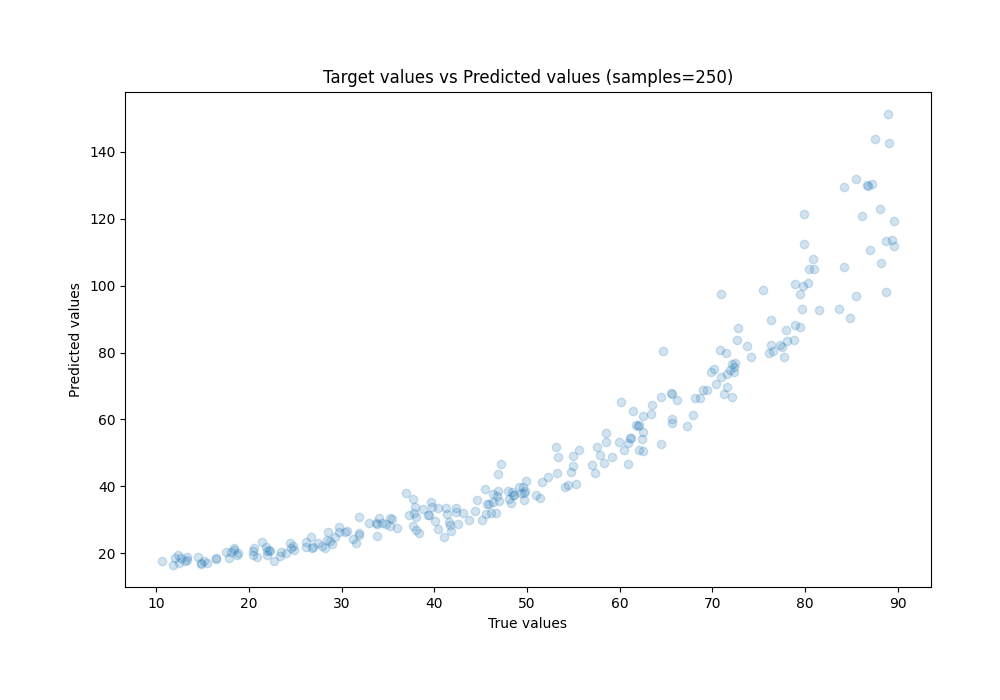
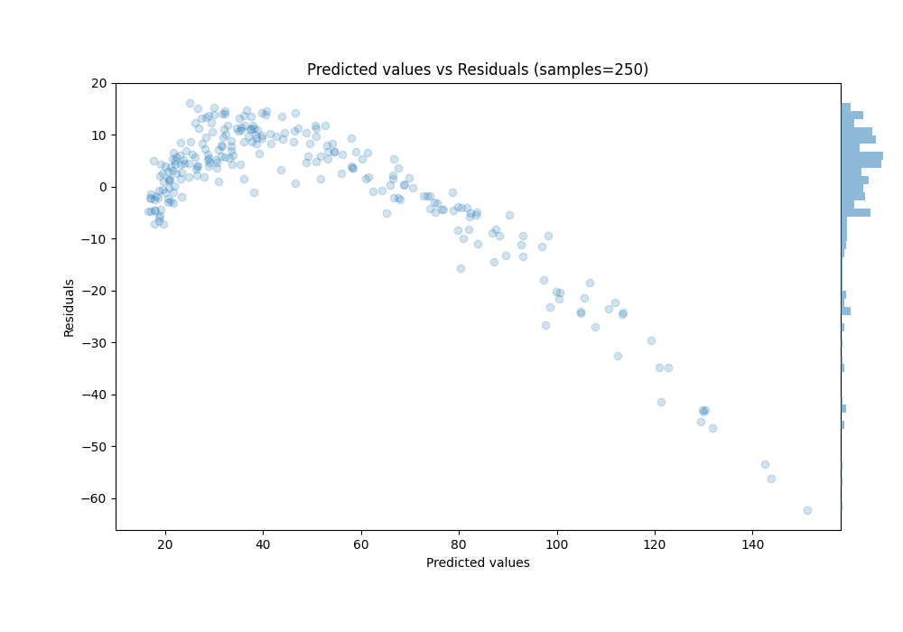
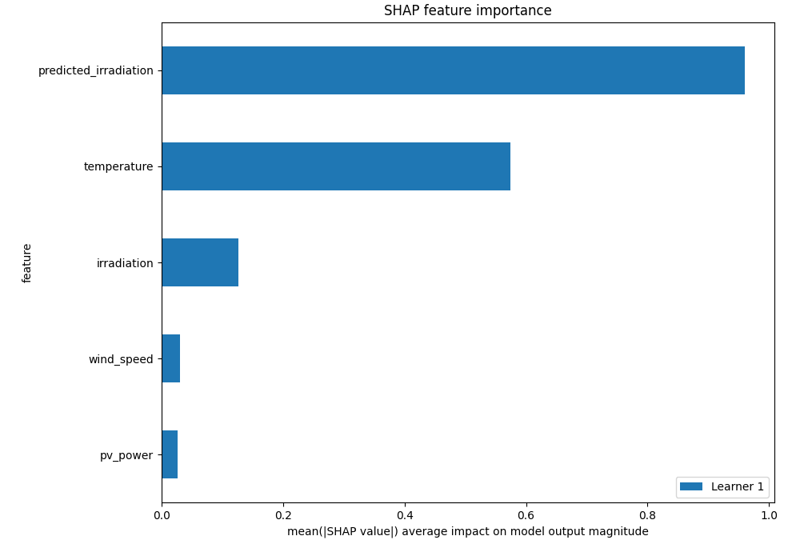
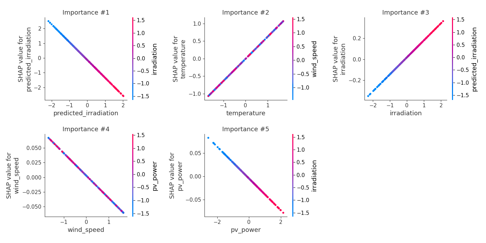
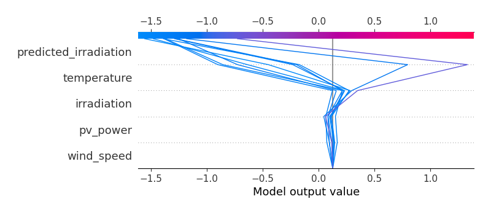
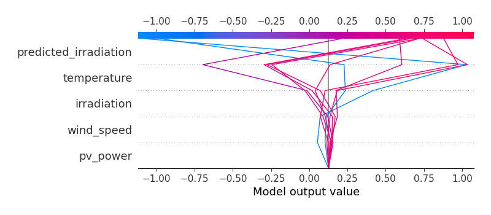

# Summary of 3_Linear

[<< Go back](../README.md)

## Linear Regression (Linear)
- **n_jobs**: -1
- **explain_level**: 2

## Validation
 - **validation_type**: split
 - **train_ratio**: 0.75
 - **shuffle**: True

## Optimized metric
rmse

## Training time

2.3 seconds

### Metric details:
| Metric   |      Score |
|:---------|-----------:|
| MAE      |   9.44448  |
| MSE      | 187.67     |
| RMSE     |  13.6993   |
| R2       |   0.617304 |
| MAPE     |   0.183943 |

## Learning curves

## Coefficients
| feature               |    Learner_1 |
|:----------------------|-------------:|
| temperature           |  0.630294    |
| irradiation           |  0.161572    |
| intercept             |  1.23689e-15 |
| pv_power              | -0.0340644   |
| wind_speed            | -0.038137    |
| predicted_irradiation | -1.21147     |

## Permutation-based Importance

## True vs Predicted

## Predicted vs Residuals

## SHAP Importance

## SHAP Dependence plots

### Dependence (Fold 1)

## SHAP Decision plots

### Top-10 Worst decisions (Fold 1)

### Top-10 Best decisions (Fold 1)

[<< Go back](../README.md)
