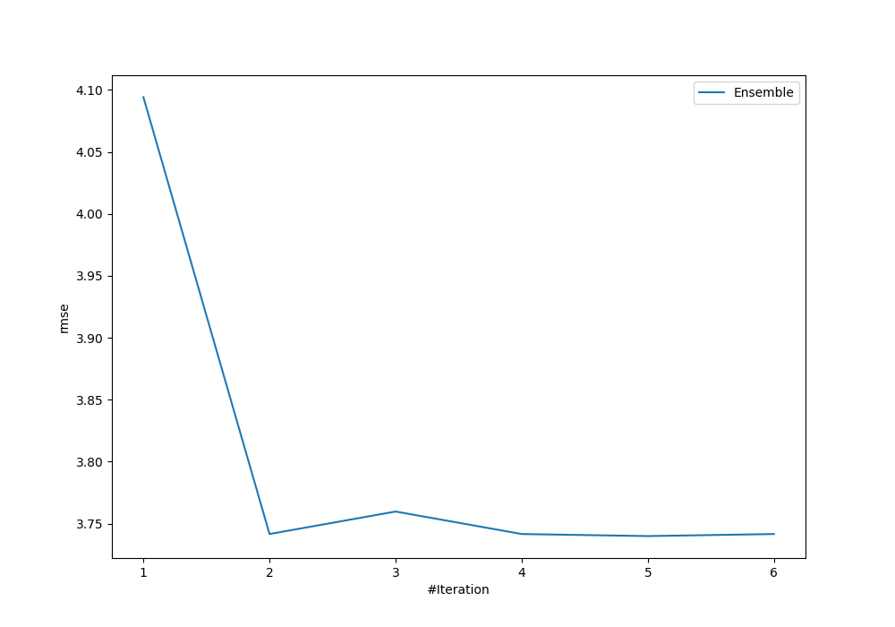
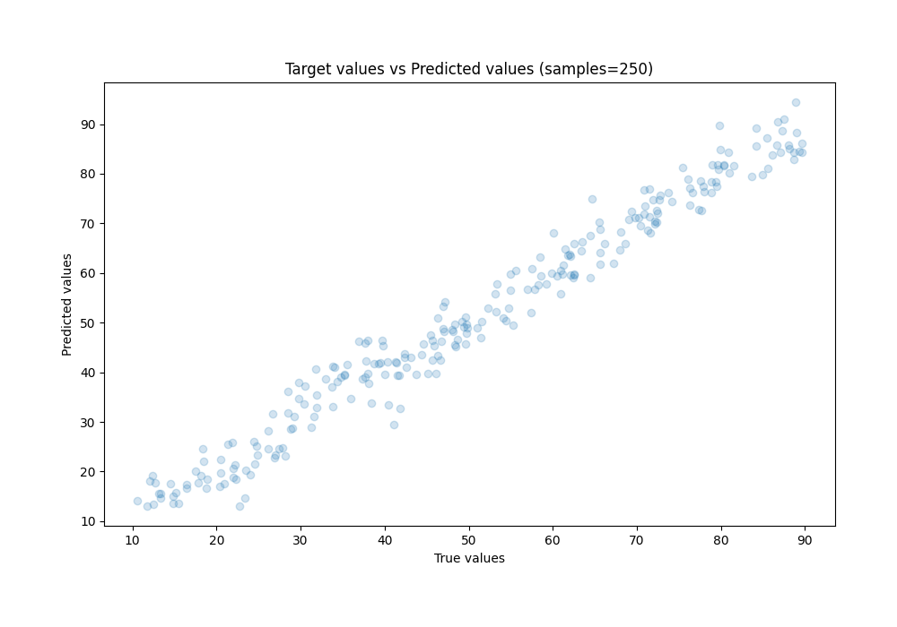
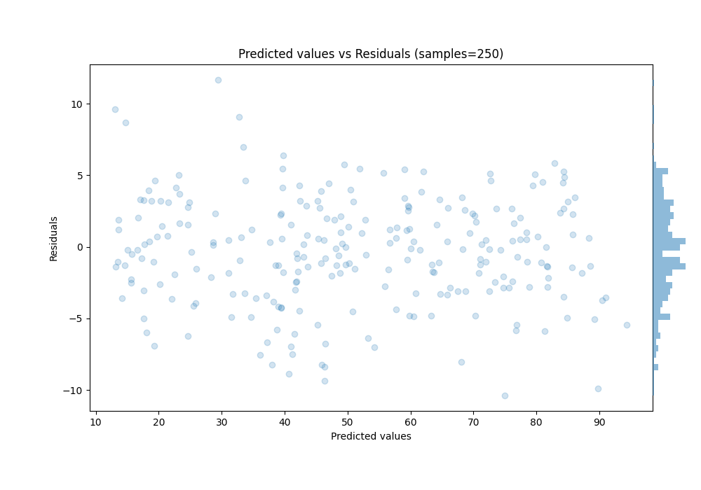

# Summary of Ensemble

[<< Go back](../README.md)

## Ensemble structure
| Model                   |   Weight |
|:------------------------|---------:|
| 4_Default_Xgboost       |        2 |
| 5_Default_NeuralNetwork |        3 |

### Metric details:
| Metric   |      Score |
|:---------|-----------:|
| MAE      |  2.95516   |
| MSE      | 13.9872    |
| RMSE     |  3.73994   |
| R2       |  0.971477  |
| MAPE     |  0.0776134 |

## Learning curves

## True vs Predicted

## Predicted vs Residuals

[<< Go back](../README.md)
