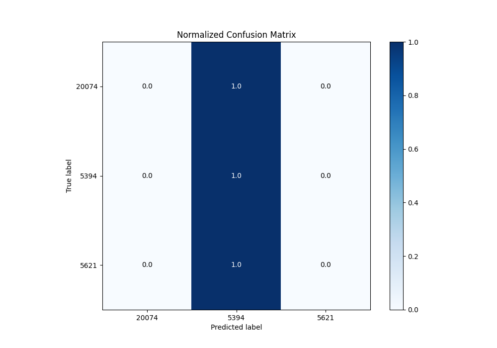
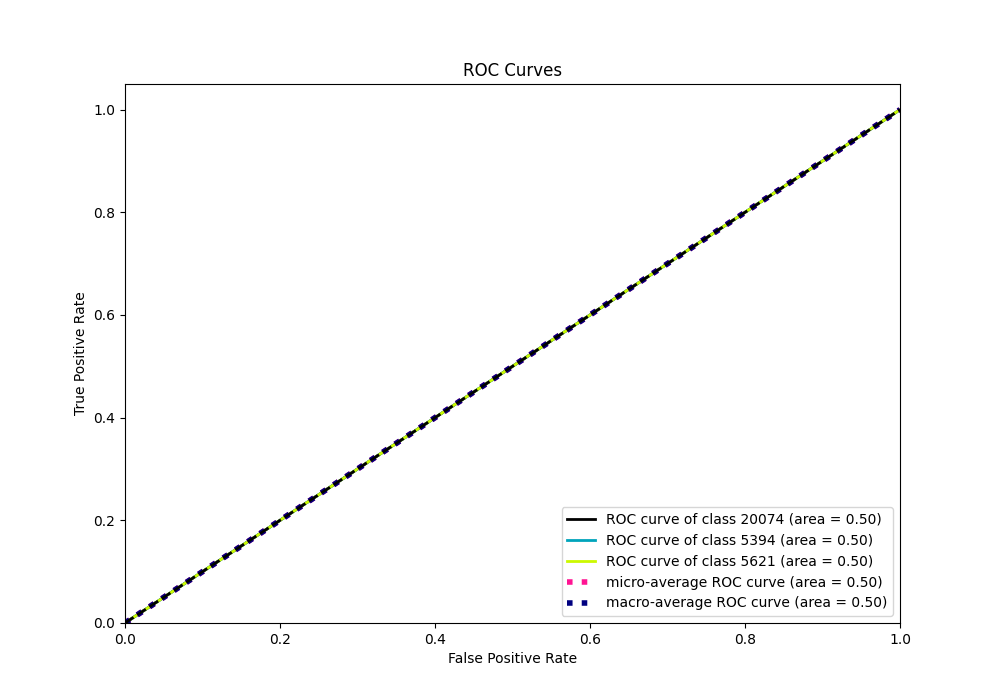
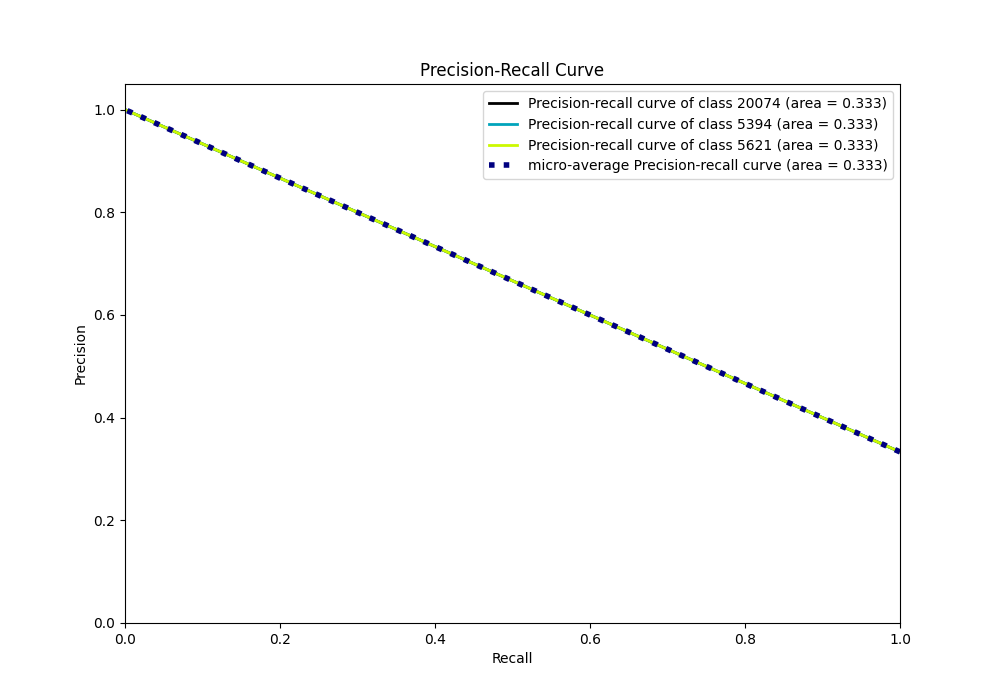

# Summary of 1_Baseline

[<< Go back](../README.md)

## Baseline Classifier (Baseline)
- **n_jobs**: -1
- **num_class**: 3
- **explain_level**: 2

## Validation
 - **validation_type**: split
 - **train_ratio**: 0.75
 - **shuffle**: True
 - **stratify**: True

## Optimized metric
logloss

## Training time

1.6 seconds

### Metric details
|           |     5394 |   5621 |   20074 |   accuracy |   macro avg |   weighted avg |   logloss |
|:----------|---------:|-------:|--------:|-----------:|------------:|---------------:|----------:|
| precision | 0.333333 |      0 |       0 |   0.333333 |    0.111111 |       0.111111 |   1.09861 |
| recall    | 1        |      0 |       0 |   0.333333 |    0.333333 |       0.333333 |   1.09861 |
| f1-score  | 0.5      |      0 |       0 |   0.333333 |    0.166667 |       0.166667 |   1.09861 |
| support   | 5        |      5 |       5 |   0.333333 |   15        |      15        |   1.09861 |

## Confusion matrix
|                  |   Predicted as 5394 |   Predicted as 5621 |   Predicted as 20074 |
|:-----------------|--------------------:|--------------------:|---------------------:|
| Labeled as 5394  |                   5 |                   0 |                    0 |
| Labeled as 5621  |                   5 |                   0 |                    0 |
| Labeled as 20074 |                   5 |                   0 |                    0 |

## Learning curves

## Confusion Matrix

## Normalized Confusion Matrix

## ROC Curve

## Precision Recall Curve

[<< Go back](../README.md)
