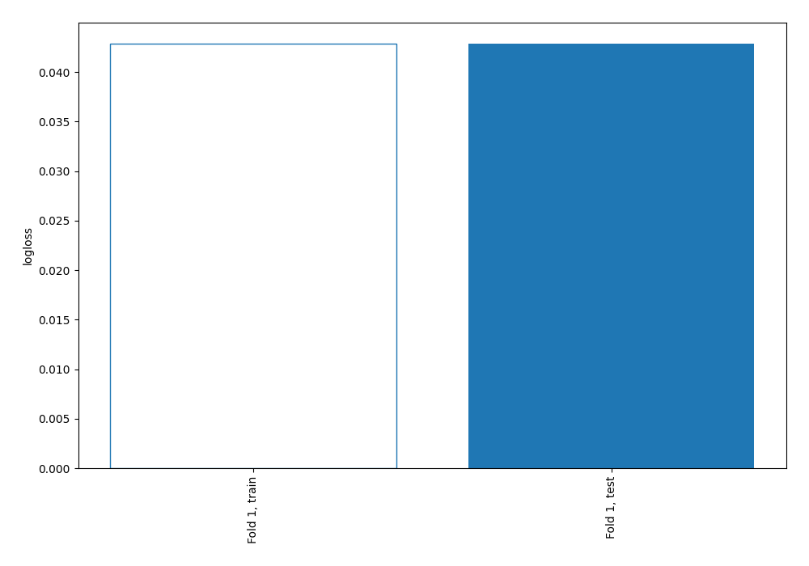
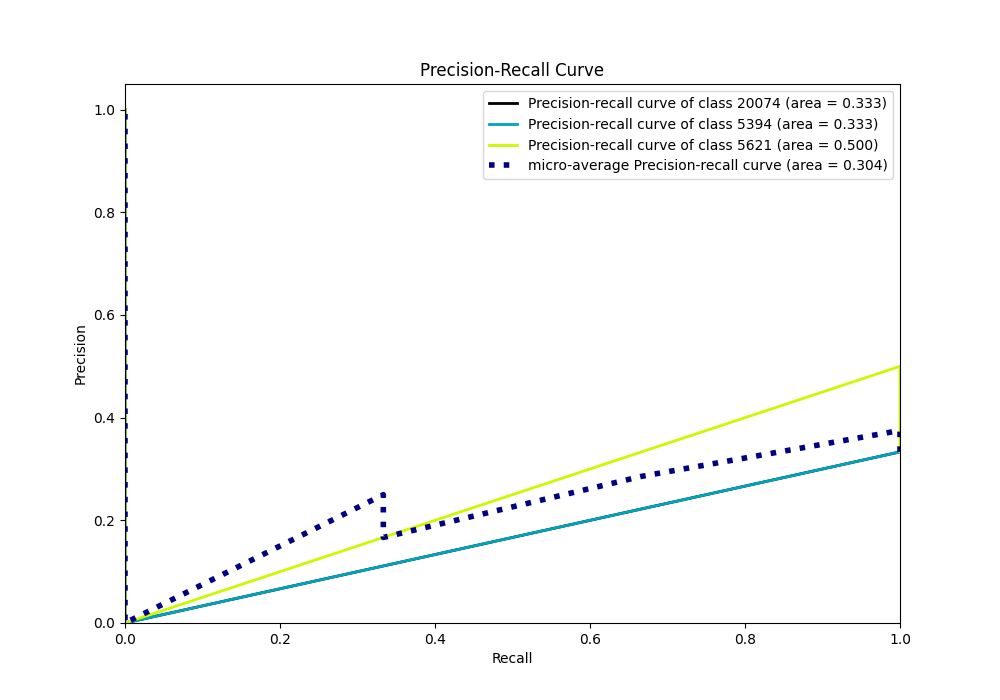

# Summary of 3_Linear

[<< Go back](../README.md)

## Logistic Regression (Linear)
- **n_jobs**: -1
- **num_class**: 3
- **explain_level**: 2

## Validation
 - **validation_type**: split
 - **train_ratio**: 0.75
 - **shuffle**: True
 - **stratify**: True

## Optimized metric
logloss

## Training time

5.6 seconds

### Metric details
|           |   5394 |   5621 |   20074 |   accuracy |   macro avg |   weighted avg |   logloss |
|:----------|-------:|-------:|--------:|-----------:|------------:|---------------:|----------:|
| precision |      1 |      1 |       1 |          1 |           1 |              1 | 0.0428567 |
| recall    |      1 |      1 |       1 |          1 |           1 |              1 | 0.0428567 |
| f1-score  |      1 |      1 |       1 |          1 |           1 |              1 | 0.0428567 |
| support   |      5 |      5 |       5 |          1 |          15 |             15 | 0.0428567 |

## Confusion matrix
|                  |   Predicted as 5394 |   Predicted as 5621 |   Predicted as 20074 |
|:-----------------|--------------------:|--------------------:|---------------------:|
| Labeled as 5394  |                   5 |                   0 |                    0 |
| Labeled as 5621  |                   0 |                   5 |                    0 |
| Labeled as 20074 |                   0 |                   0 |                    5 |

## Learning curves

## Coefficients

### Coefficients learner #1
|                                            |      5394 |      5621 |       20074 |
|:-------------------------------------------|----------:|----------:|------------:|
| intercept                                  | -0.117682 |  0.126818 | -0.00913644 |
| Year                                       | -0.966751 |  1.28437  | -0.317615   |
| No. of employed persons                    | -0.982388 |  0.280424 |  0.701964   |
| Total labour force in the city _age 15to59 | -0.431246 | -0.918748 |  1.34999    |

## Permutation-based Importance

## Confusion Matrix

## Normalized Confusion Matrix

## ROC Curve

## Precision Recall Curve

[<< Go back](../README.md)
