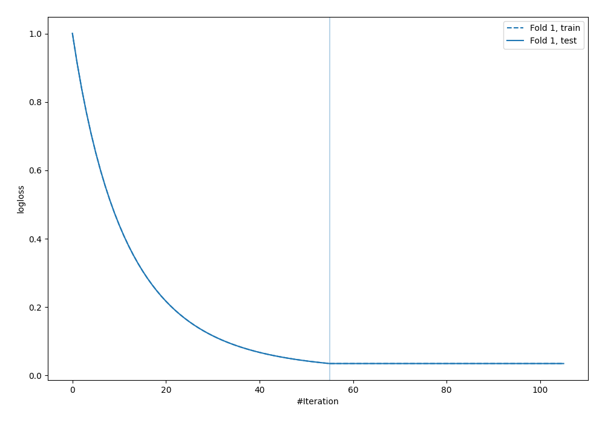
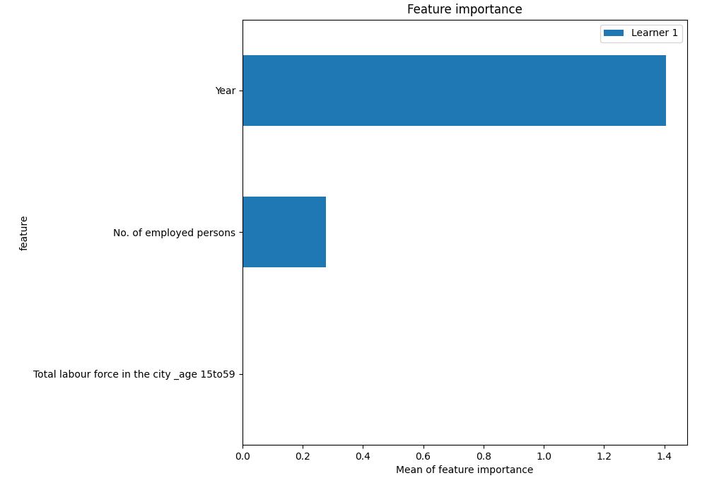
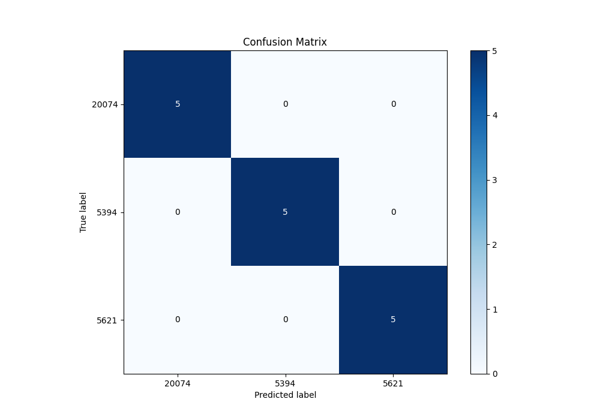
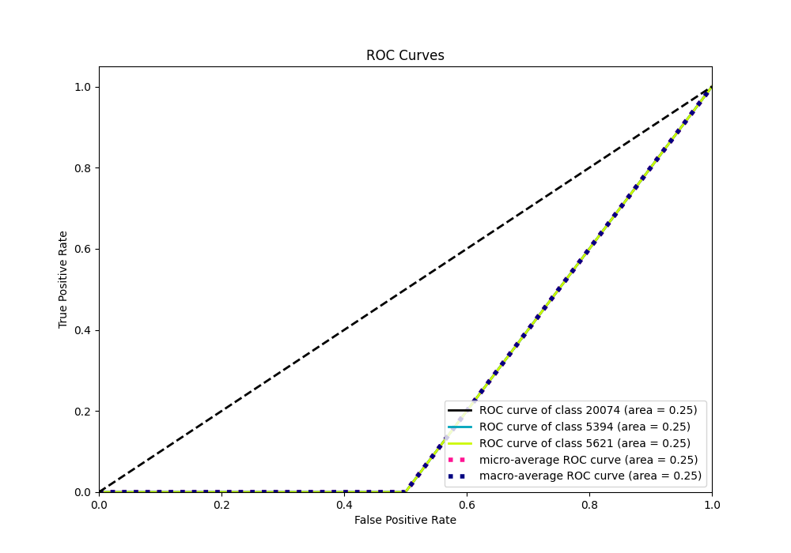
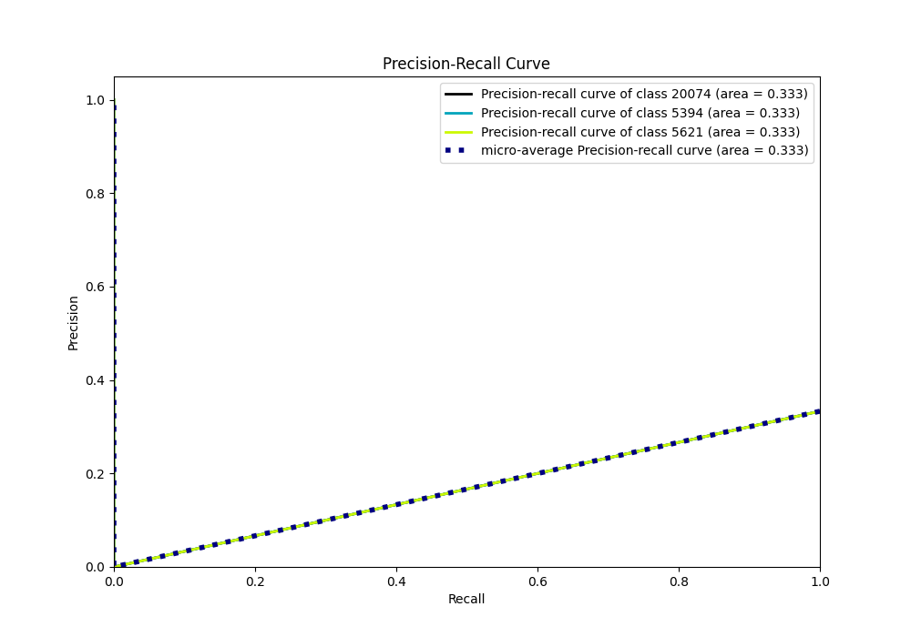

# Summary of 4_Default_Xgboost

[<< Go back](../README.md)

## Extreme Gradient Boosting (Xgboost)
- **n_jobs**: -1
- **objective**: multi:softprob
- **eta**: 0.075
- **max_depth**: 6
- **min_child_weight**: 1
- **subsample**: 1.0
- **colsample_bytree**: 1.0
- **eval_metric**: mlogloss
- **num_class**: 3
- **explain_level**: 2

## Validation
 - **validation_type**: split
 - **train_ratio**: 0.75
 - **shuffle**: True
 - **stratify**: True

## Optimized metric
logloss

## Training time

4.7 seconds

### Metric details
|           |   5394 |   5621 |   20074 |   accuracy |   macro avg |   weighted avg |   logloss |
|:----------|-------:|-------:|--------:|-----------:|------------:|---------------:|----------:|
| precision |      1 |      1 |       1 |          1 |           1 |              1 | 0.0348775 |
| recall    |      1 |      1 |       1 |          1 |           1 |              1 | 0.0348775 |
| f1-score  |      1 |      1 |       1 |          1 |           1 |              1 | 0.0348775 |
| support   |      5 |      5 |       5 |          1 |          15 |             15 | 0.0348775 |

## Confusion matrix
|                  |   Predicted as 5394 |   Predicted as 5621 |   Predicted as 20074 |
|:-----------------|--------------------:|--------------------:|---------------------:|
| Labeled as 5394  |                   5 |                   0 |                    0 |
| Labeled as 5621  |                   0 |                   5 |                    0 |
| Labeled as 20074 |                   0 |                   0 |                    5 |

## Learning curves

## Permutation-based Importance

## Confusion Matrix

## Normalized Confusion Matrix

## ROC Curve

## Precision Recall Curve

[<< Go back](../README.md)
