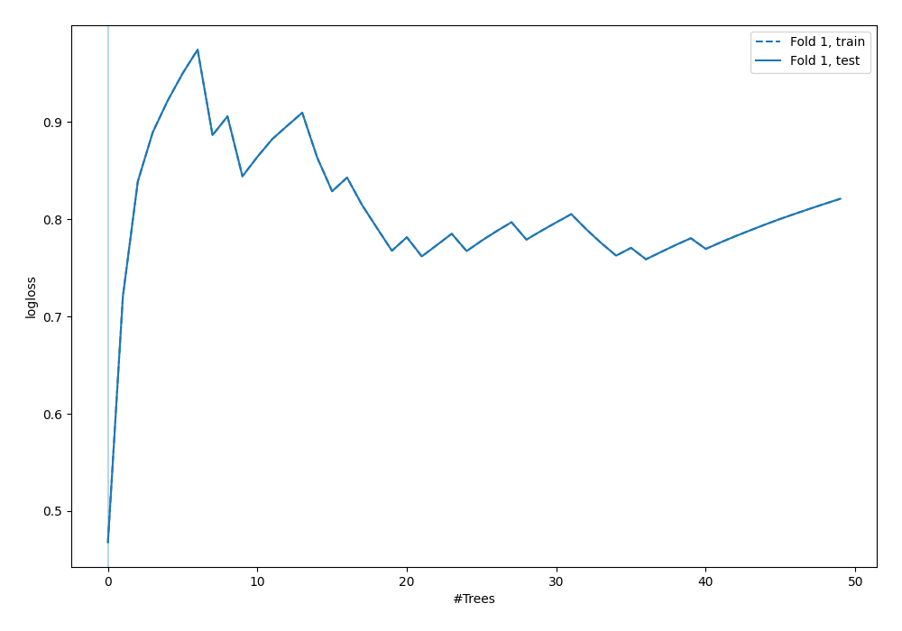
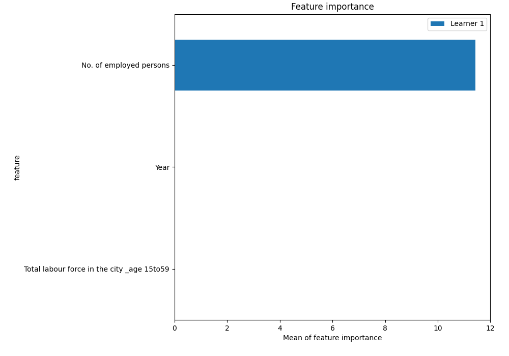
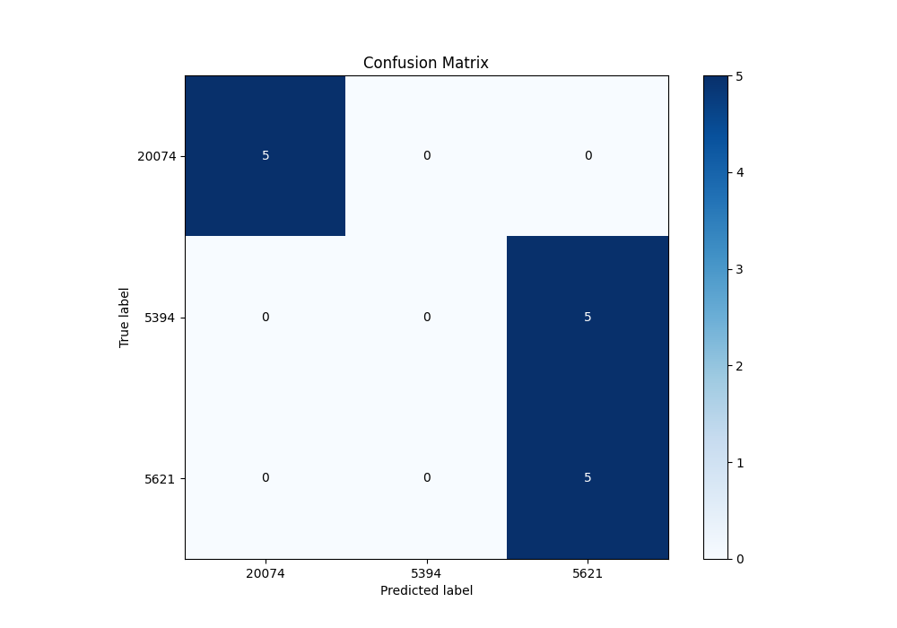
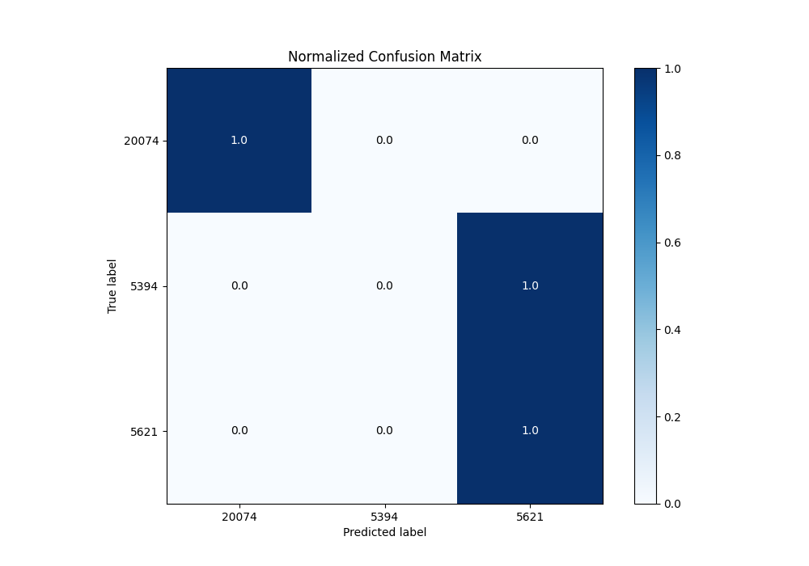
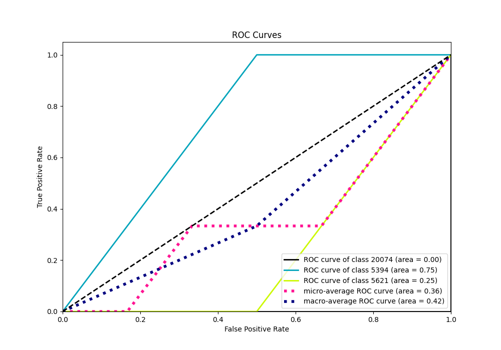
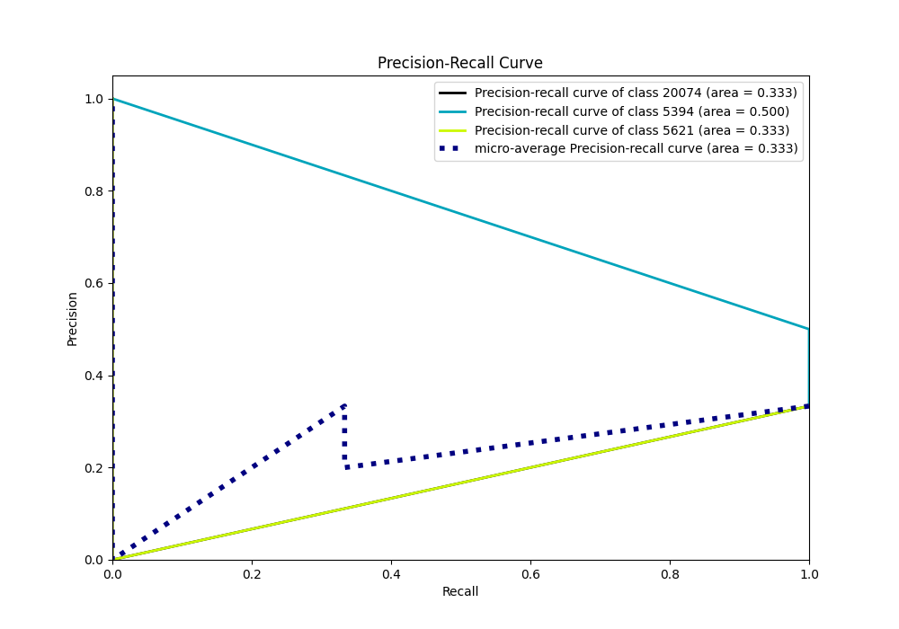

# Summary of 6_Default_RandomForest

[<< Go back](../README.md)

## Random Forest
- **n_jobs**: -1
- **criterion**: gini
- **max_features**: 0.9
- **min_samples_split**: 30
- **max_depth**: 4
- **eval_metric_name**: logloss
- **num_class**: 3
- **explain_level**: 2

## Validation
 - **validation_type**: split
 - **train_ratio**: 0.75
 - **shuffle**: True
 - **stratify**: True

## Optimized metric
logloss

## Training time

2.5 seconds

### Metric details
|           |   5394 |     5621 |   20074 |   accuracy |   macro avg |   weighted avg |   logloss |
|:----------|-------:|---------:|--------:|-----------:|------------:|---------------:|----------:|
| precision |      0 | 0.5      |       1 |   0.666667 |    0.5      |       0.5      |  0.467818 |
| recall    |      0 | 1        |       1 |   0.666667 |    0.666667 |       0.666667 |  0.467818 |
| f1-score  |      0 | 0.666667 |       1 |   0.666667 |    0.555556 |       0.555556 |  0.467818 |
| support   |      5 | 5        |       5 |   0.666667 |   15        |      15        |  0.467818 |

## Confusion matrix
|                  |   Predicted as 5394 |   Predicted as 5621 |   Predicted as 20074 |
|:-----------------|--------------------:|--------------------:|---------------------:|
| Labeled as 5394  |                   0 |                   5 |                    0 |
| Labeled as 5621  |                   0 |                   5 |                    0 |
| Labeled as 20074 |                   0 |                   0 |                    5 |

## Learning curves

## Permutation-based Importance

## Confusion Matrix

## Normalized Confusion Matrix

## ROC Curve

## Precision Recall Curve

[<< Go back](../README.md)
