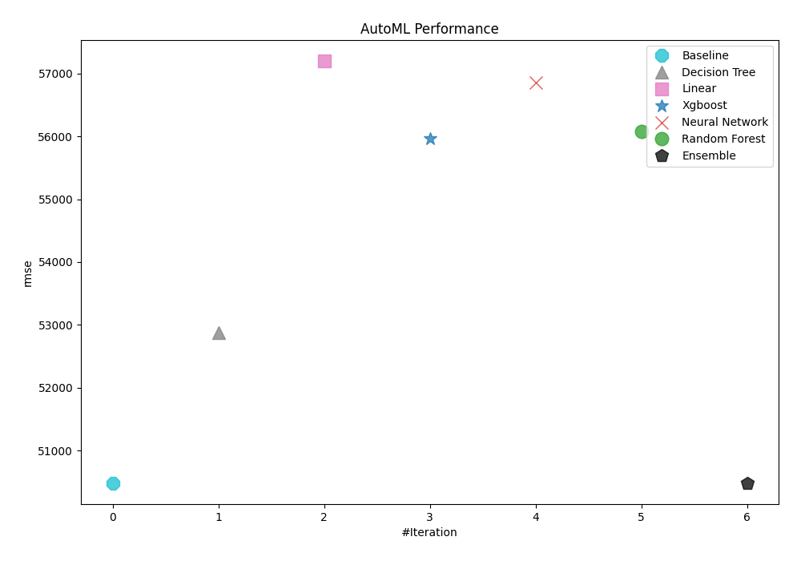
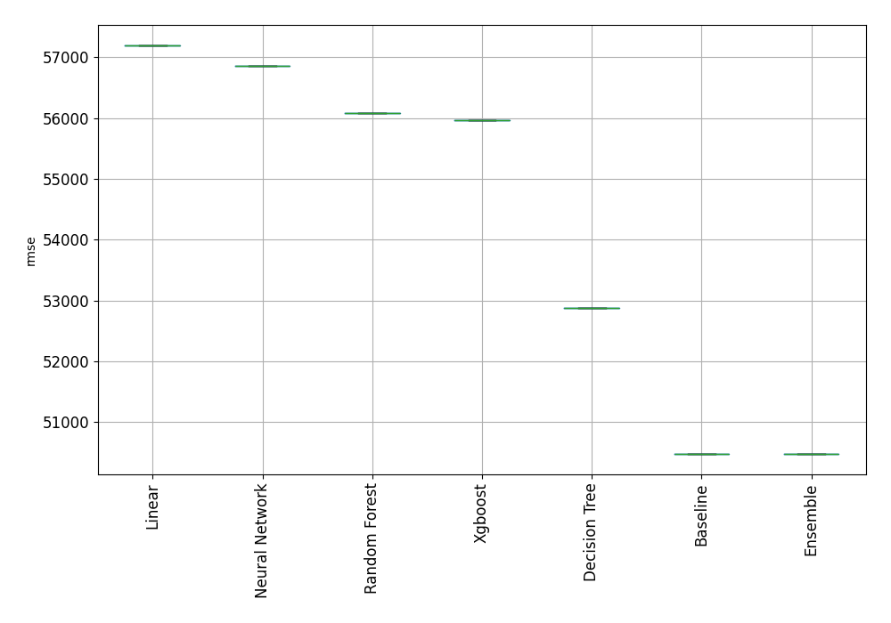
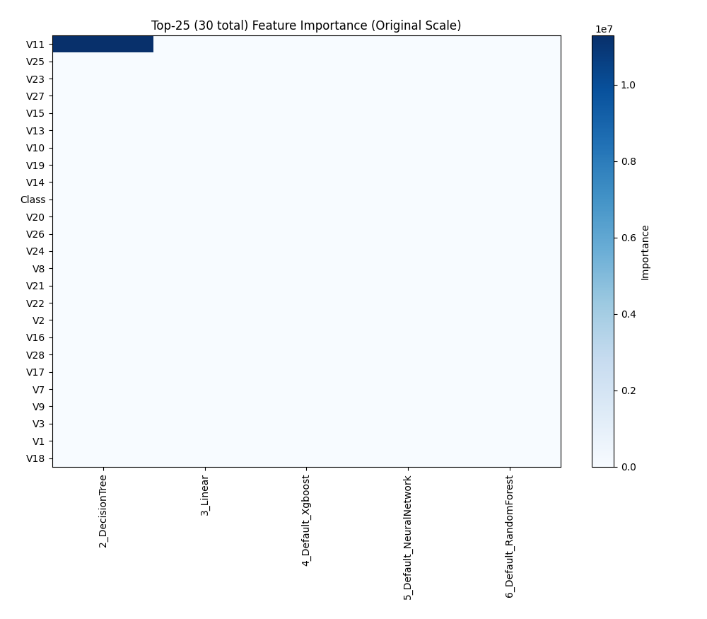
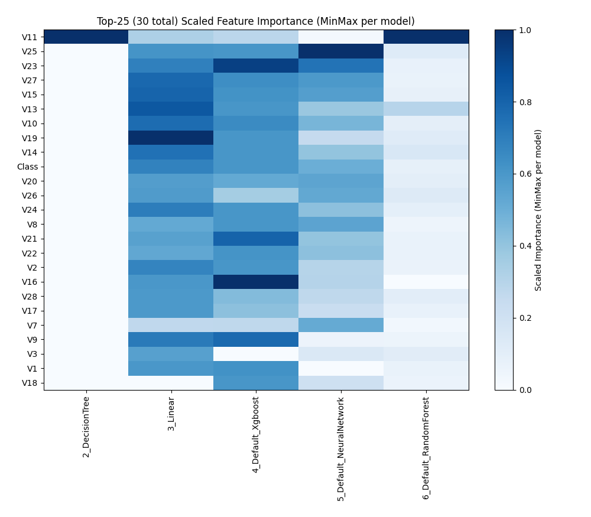
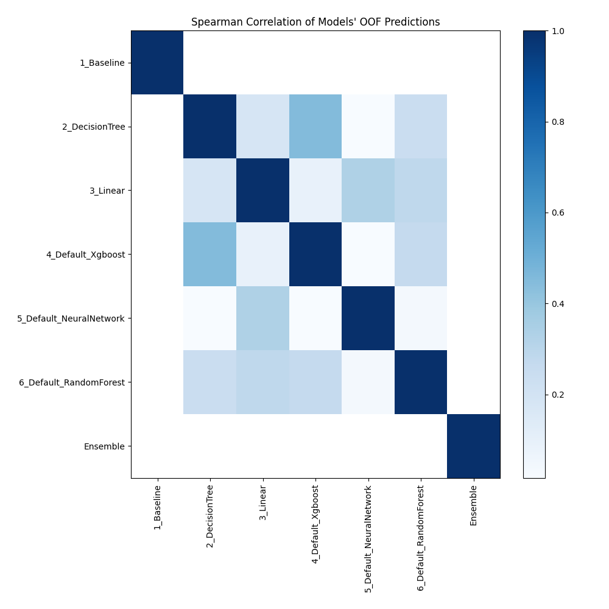

# AutoML Leaderboard

| Best model   | name                                                         | model_type     | metric_type   |   metric_value |   train_time |
|:-------------|:-------------------------------------------------------------|:---------------|:--------------|---------------:|-------------:|
| **the best** | [1_Baseline](1_Baseline/README.md)                           | Baseline       | rmse          |        50483.6 |        16.72 |
|              | [2_DecisionTree](2_DecisionTree/README.md)                   | Decision Tree  | rmse          |        52882.4 |       188.63 |
|              | [3_Linear](3_Linear/README.md)                               | Linear         | rmse          |        57196.1 |        15.18 |
|              | [4_Default_Xgboost](4_Default_Xgboost/README.md)             | Xgboost        | rmse          |        55959.8 |        59.79 |
|              | [5_Default_NeuralNetwork](5_Default_NeuralNetwork/README.md) | Neural Network | rmse          |        56854.4 |         4.86 |
|              | [6_Default_RandomForest](6_Default_RandomForest/README.md)   | Random Forest  | rmse          |        56083.7 |        45.06 |
|              | [Ensemble](Ensemble/README.md)                               | Ensemble       | rmse          |        50483.6 |         1.52 |

### AutoML Performance

### AutoML Performance Boxplot

### Features Importance (Original Scale)

### Scaled Features Importance (MinMax per Model)

### Spearman Correlation of Models

