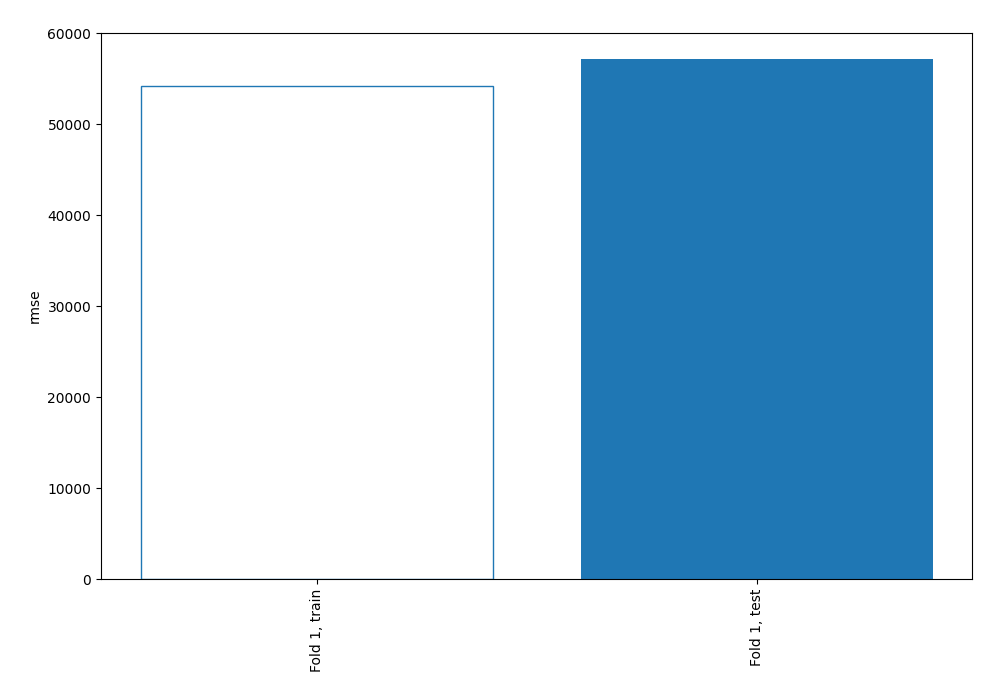
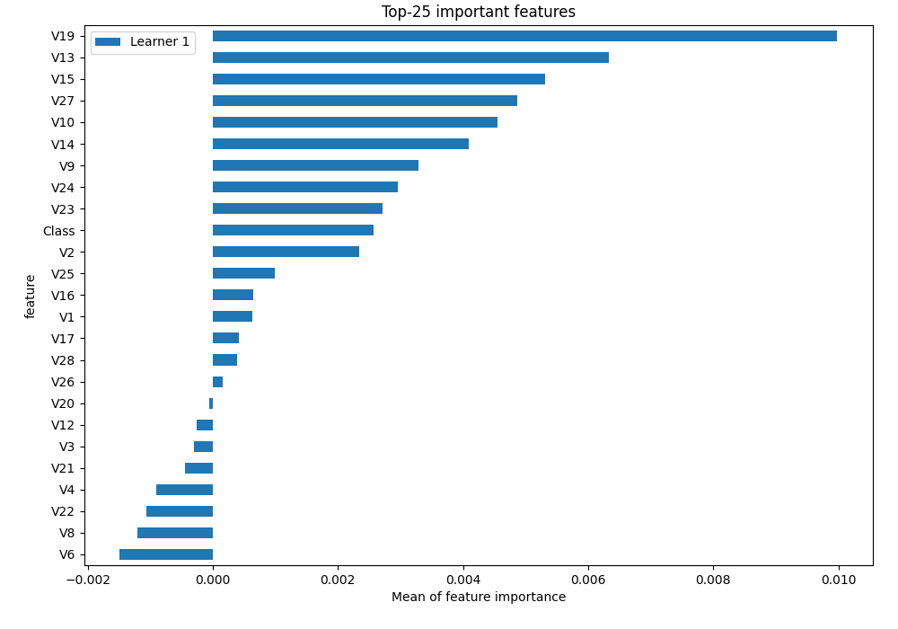
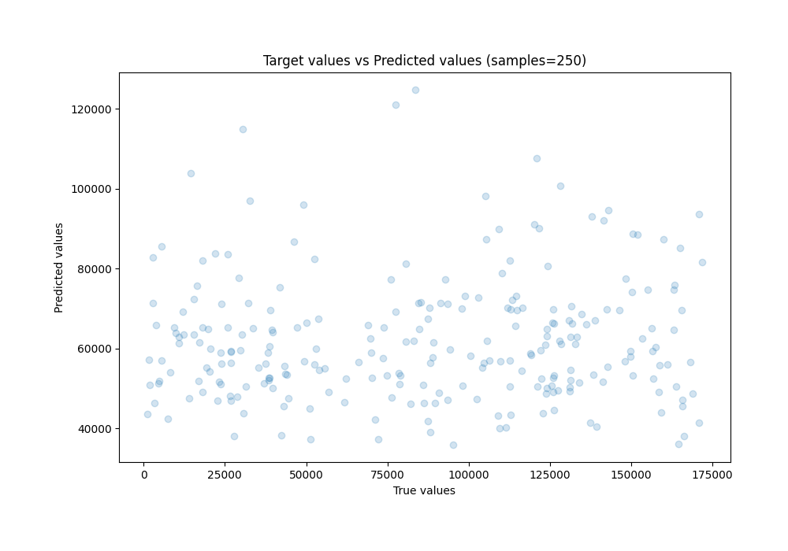
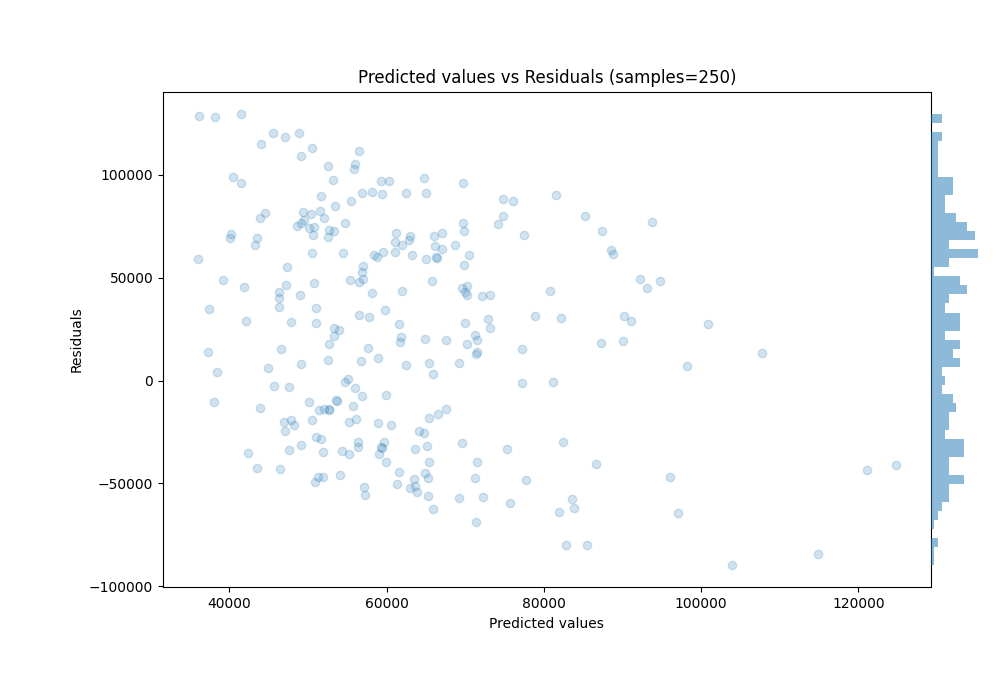
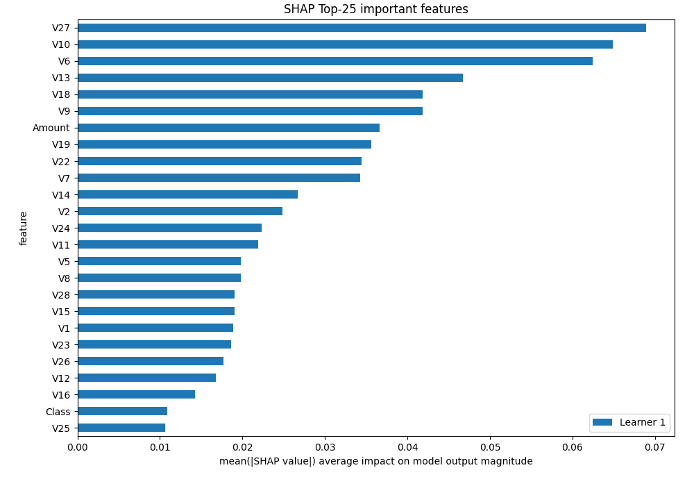
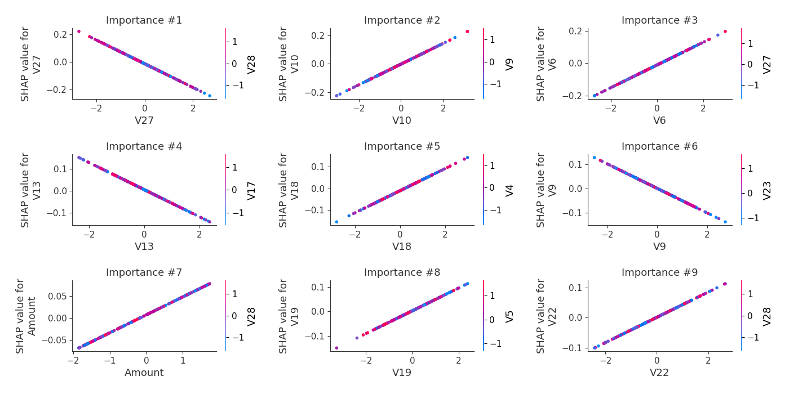
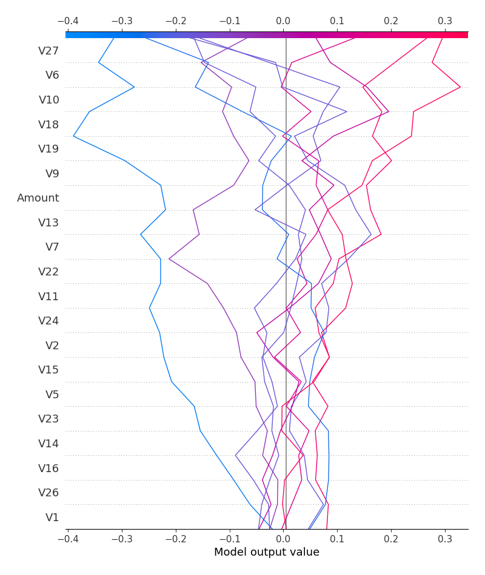
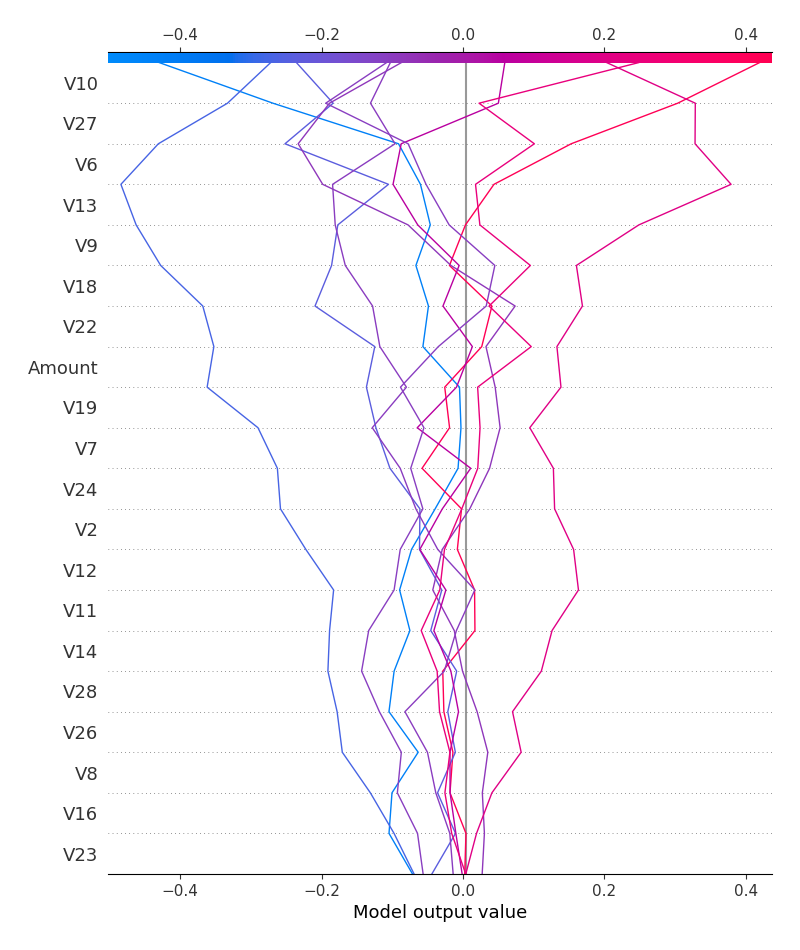

# Summary of 3_Linear

[<< Go back](../README.md)

## Linear Regression (Linear)
- **n_jobs**: -1
- **explain_level**: 2

## Validation
 - **validation_type**: split
 - **train_ratio**: 0.75
 - **shuffle**: True

## Optimized metric
rmse

## Training time

3.6 seconds

### Metric details:
| Metric   |          Score |
|:---------|---------------:|
| MAE      | 48860.2        |
| MSE      |     3.2714e+09 |
| RMSE     | 57196.1        |
| R2       |    -0.283856   |
| MAPE     |     1.69386    |

## Learning curves

## Coefficients
| feature   |   Learner_1 |
|:----------|------------:|
| Class     |  0.263932   |
| V10       |  0.0724303  |
| V6        |  0.0702648  |
| V18       |  0.0513541  |
| V19       |  0.0465545  |
| V22       |  0.0419636  |
| V7        |  0.0416355  |
| Amount    |  0.0407933  |
| V14       |  0.033153   |
| V8        |  0.0246129  |
| V28       |  0.024252   |
| V26       |  0.0223475  |
| V16       |  0.0178862  |
| V25       |  0.0126105  |
| V4        |  0.00967391 |
| V17       |  0.00562939 |
| V20       | -0.0024573  |
| V21       | -0.00361673 |
| V3        | -0.00530885 |
| intercept | -0.0172422  |
| V12       | -0.0213756  |
| V15       | -0.0233573  |
| V1        | -0.024692   |
| V23       | -0.0261511  |
| V11       | -0.0267889  |
| V5        | -0.0268408  |
| V24       | -0.0268523  |
| V2        | -0.0311951  |
| V9        | -0.0507282  |
| V13       | -0.0615016  |
| V27       | -0.0860273  |

## Permutation-based Importance

## True vs Predicted

## Predicted vs Residuals

## SHAP Importance

## SHAP Dependence plots

### Dependence (Fold 1)

## SHAP Decision plots

### Top-10 Worst decisions (Fold 1)

### Top-10 Best decisions (Fold 1)

[<< Go back](../README.md)
