# Summary of 3_Linear

[<< Go back](../README.md)

## Logistic Regression (Linear)
- **n_jobs**: -1
- **explain_level**: 2

## Validation
 - **validation_type**: split
 - **train_ratio**: 0.75
 - **shuffle**: True
 - **stratify**: True

## Optimized metric
logloss

## Training time

4.5 seconds

## Metric details
|           |    score |   threshold |
|:----------|---------:|------------:|
| logloss   | 0.587226 |  nan        |
| auc       | 0.66     |  nan        |
| f1        | 0.666667 |    0.283339 |
| accuracy  | 0.7      |    0.433731 |
| precision | 1        |    0.433731 |
| recall    | 1        |    0.283339 |
| mcc       | 0.5      |    0.433731 |

## Metric details with threshold from accuracy metric
|           |    score |   threshold |
|:----------|---------:|------------:|
| logloss   | 0.587226 |  nan        |
| auc       | 0.66     |  nan        |
| f1        | 0.666667 |    0.433731 |
| accuracy  | 0.7      |    0.433731 |
| precision | 0.75     |    0.433731 |
| recall    | 0.6      |    0.433731 |
| mcc       | 0.408248 |    0.433731 |

## Confusion matrix (at threshold=0.433731)
|              |   Predicted as 0 |   Predicted as 1 |
|:-------------|-----------------:|-----------------:|
| Labeled as 0 |                4 |                1 |
| Labeled as 1 |                2 |                3 |

## Learning curves
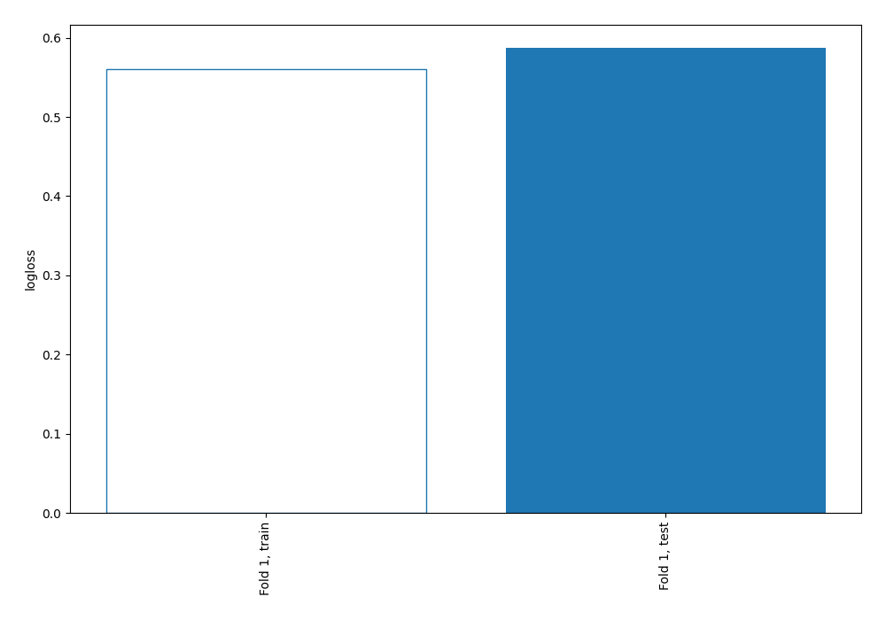

## Coefficients
| feature     |   Learner_1 |
|:------------|------------:|
| intercept   |   0.0827784 |
| Outlook     |  -0.610793  |
| Temperature |  -0.617451  |
| PlayTennis  |  -0.865946  |

## Permutation-based Importance
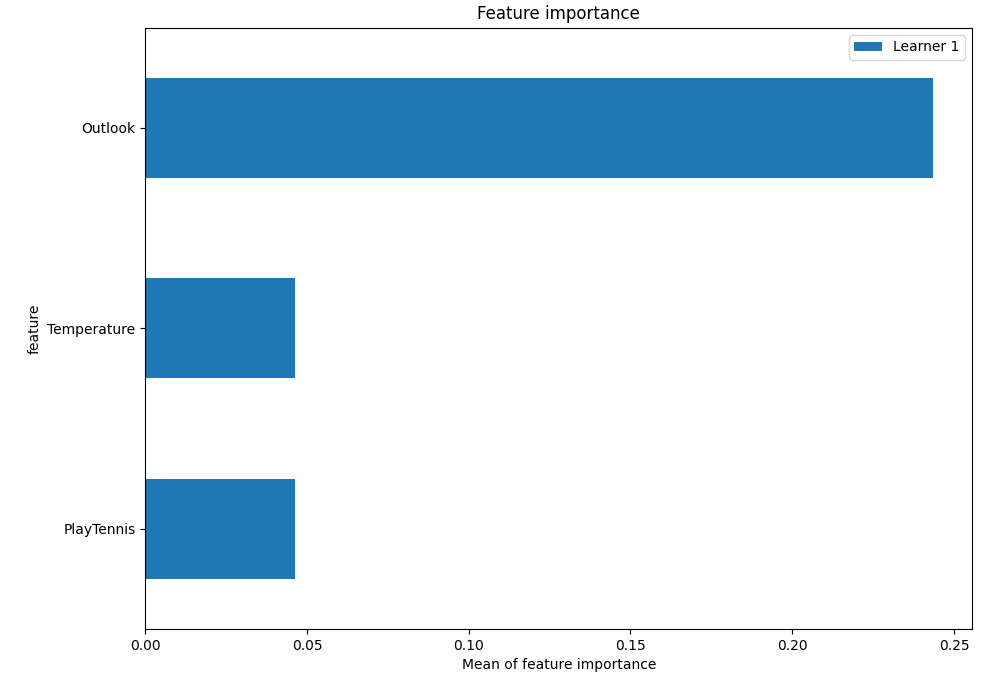
## Confusion Matrix

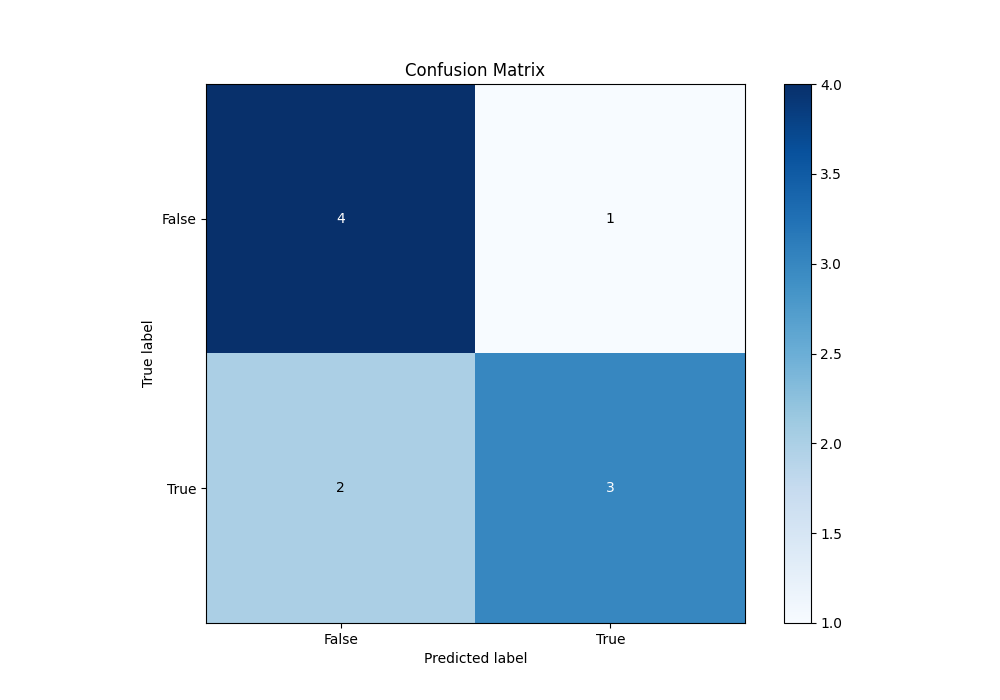

## Normalized Confusion Matrix

## ROC Curve

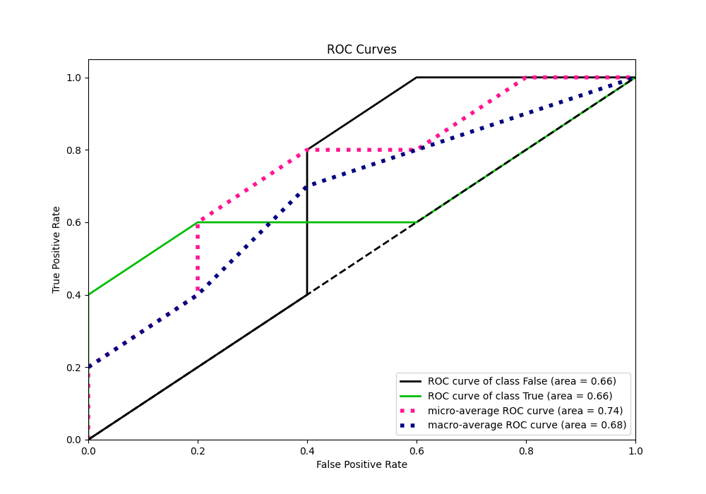

## Kolmogorov-Smirnov Statistic

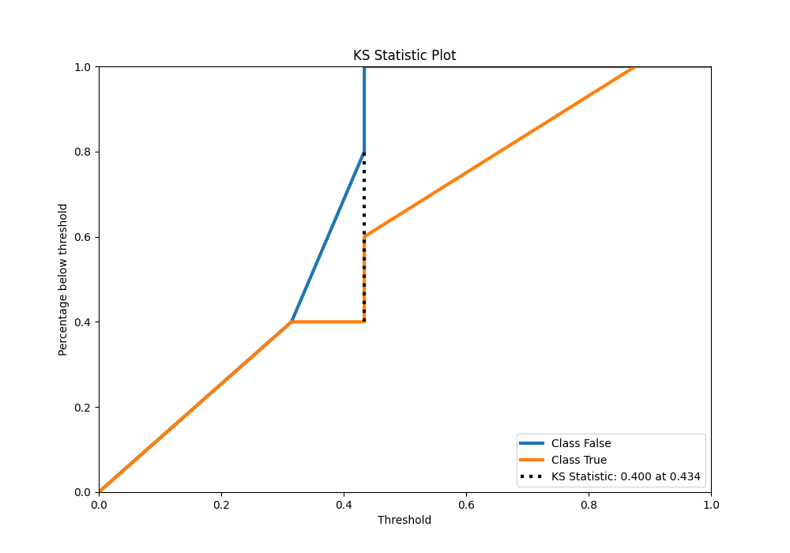

## Precision-Recall Curve

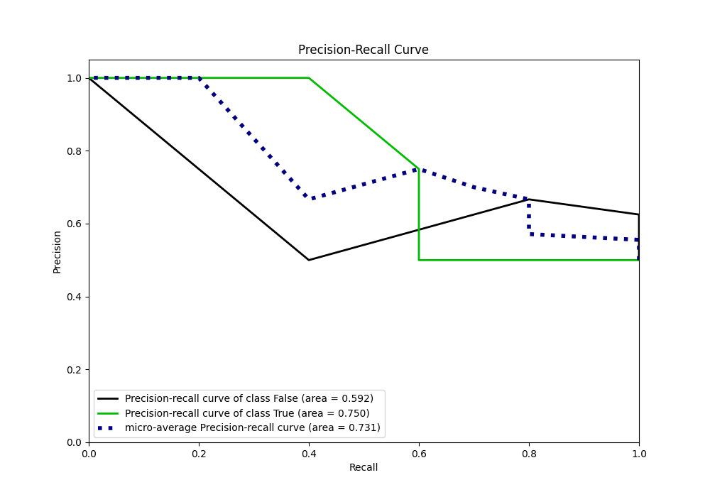

## Calibration Curve

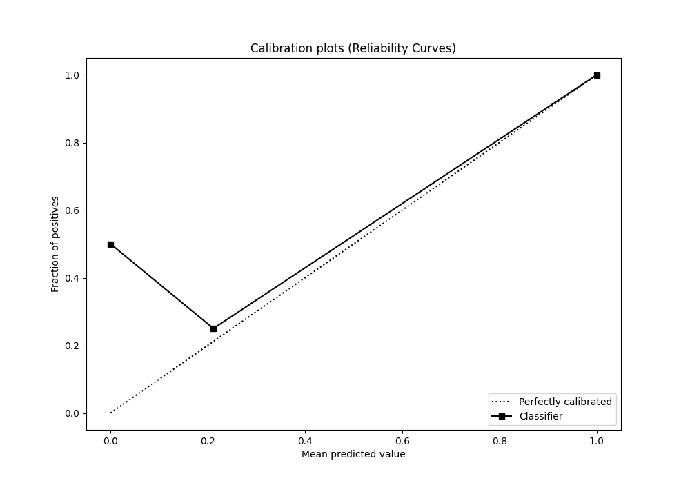

## Cumulative Gains Curve

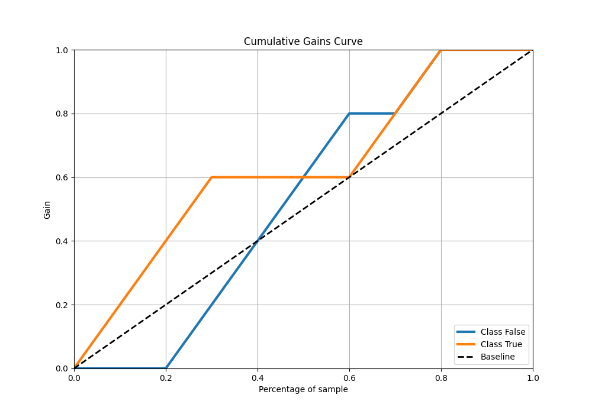

## Lift Curve

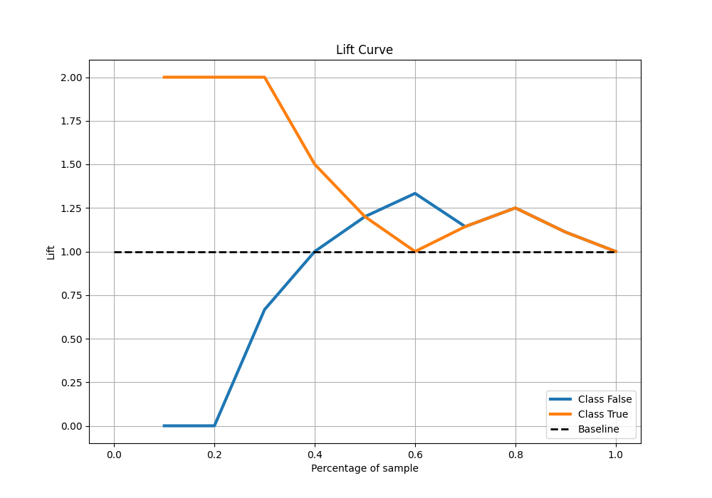

## SHAP Importance
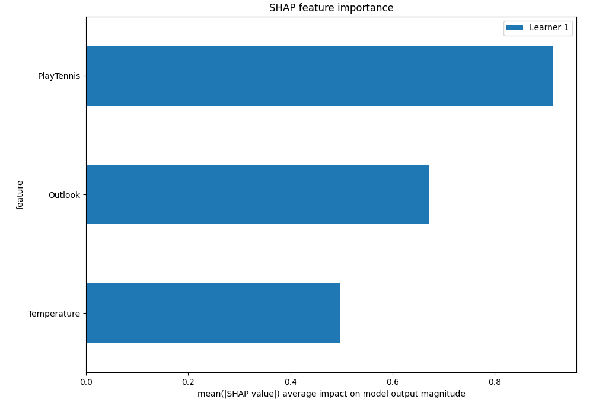

## SHAP Dependence plots

### Dependence (Fold 1)
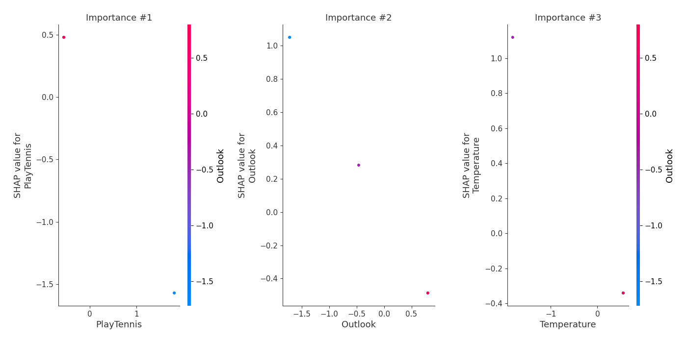

## SHAP Decision plots

[<< Go back](../README.md)
