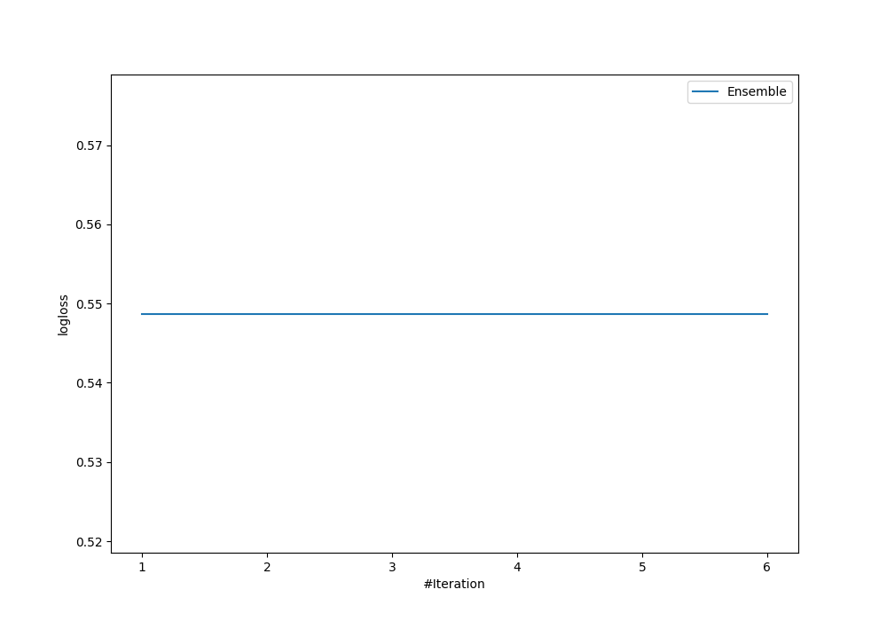
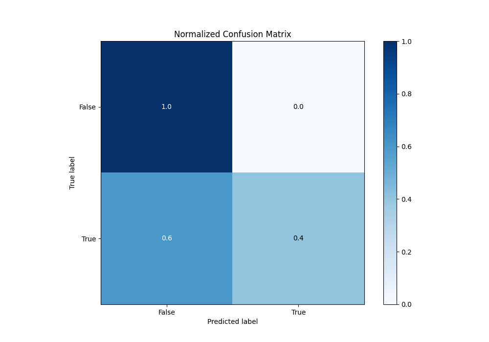
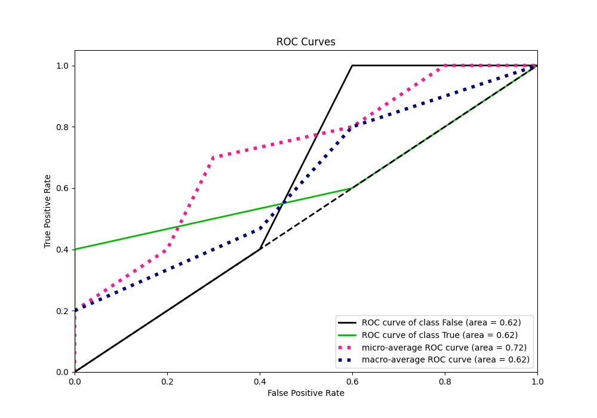
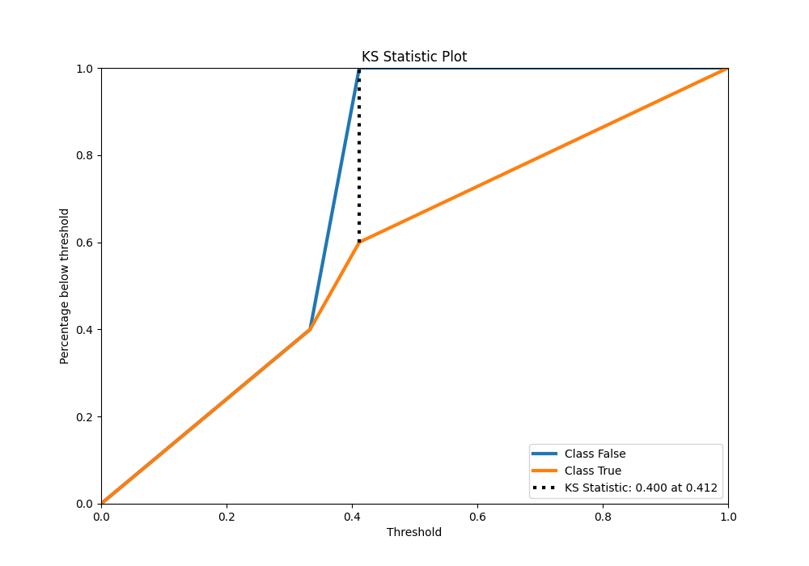
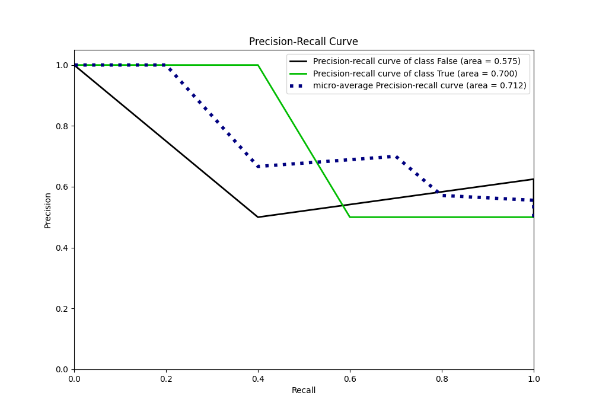
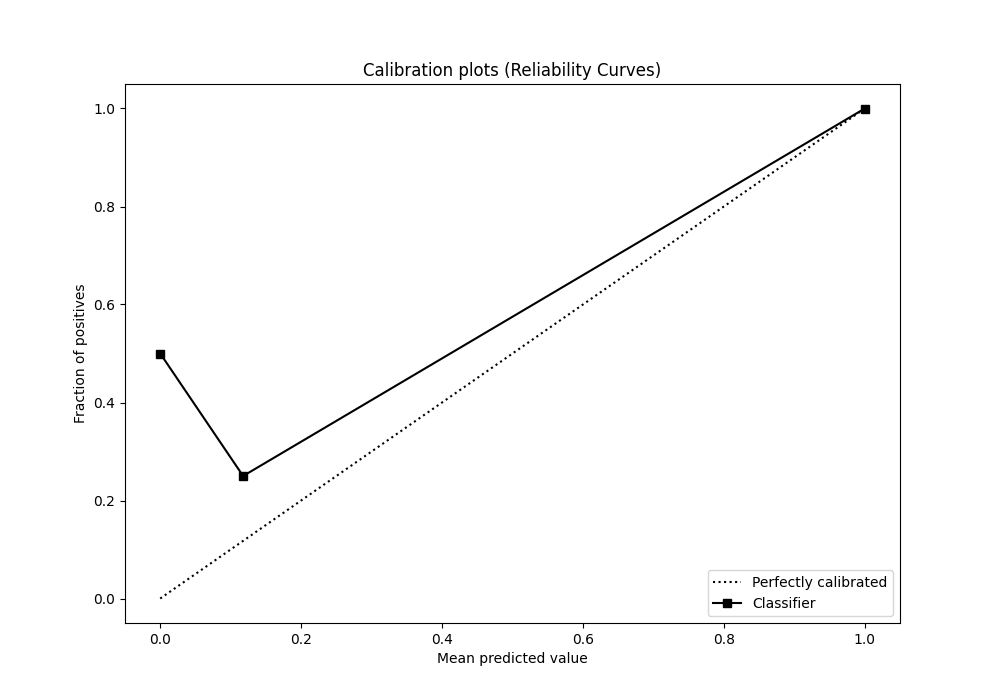
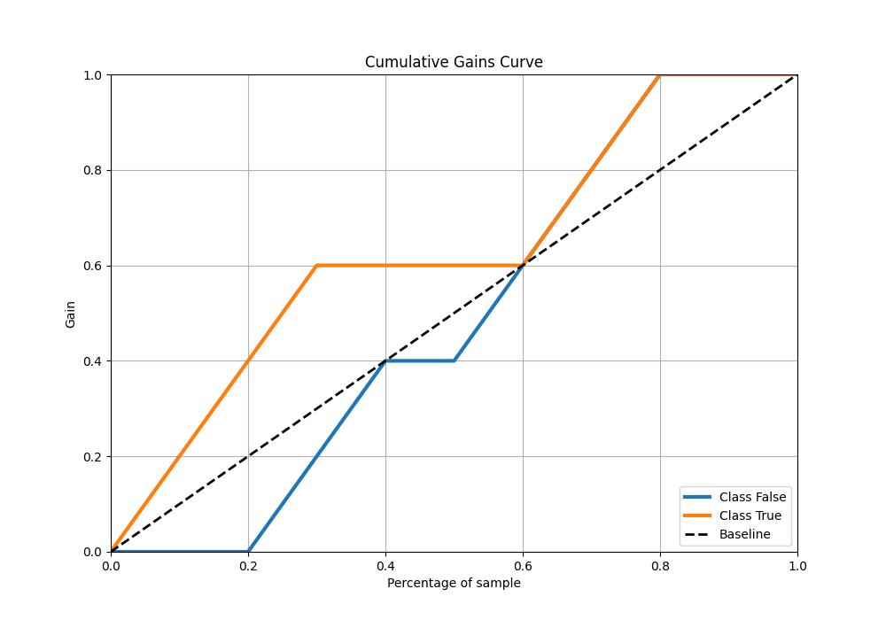
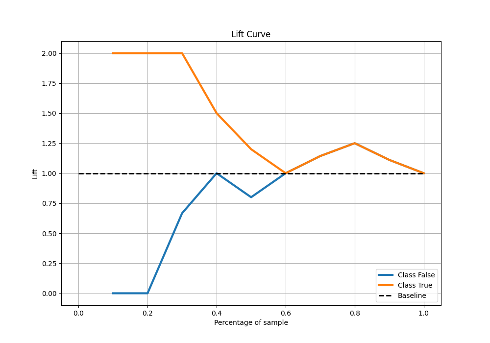

# Summary of Ensemble

[<< Go back](../README.md)

## Ensemble structure
| Model          |   Weight |
|:---------------|---------:|
| 2_DecisionTree |        1 |

## Metric details
|           |    score |   threshold |
|:----------|---------:|------------:|
| logloss   | 0.548734 |  nan        |
| auc       | 0.62     |  nan        |
| f1        | 0.666667 |    0.3      |
| accuracy  | 0.7      |    0.411765 |
| precision | 1        |    0.411765 |
| recall    | 1        |    0.3      |
| mcc       | 0.5      |    0.411765 |

## Metric details with threshold from accuracy metric
|           |    score |   threshold |
|:----------|---------:|------------:|
| logloss   | 0.548734 |  nan        |
| auc       | 0.62     |  nan        |
| f1        | 0.571429 |    0.411765 |
| accuracy  | 0.7      |    0.411765 |
| precision | 1        |    0.411765 |
| recall    | 0.4      |    0.411765 |
| mcc       | 0.5      |    0.411765 |

## Confusion matrix (at threshold=0.411765)
|              |   Predicted as 0 |   Predicted as 1 |
|:-------------|-----------------:|-----------------:|
| Labeled as 0 |                5 |                0 |
| Labeled as 1 |                3 |                2 |

## Learning curves

## Confusion Matrix

## Normalized Confusion Matrix

## ROC Curve

## Kolmogorov-Smirnov Statistic

## Precision-Recall Curve

## Calibration Curve

## Cumulative Gains Curve

## Lift Curve

[<< Go back](../README.md)
