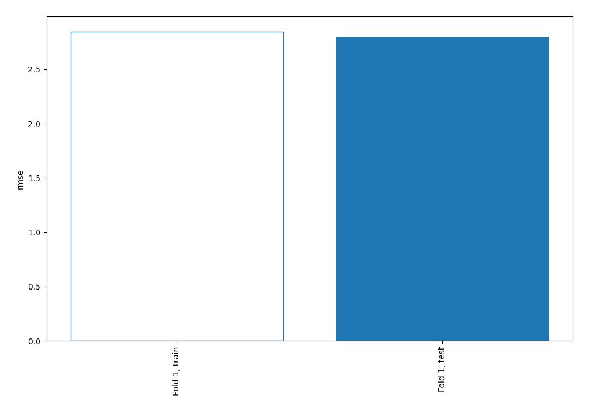
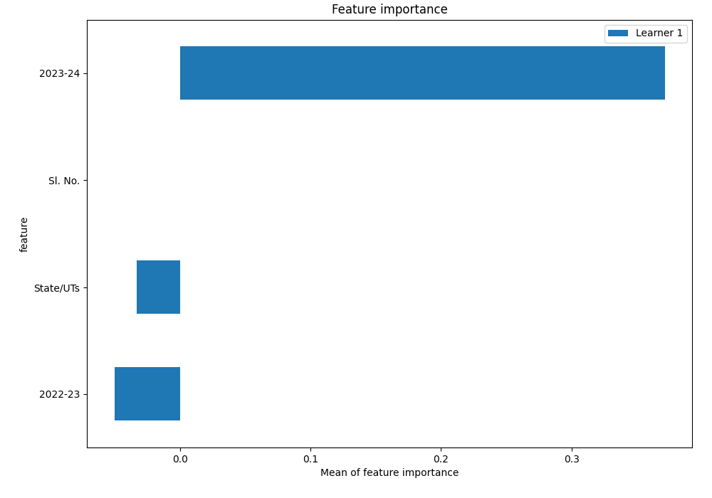
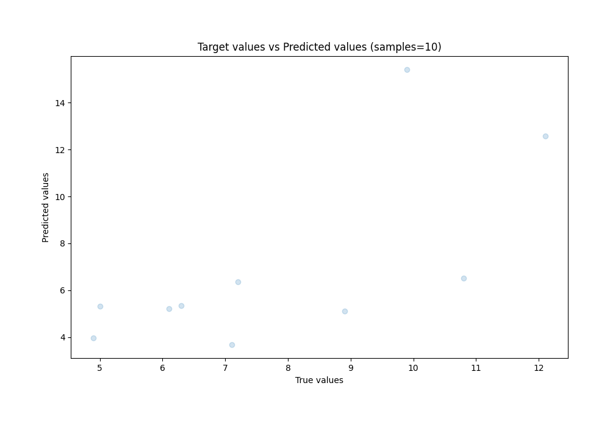
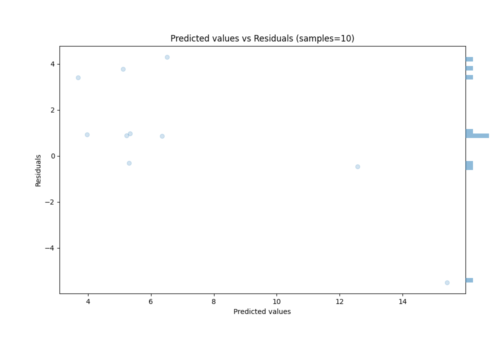
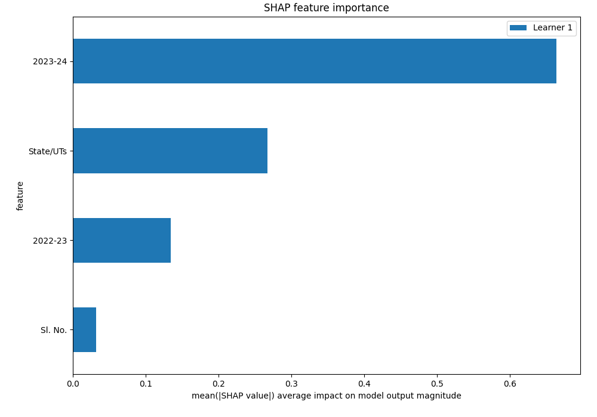
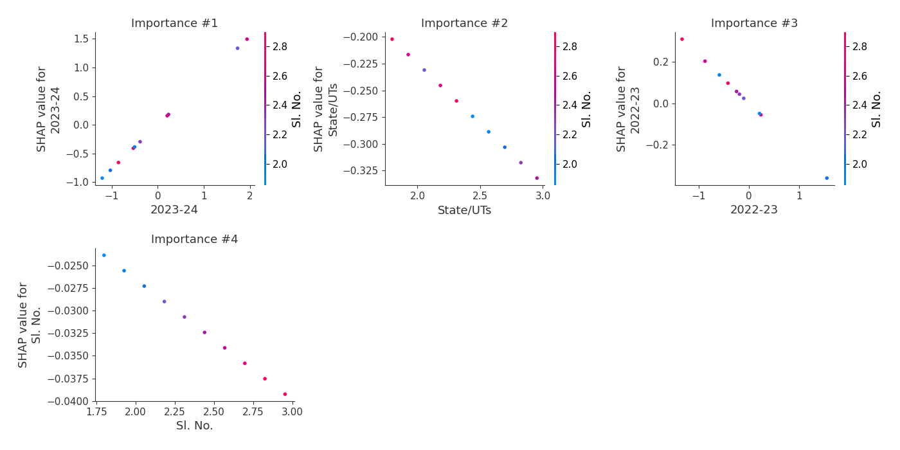
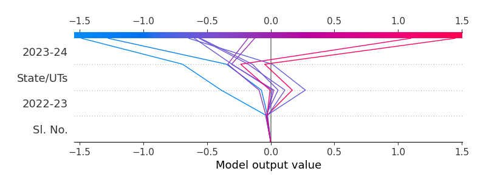

# Summary of 3_Linear

[<< Go back](../README.md)

## Linear Regression (Linear)
- **n_jobs**: -1
- **explain_level**: 2

## Validation
 - **validation_type**: split
 - **train_ratio**: 0.75
 - **shuffle**: True

## Optimized metric
rmse

## Training time

2.4 seconds

### Metric details:
| Metric   |     Score |
|:---------|----------:|
| MAE      |  2.1377   |
| MSE      |  7.81961  |
| RMSE     |  2.79636  |
| R2       | -0.412987 |
| MAPE     |  0.256288 |

## Learning curves

## Coefficients
| feature   |    Learner_1 |
|:----------|-------------:|
| 2023-24   |  0.772129    |
| intercept | -1.01423e-16 |
| Sl. No.   | -0.0132878   |
| State/UTs | -0.112462    |
| 2022-23   | -0.233016    |

## Permutation-based Importance

## True vs Predicted

## Predicted vs Residuals

## SHAP Importance

## SHAP Dependence plots

### Dependence (Fold 1)

## SHAP Decision plots

### Top-10 Worst decisions (Fold 1)

### Top-10 Best decisions (Fold 1)

[<< Go back](../README.md)
