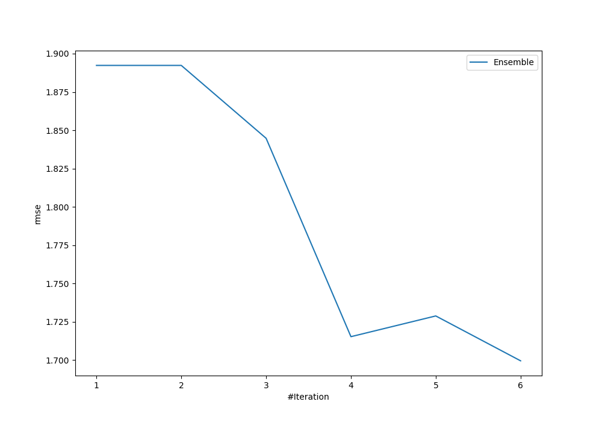
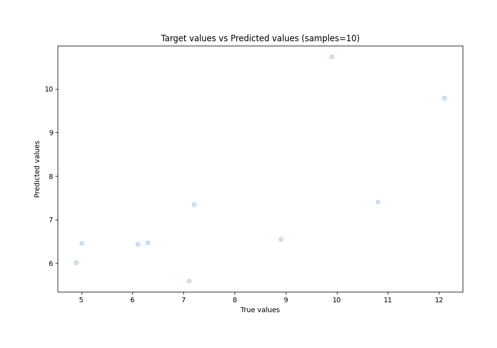

# Summary of Ensemble

[<< Go back](../README.md)

## Ensemble structure
| Model             |   Weight |
|:------------------|---------:|
| 1_Baseline        |        2 |
| 3_Linear          |        2 |
| 4_Default_Xgboost |        2 |

### Metric details:
| Metric   |    Score |
|:---------|---------:|
| MAE      | 1.36268  |
| MSE      | 2.88832  |
| RMSE     | 1.6995   |
| R2       | 0.478088 |
| MAPE     | 0.168832 |

## Learning curves

## True vs Predicted

## Predicted vs Residuals

[<< Go back](../README.md)
