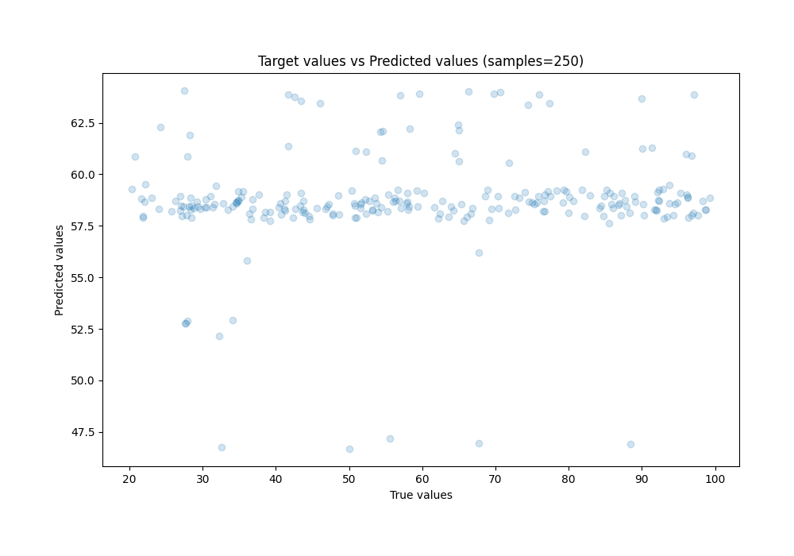
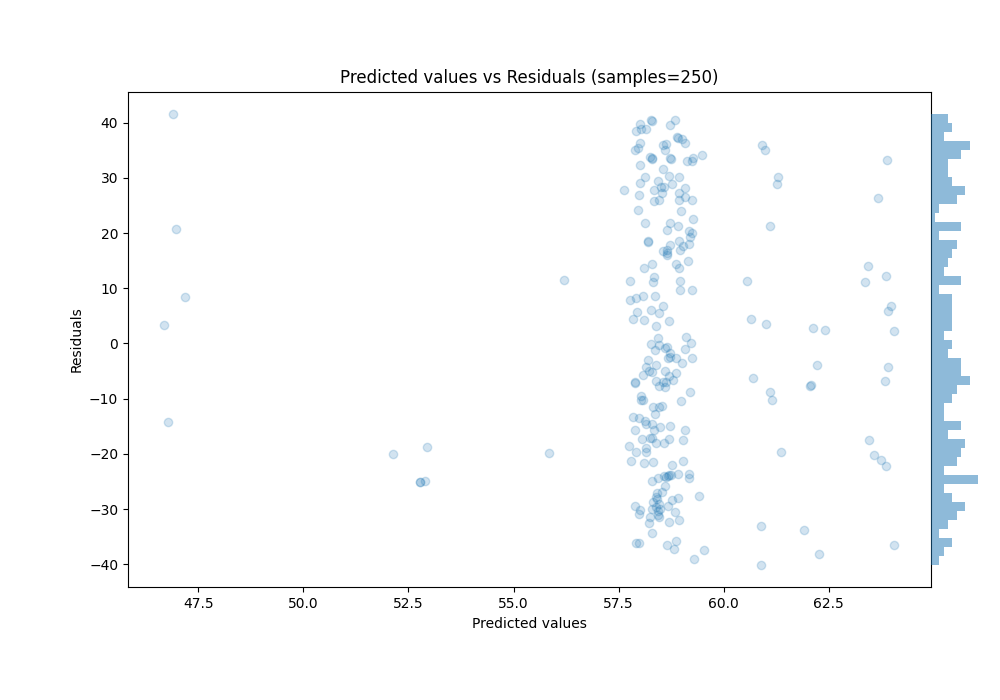

# Summary of Ensemble

[<< Go back](../README.md)

## Ensemble structure
| Model          |   Weight |
|:---------------|---------:|
| 1_Baseline     |        3 |
| 2_DecisionTree |        2 |
| 3_Linear       |        1 |

### Metric details:
| Metric   |        Score |
|:---------|-------------:|
| MAE      |  19.9747     |
| MSE      | 531.969      |
| RMSE     |  23.0644     |
| R2       |   0.00833394 |
| MAPE     |   0.427639   |

## Learning curves

## True vs Predicted

## Predicted vs Residuals

[<< Go back](../README.md)
