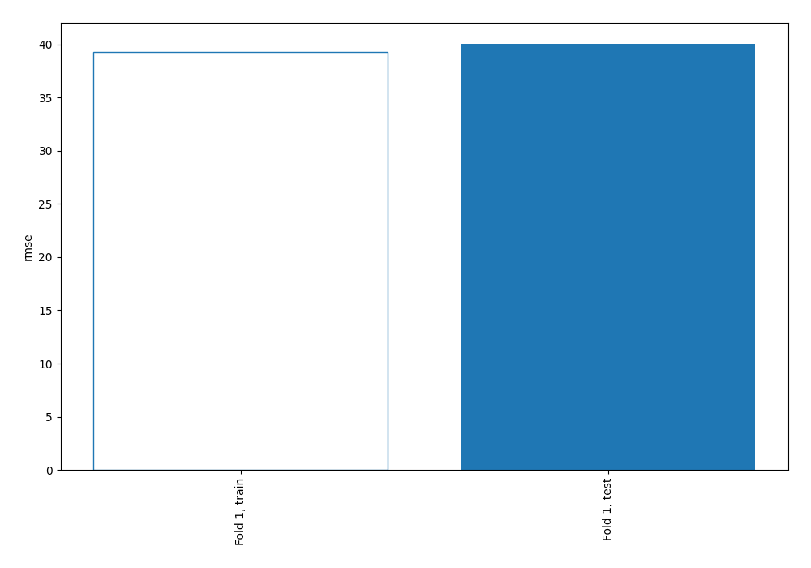
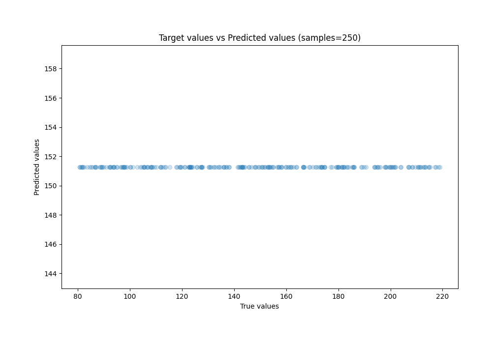
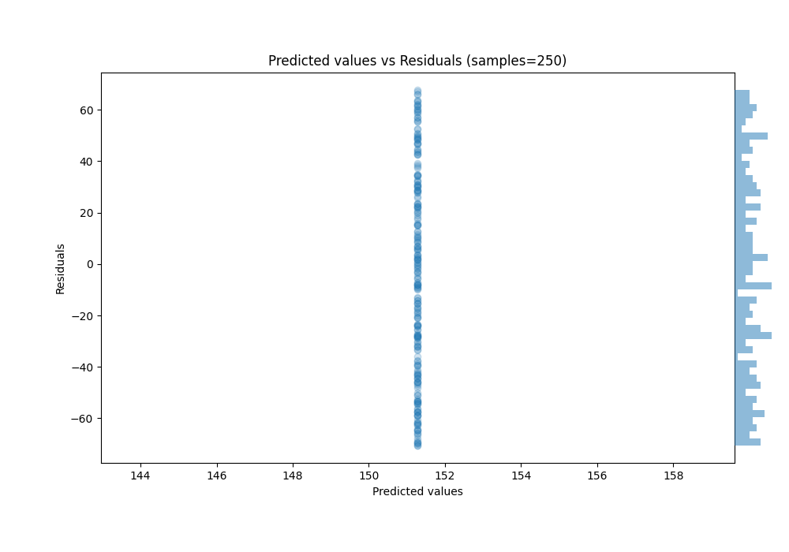

# Summary of 1_Baseline

[<< Go back](../README.md)

## Baseline Regressor (Baseline)
- **n_jobs**: -1
- **explain_level**: 2

## Validation
 - **validation_type**: split
 - **train_ratio**: 0.75
 - **shuffle**: True

## Optimized metric
rmse

## Training time

0.4 seconds

### Metric details:
| Metric   |        Score |
|:---------|-------------:|
| MAE      |   34.3532    |
| MSE      | 1603.26      |
| RMSE     |   40.0407    |
| R2       |   -0.0115469 |
| MAPE     |    0.26961   |

## Learning curves

## True vs Predicted

## Predicted vs Residuals

[<< Go back](../README.md)
