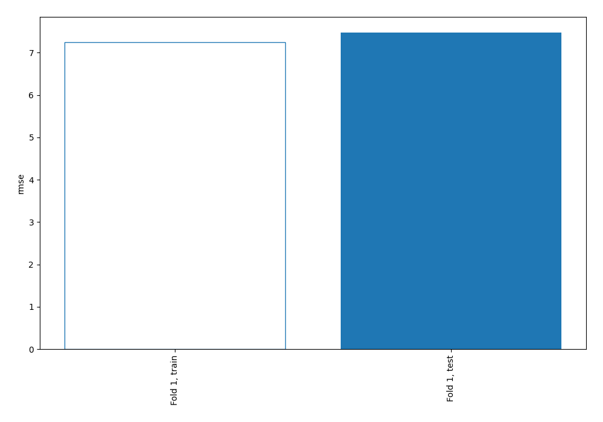
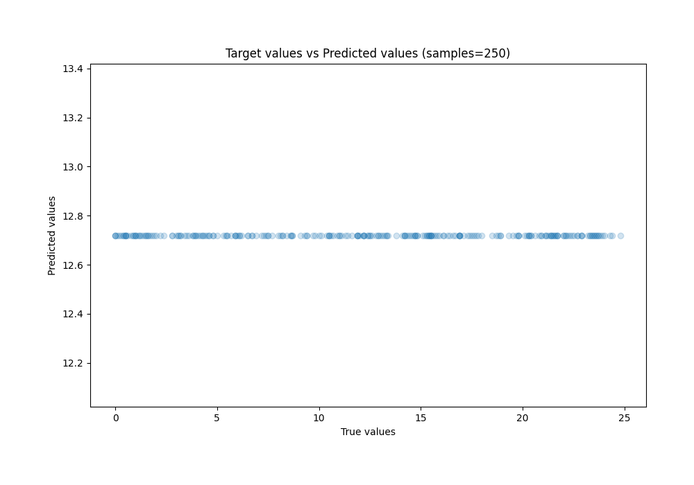
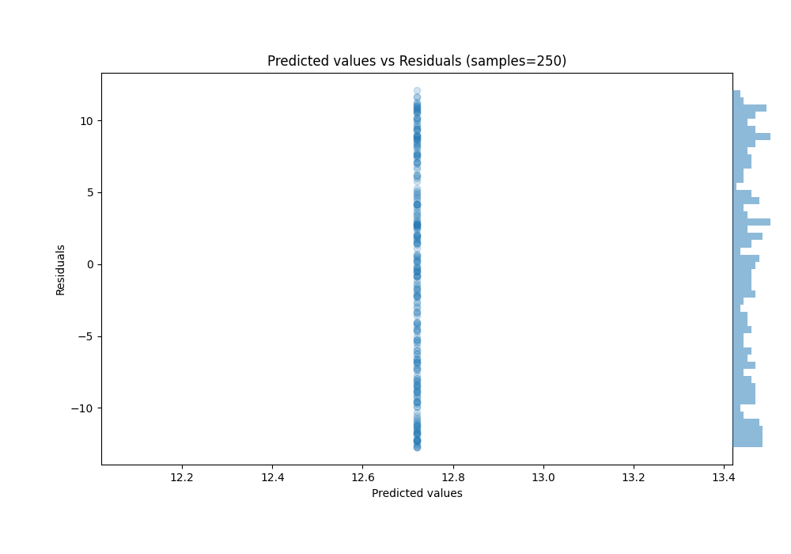

# Summary of 1_Baseline

[<< Go back](../README.md)

## Baseline Regressor (Baseline)
- **n_jobs**: -1
- **explain_level**: 2

## Validation
 - **validation_type**: split
 - **train_ratio**: 0.75
 - **shuffle**: True

## Optimized metric
rmse

## Training time

0.7 seconds

### Metric details:
| Metric   |        Score |
|:---------|-------------:|
| MAE      |  6.44592     |
| MSE      | 55.8486      |
| RMSE     |  7.47319     |
| R2       | -0.00457394  |
| MAPE     |  6.87444e+14 |

## Learning curves

## True vs Predicted

## Predicted vs Residuals

[<< Go back](../README.md)
