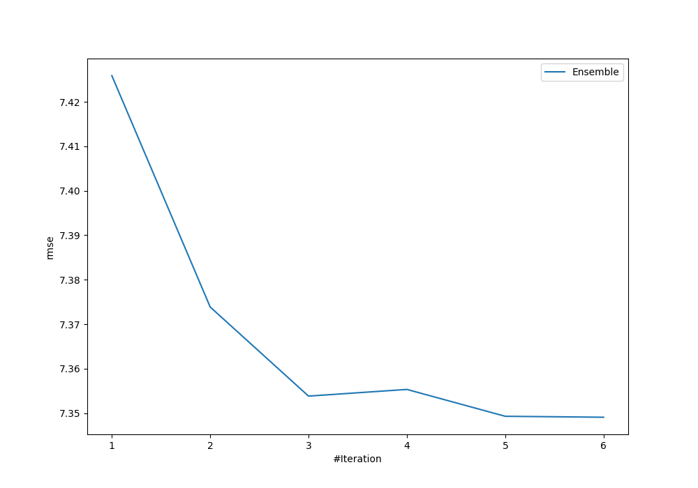
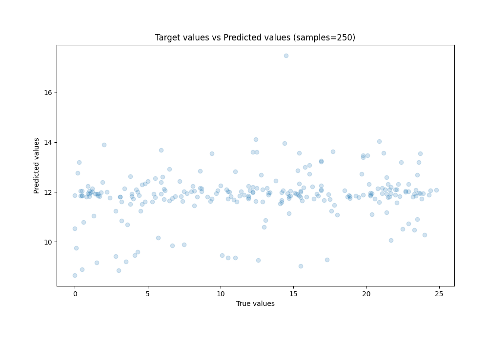
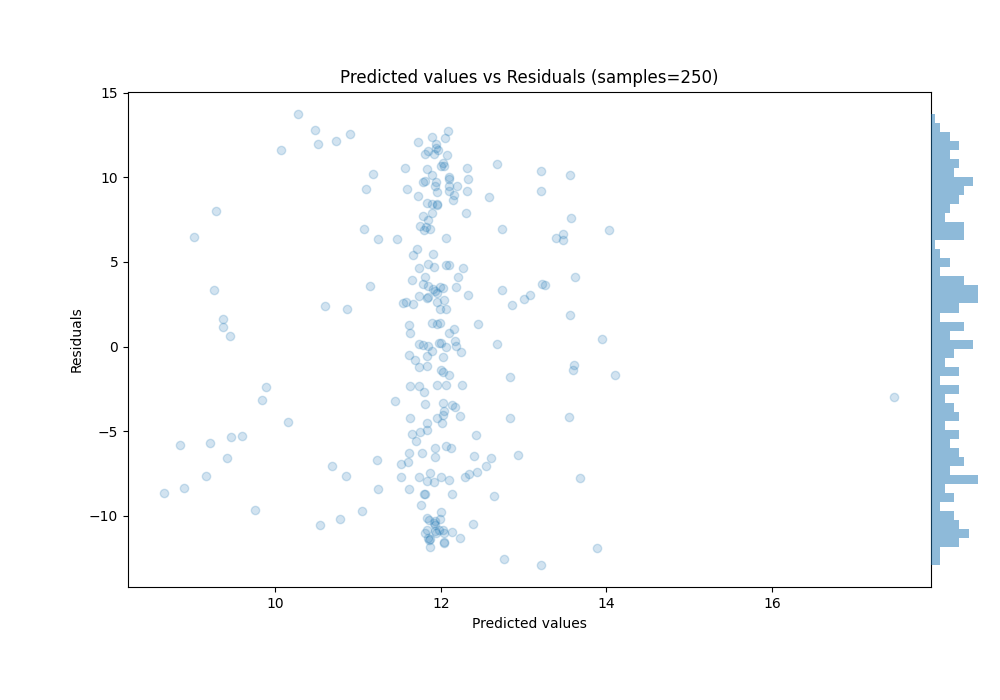

# Summary of Ensemble

[<< Go back](../README.md)

## Ensemble structure
| Model                  |   Weight |
|:-----------------------|---------:|
| 1_Baseline             |        1 |
| 2_DecisionTree         |        3 |
| 4_Default_Xgboost      |        1 |
| 6_Default_RandomForest |        1 |

### Metric details:
| Metric   |        Score |
|:---------|-------------:|
| MAE      |  6.35499     |
| MSE      | 54.0091      |
| RMSE     |  7.34909     |
| R2       |  0.0285134   |
| MAPE     |  5.59516e+14 |

## Learning curves

## True vs Predicted

## Predicted vs Residuals

[<< Go back](../README.md)
