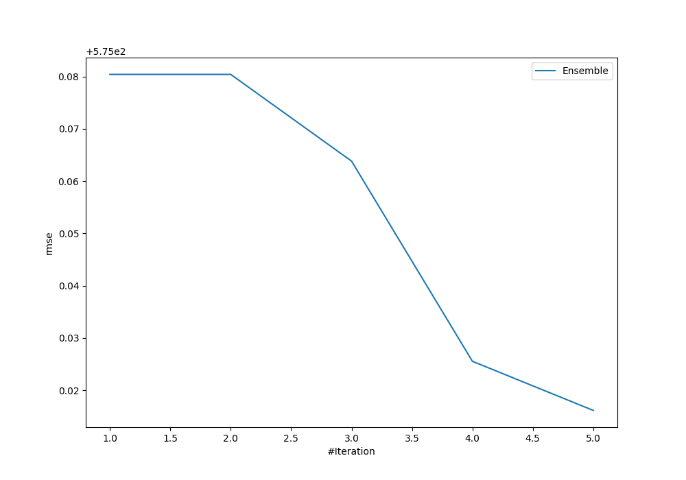
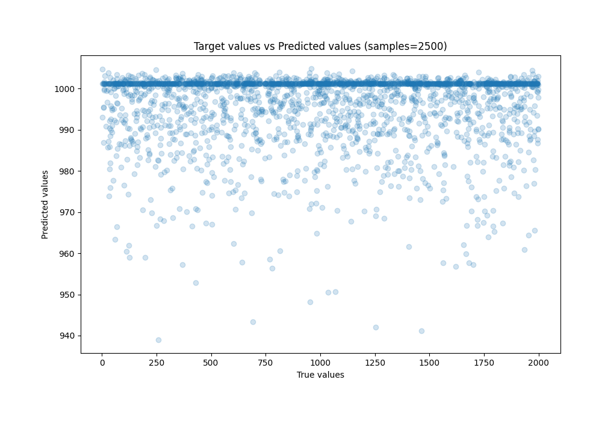
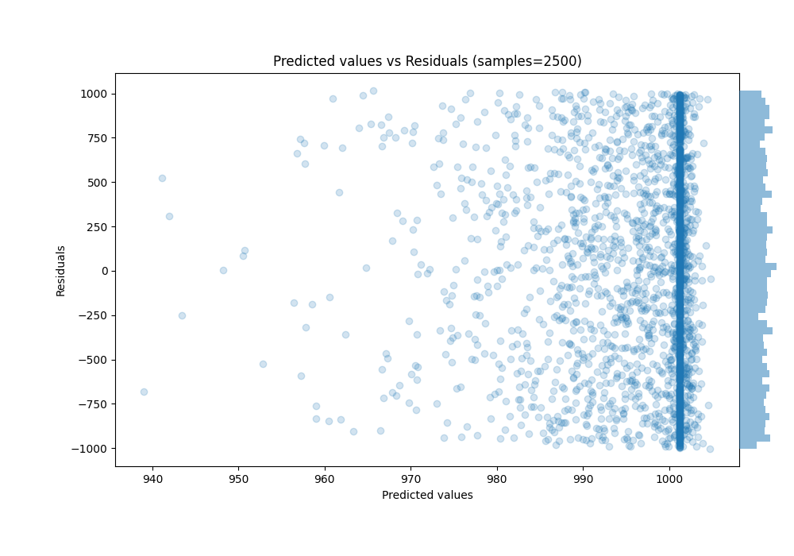

# Summary of Ensemble

[<< Go back](../README.md)

## Ensemble structure
| Model                   |   Weight |
|:------------------------|---------:|
| 1_Baseline              |        4 |
| 4_Default_NeuralNetwork |        1 |

### Metric details:
| Metric   |            Score |
|:---------|-----------------:|
| MAE      |    494.682       |
| MSE      | 330644           |
| RMSE     |    575.016       |
| R2       |     -0.000479456 |
| MAPE     |      2.69267     |

## Learning curves

## True vs Predicted

## Predicted vs Residuals

[<< Go back](../README.md)
