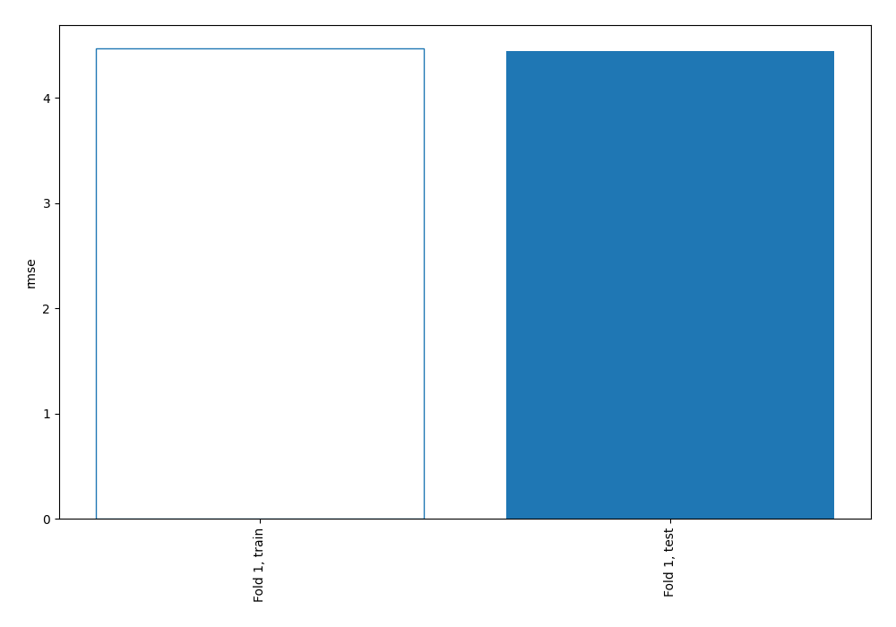
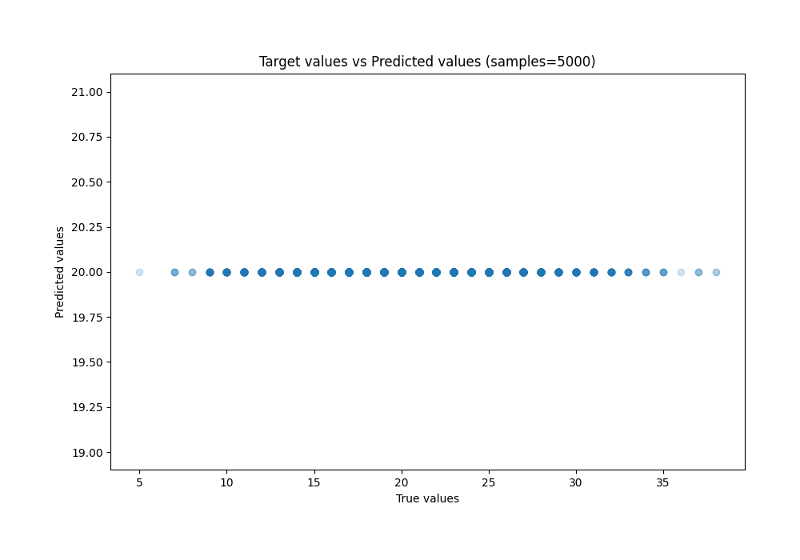
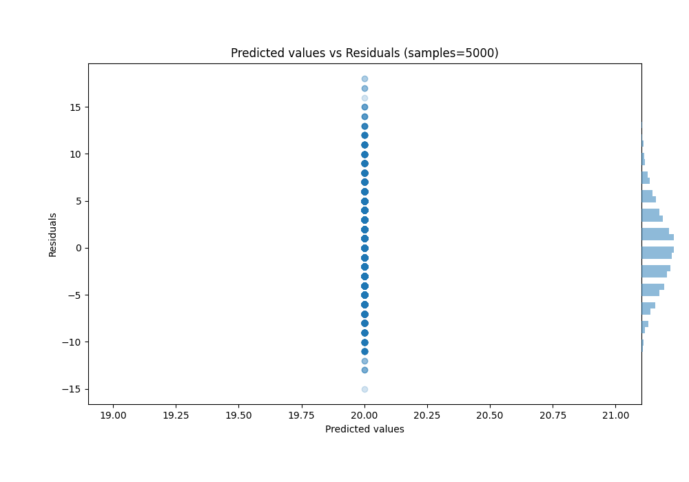

# Summary of 1_Baseline

[<< Go back](../README.md)

## Baseline Regressor (Baseline)
- **n_jobs**: -1
- **explain_level**: 2

## Validation
 - **validation_type**: split
 - **train_ratio**: 0.75
 - **shuffle**: True

## Optimized metric
rmse

## Training time

0.4 seconds

### Metric details:
| Metric   |        Score |
|:---------|-------------:|
| MAE      |  3.51238     |
| MSE      | 19.7473      |
| RMSE     |  4.44379     |
| R2       | -1.12729e-05 |
| MAPE     |  0.192244    |

## Learning curves

## True vs Predicted

## Predicted vs Residuals

[<< Go back](../README.md)
