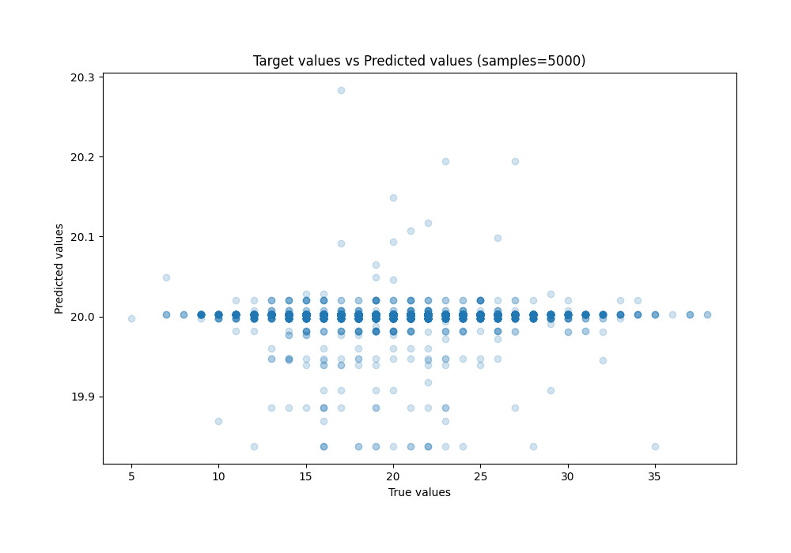

# Summary of Ensemble

[<< Go back](../README.md)

## Ensemble structure
| Model             |   Weight |
|:------------------|---------:|
| 1_Baseline        |        1 |
| 3_Default_Xgboost |        1 |

### Metric details:
| Metric   |        Score |
|:---------|-------------:|
| MAE      |  3.51249     |
| MSE      | 19.7471      |
| RMSE     |  4.44377     |
| R2       | -3.09421e-06 |
| MAPE     |  0.19225     |

## Learning curves

## True vs Predicted

## Predicted vs Residuals

[<< Go back](../README.md)
