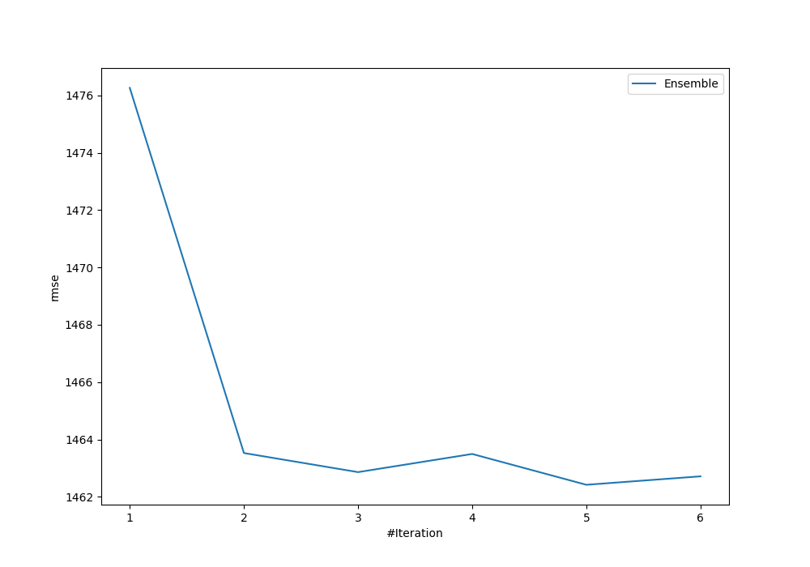
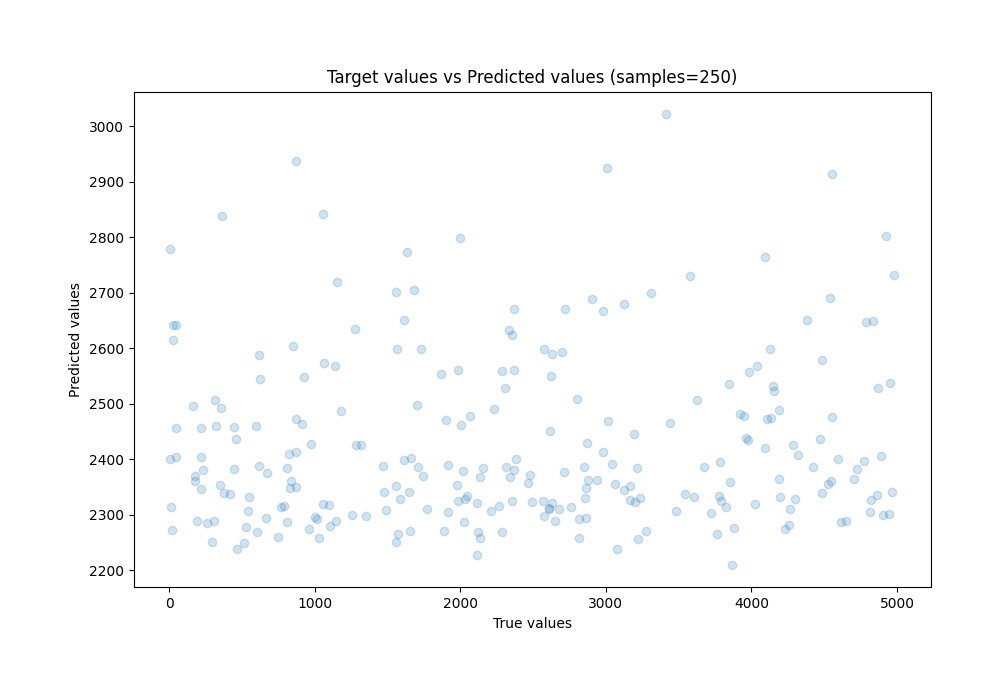
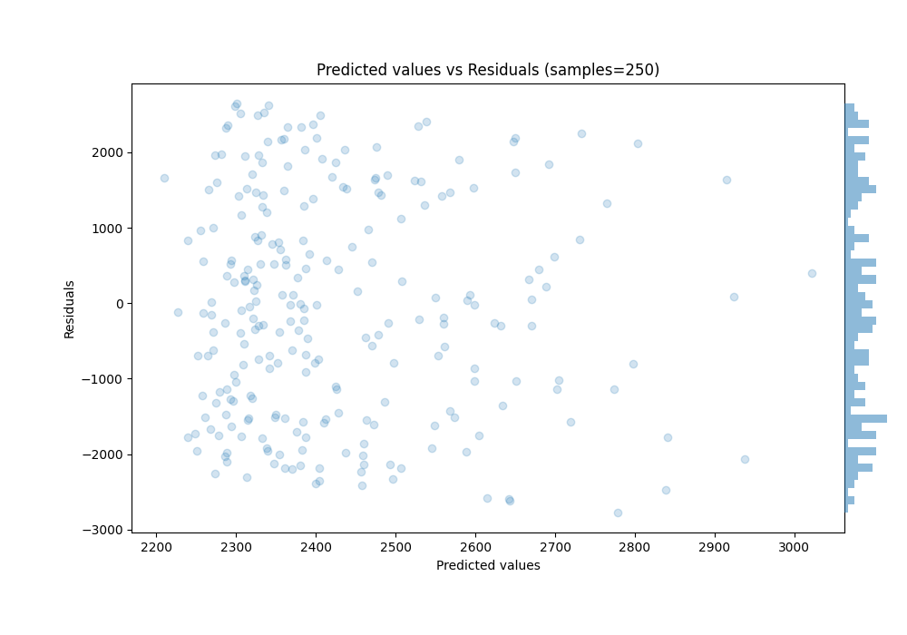

# Summary of Ensemble

[<< Go back](../README.md)

## Ensemble structure
| Model                   |   Weight |
|:------------------------|---------:|
| 1_Baseline              |        2 |
| 5_Default_NeuralNetwork |        2 |
| 6_Default_RandomForest  |        1 |

### Metric details:
| Metric   |          Score |
|:---------|---------------:|
| MAE      | 1246.63        |
| MSE      |    2.13868e+06 |
| RMSE     | 1462.42        |
| R2       |    0.000484137 |
| MAPE     |    6.66572     |

## Learning curves

## True vs Predicted

## Predicted vs Residuals

[<< Go back](../README.md)
