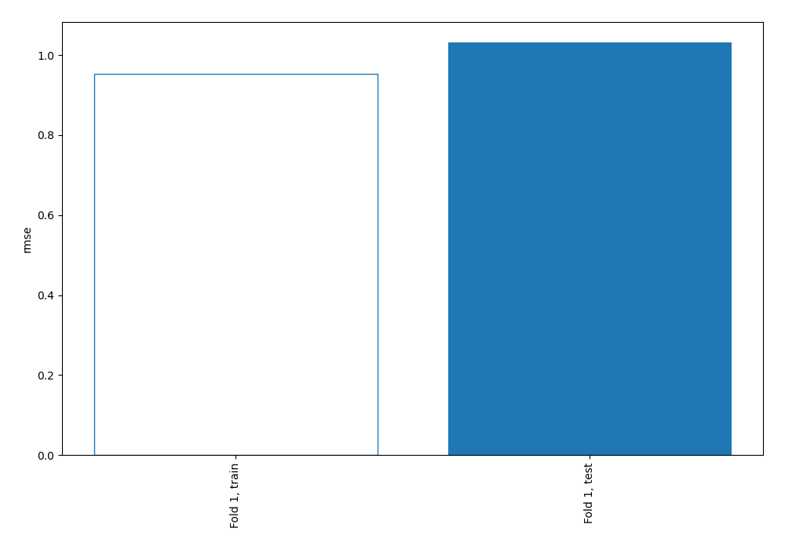
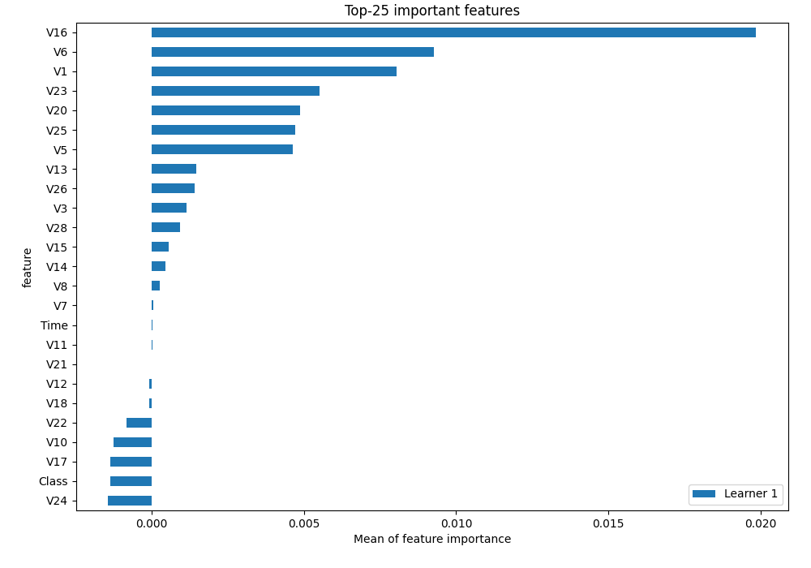
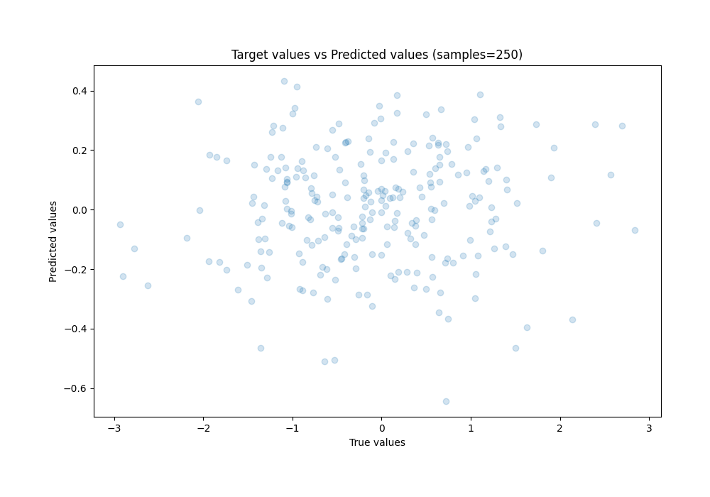
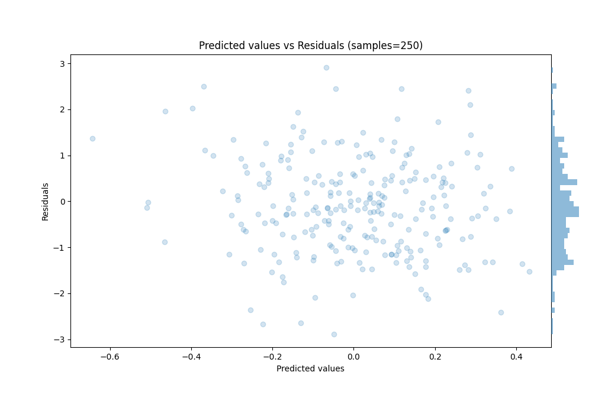
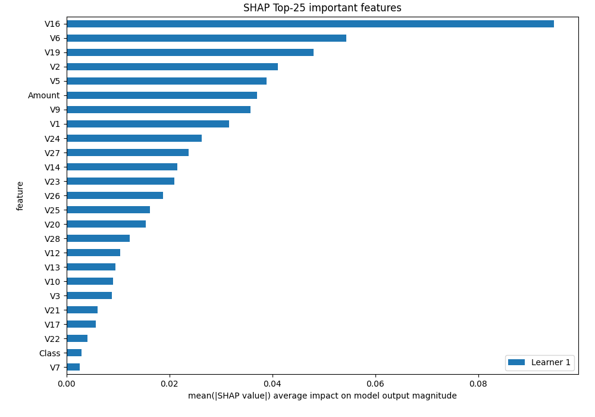
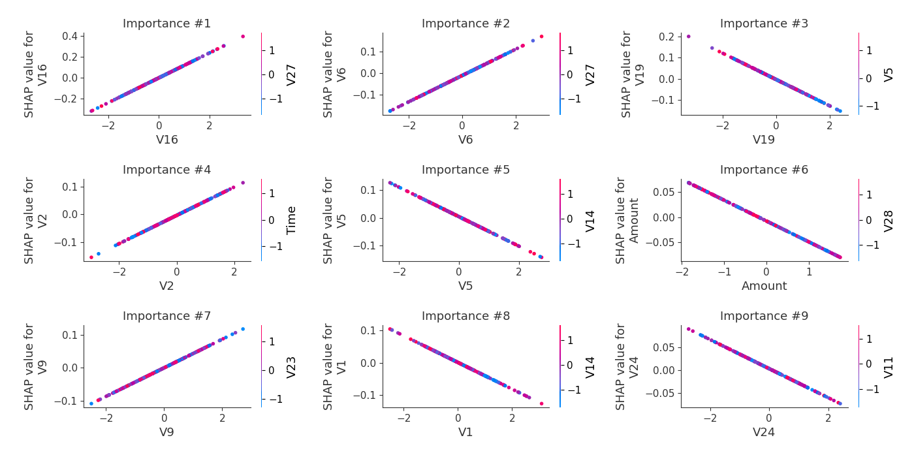
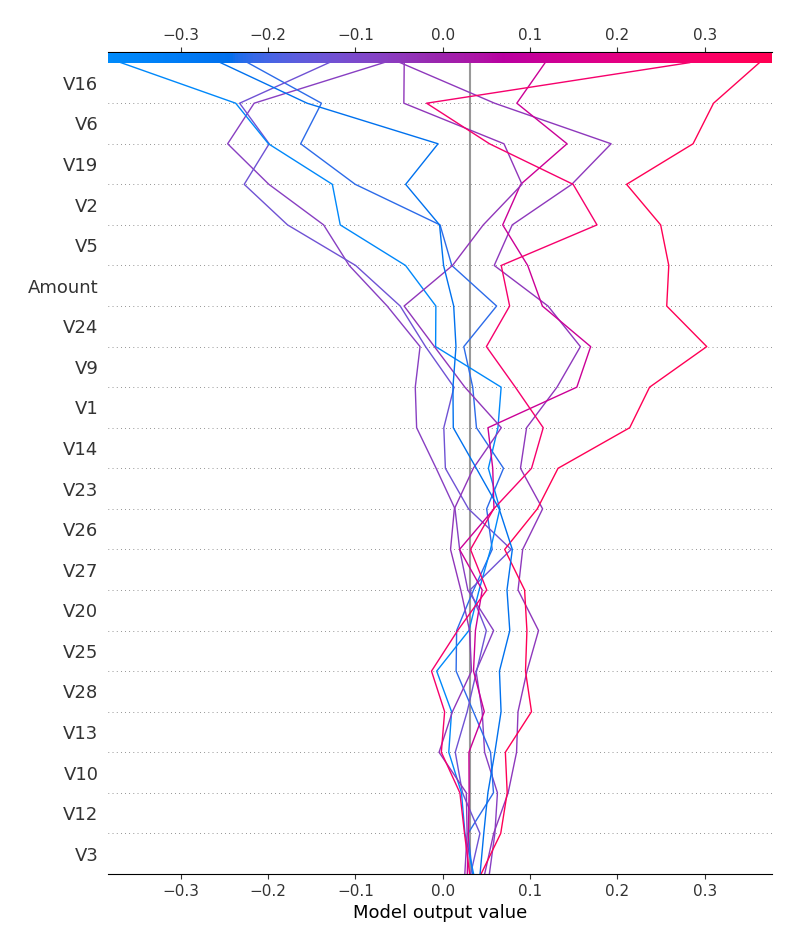
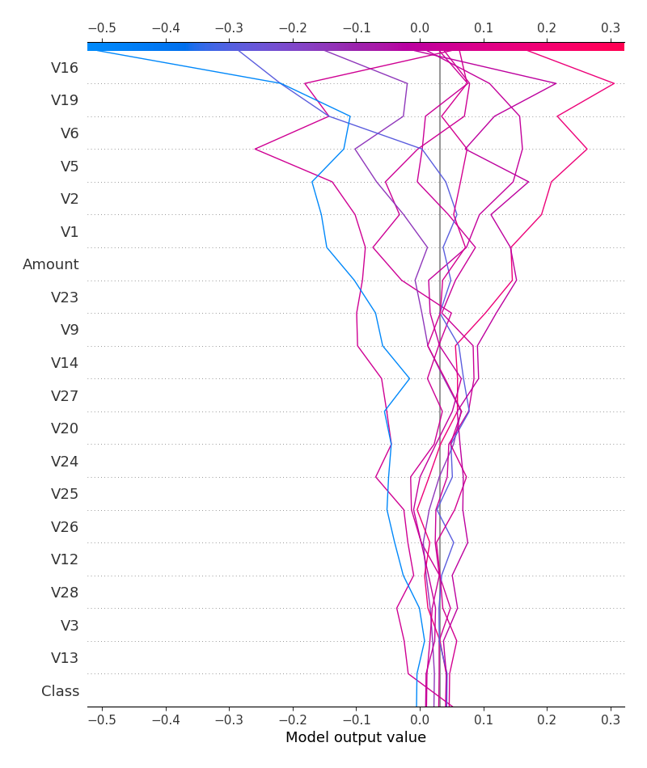

# Summary of 3_Linear

[<< Go back](../README.md)

## Linear Regression (Linear)
- **n_jobs**: -1
- **explain_level**: 2

## Validation
 - **validation_type**: split
 - **train_ratio**: 0.75
 - **shuffle**: True

## Optimized metric
rmse

## Training time

5.5 seconds

### Metric details:
| Metric   |      Score |
|:---------|-----------:|
| MAE      |  0.821662  |
| MSE      |  1.06401   |
| RMSE     |  1.03151   |
| R2       | -0.0207868 |
| MAPE     |  2.2236    |

## Learning curves

## Coefficients
| feature   |    Learner_1 |
|:----------|-------------:|
| V16       |  0.118764    |
| V6        |  0.0611201   |
| V2        |  0.0516148   |
| V9        |  0.0434144   |
| V23       |  0.0294479   |
| V26       |  0.0237194   |
| V20       |  0.019745    |
| V28       |  0.0155957   |
| V12       |  0.0132895   |
| V10       |  0.0101458   |
| intercept |  0.009623    |
| V17       |  0.00730838  |
| V22       |  0.00505911  |
| V8        |  0.00219217  |
| V11       |  0.000392705 |
| Time      | -0.000631206 |
| V18       | -0.00262653  |
| V15       | -0.00316719  |
| V7        | -0.00320707  |
| V21       | -0.00696808  |
| V3        | -0.0104135   |
| V13       | -0.0124781   |
| V25       | -0.0191482   |
| V14       | -0.0268439   |
| V27       | -0.0296075   |
| V24       | -0.0315248   |
| Amount    | -0.0412883   |
| V1        | -0.0413693   |
| V5        | -0.0525574   |
| V19       | -0.0627018   |
| Class     | -0.0702137   |

## Permutation-based Importance

## True vs Predicted

## Predicted vs Residuals

## SHAP Importance

## SHAP Dependence plots

### Dependence (Fold 1)

## SHAP Decision plots

### Top-10 Worst decisions (Fold 1)

### Top-10 Best decisions (Fold 1)

[<< Go back](../README.md)
