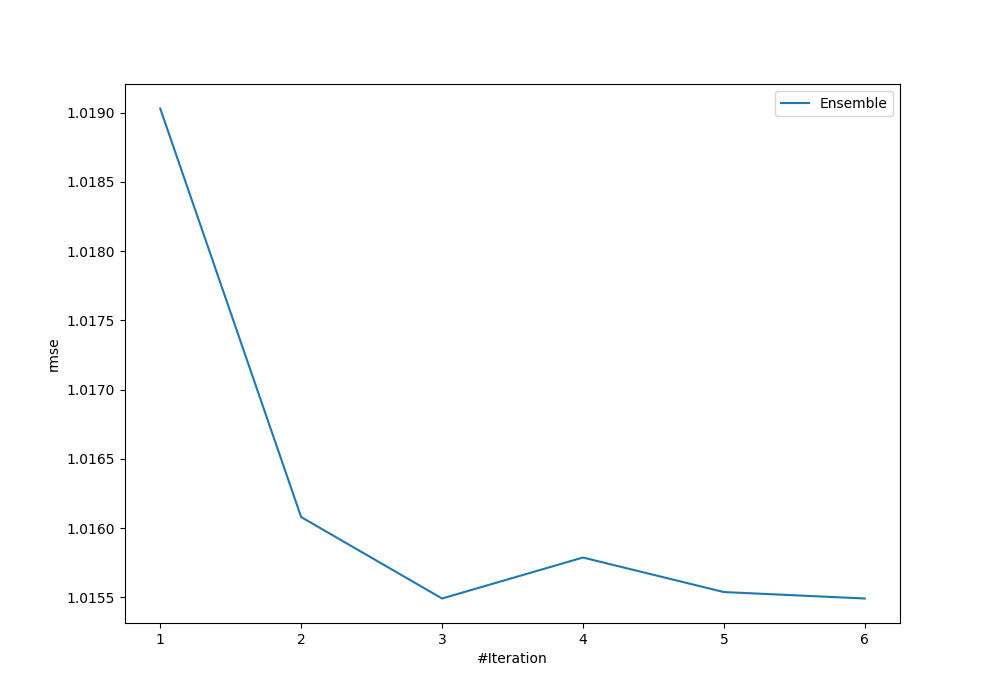
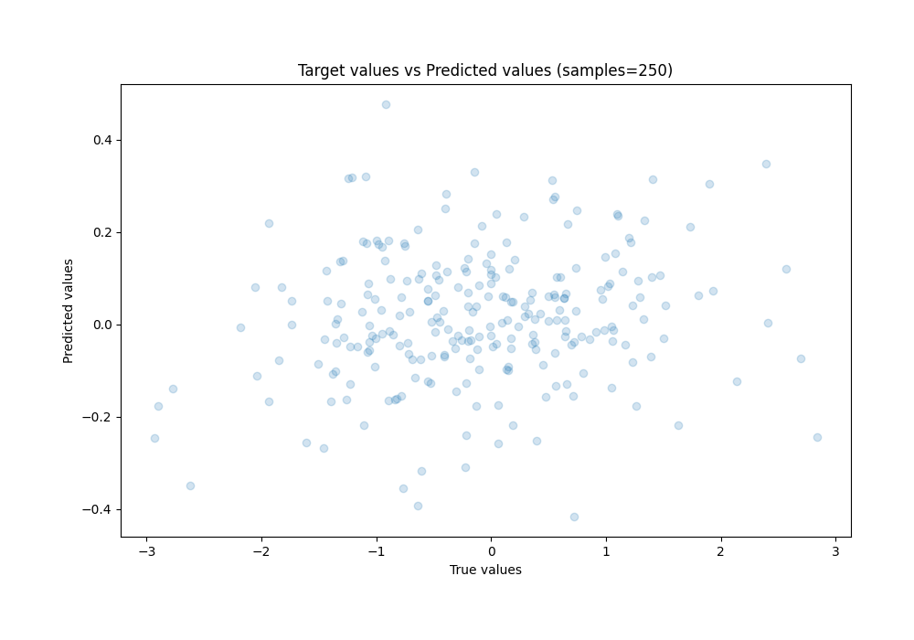
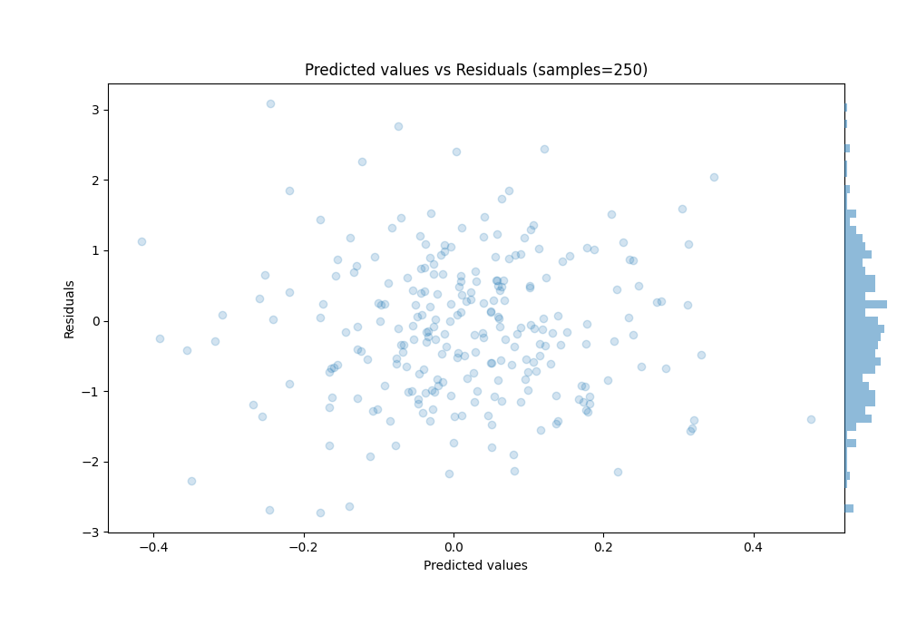

# Summary of Ensemble

[<< Go back](../README.md)

## Ensemble structure
| Model                   |   Weight |
|:------------------------|---------:|
| 4_Default_Xgboost       |        2 |
| 5_Default_NeuralNetwork |        1 |

### Metric details:
| Metric   |     Score |
|:---------|----------:|
| MAE      | 0.813951  |
| MSE      | 1.03122   |
| RMSE     | 1.01549   |
| R2       | 0.0106658 |
| MAPE     | 3.76301   |

## Learning curves

## True vs Predicted

## Predicted vs Residuals

[<< Go back](../README.md)
