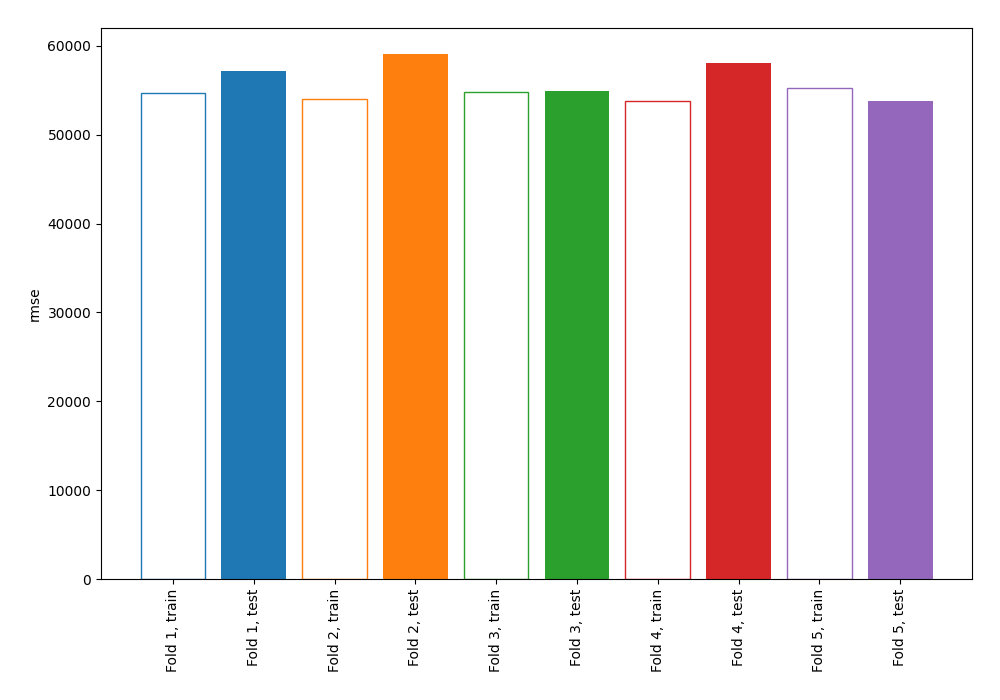
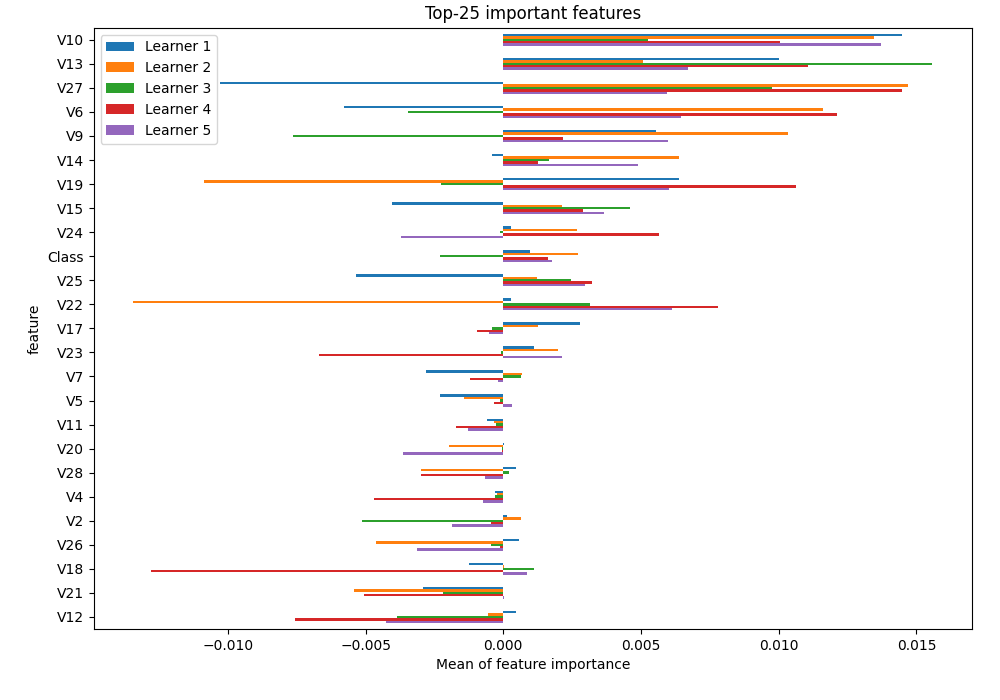
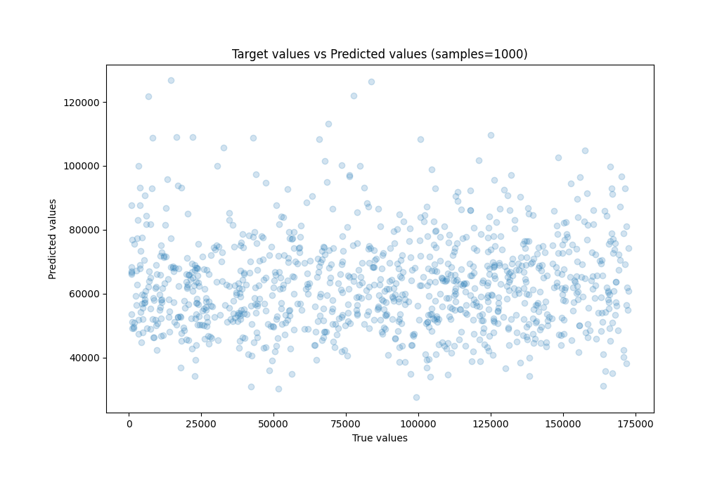
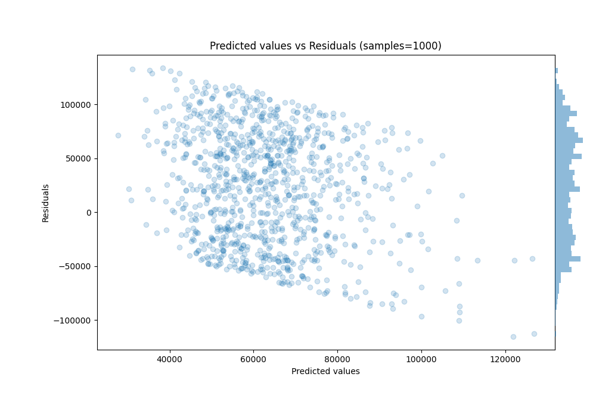

# Summary of 1_Linear

[<< Go back](../README.md)

## Linear Regression (Linear)
- **n_jobs**: -1
- **explain_level**: 1

## Validation
 - **validation_type**: kfold
 - **k_folds**: 5
 - **shuffle**: True

## Optimized metric
rmse

## Training time

5.3 seconds

### Metric details:
| Metric   |           Score |
|:---------|----------------:|
| MAE      | 48046.9         |
| MSE      |     3.20706e+09 |
| RMSE     | 56630.9         |
| R2       |    -0.283771    |
| MAPE     |     2.03685     |

## Learning curves

## Coefficients
| feature   |    Learner_1 |   Learner_2 |   Learner_3 |    Learner_4 |    Learner_5 |
|:----------|-------------:|------------:|------------:|-------------:|-------------:|
| Class     |  0.241052    |  0.195926   |  0.277827   |  0.143315    |  0.125503    |
| V10       |  0.0562115   |  0.0741926  |  0.0840118  |  0.04864     |  0.0543109   |
| V19       |  0.0546686   |  0.108531   |  0.0754367  |  0.0360339   |  0.0347181   |
| V22       |  0.0593488   |  0.0943982  |  0.0558361  |  0.022856    |  0.0357461   |
| V6        |  0.0683437   |  0.0295845  |  0.0602261  |  0.0427603   |  0.0580428   |
| V14       |  0.0413262   |  0.0284449  |  0.0179532  |  0.0297005   |  0.0185301   |
| V25       |  0.0490003   |  0.0190406  |  0.0238559  |  0.0127098   |  0.0267219   |
| V8        |  0.00710121  |  0.0130879  | -0.00618836 |  0.0559712   |  0.0280172   |
| V26       |  0.0135529   |  0.0546861  | -0.00311233 | -0.000957065 |  0.0302354   |
| V18       | -0.00463062  |  0.0240939  |  0.0127129  |  0.0490936   |  0.00849433  |
| V17       |  0.0180505   |  0.0182389  |  0.0205913  |  0.0293025   | -0.00289895  |
| V21       |  0.0311145   | -0.0258708  |  0.0253708  |  0.0336619   |  0.000203182 |
| V16       | -0.0157208   | -0.0184478  |  0.0387806  |  0.031611    |  0.0182804   |
| V28       |  0.0226313   |  0.01889    |  0.00299929 | -0.0173375   |  0.0173717   |
| V7        |  0.0172866   |  0.00842471 |  0.0120503  | -0.0107      |  0.0156513   |
| V20       |  0.000319846 | -0.0139197  |  0.0110155  | -0.00440946  |  0.0249922   |
| V3        | -0.0291908   | -0.0151778  |  0.0202673  |  0.0181002   |  0.0158435   |
| V11       | -0.0117511   |  0.0146839  | -0.0054819  | -0.0121415   |  0.0177826   |
| Amount    |  0.0299142   | -0.0630078  |  0.0237295  | -0.00868703  |  0.00876222  |
| V4        |  0.00518037  | -0.0120275  | -0.0083875  |  0.0172731   | -0.0167462   |
| V12       | -0.00271282  | -0.00831813 | -0.0239242  |  0.0219468   | -0.0236393   |
| intercept | -0.0152612   | -0.00405809 | -0.0107716  | -0.00534185  | -0.0150851   |
| V5        | -0.0255472   | -0.0238128  |  0.00150549 |  0.0107682   | -0.0144426   |
| V2        | -0.0239622   | -0.00284769 | -0.0400825  | -0.0188631   |  0.00738848  |
| V1        |  0.0118757   | -0.0475977  | -0.0170379  | -0.0529239   | -0.00380333  |
| V23       | -0.0173384   | -0.0205546  | -0.0249129  | -0.0623146   | -0.00828576  |
| V24       | -0.0323645   | -0.0210582  | -0.0444042  | -0.0218502   | -0.0424345   |
| V15       | -0.0576394   | -0.0151035  | -0.0354371  | -0.0370679   | -0.0229603   |
| V9        | -0.0409499   | -0.0726756  | -0.0759287  | -0.0373917   | -0.0312706   |
| V27       | -0.095909    | -0.0465883  | -0.0791579  | -0.0667218   | -0.0728584   |
| V13       | -0.0658841   | -0.0722858  | -0.0673161  | -0.0798113   | -0.0780204   |

## Permutation-based Importance

## True vs Predicted

## Predicted vs Residuals

[<< Go back](../README.md)
