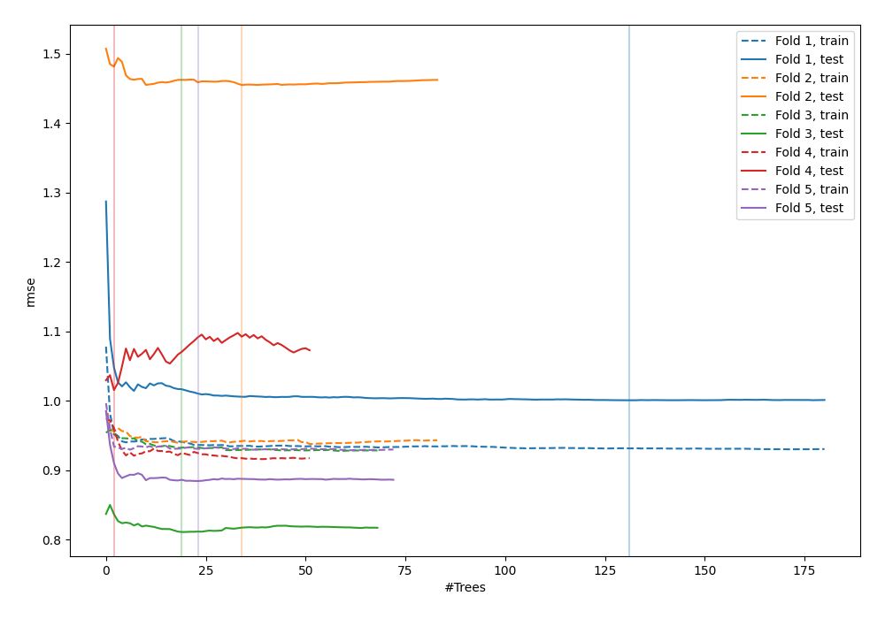
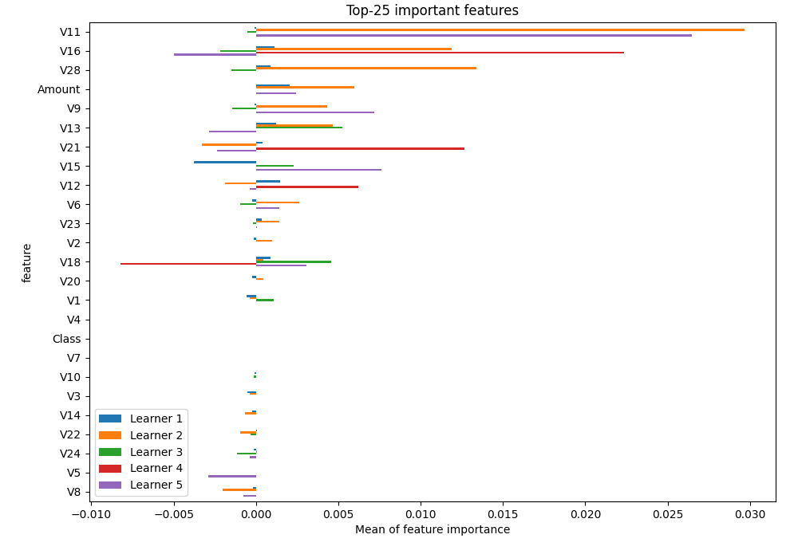
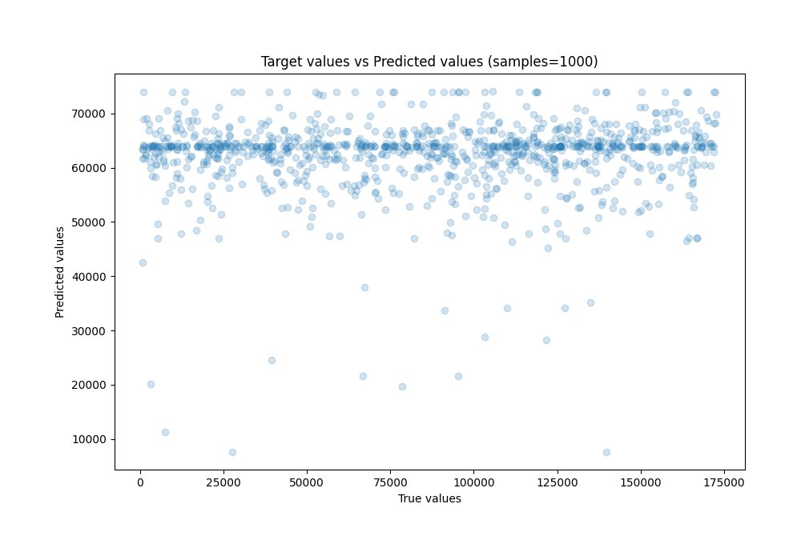
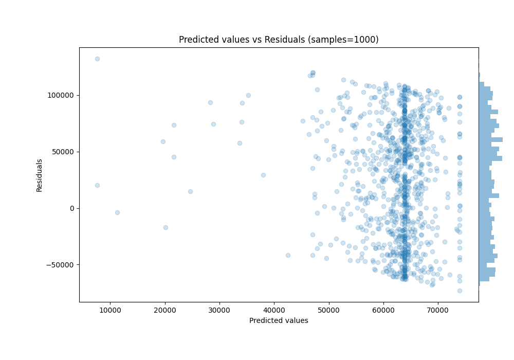

# Summary of 20_RandomForest

[<< Go back](../README.md)

## Random Forest
- **n_jobs**: -1
- **criterion**: squared_error
- **max_features**: 0.7
- **min_samples_split**: 50
- **max_depth**: 3
- **eval_metric_name**: rmse
- **explain_level**: 1

## Validation
 - **validation_type**: kfold
 - **k_folds**: 5
 - **shuffle**: True

## Optimized metric
rmse

## Training time

22.7 seconds

### Metric details:
| Metric   |           Score |
|:---------|----------------:|
| MAE      | 47519.5         |
| MSE      |     3.09273e+09 |
| RMSE     | 55612.3         |
| R2       |    -0.238005    |
| MAPE     |     1.9653      |

## Learning curves

## Permutation-based Importance

## True vs Predicted

## Predicted vs Residuals

[<< Go back](../README.md)
