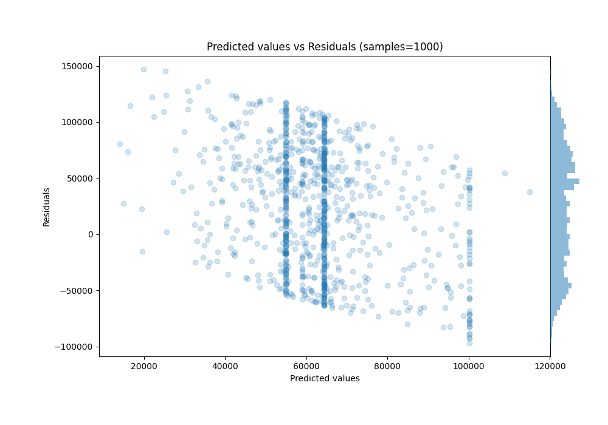

# Summary of 23_NeuralNetwork

[<< Go back](../README.md)

## Neural Network
- **n_jobs**: -1
- **dense_1_size**: 32
- **dense_2_size**: 4
- **learning_rate**: 0.05
- **explain_level**: 1

## Validation
 - **validation_type**: kfold
 - **k_folds**: 5
 - **shuffle**: True

## Optimized metric
rmse

## Training time

4.4 seconds

### Metric details:
| Metric   |           Score |
|:---------|----------------:|
| MAE      | 48825.6         |
| MSE      |     3.32435e+09 |
| RMSE     | 57657.2         |
| R2       |    -0.330722    |
| MAPE     |     1.99175     |

## Learning curves

## Permutation-based Importance

## True vs Predicted

## Predicted vs Residuals

[<< Go back](../README.md)
