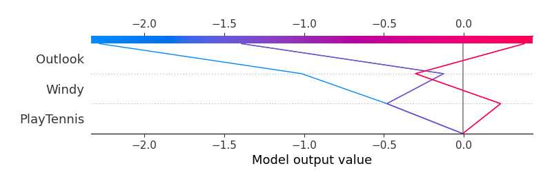

# Summary of 38_Xgboost

[<< Go back](../README.md)

## Extreme Gradient Boosting (Xgboost)
- **n_jobs**: -1
- **objective**: reg:squarederror
- **eta**: 0.15
- **max_depth**: 7
- **min_child_weight**: 25
- **subsample**: 0.9
- **colsample_bytree**: 0.6
- **eval_metric**: rmse
- **explain_level**: 1

## Validation
 - **validation_type**: kfold
 - **k_folds**: 5
 - **shuffle**: True

## Optimized metric
rmse

## Training time

31.5 seconds

### Metric details:
| Metric   |           Score |
|:---------|----------------:|
| MAE      | 47546.1         |
| MSE      |     3.11139e+09 |
| RMSE     | 55779.8         |
| R2       |    -0.245474    |
| MAPE     |     1.91234     |

## Learning curves

## Permutation-based Importance

## True vs Predicted

## Predicted vs Residuals

[<< Go back](../README.md)
