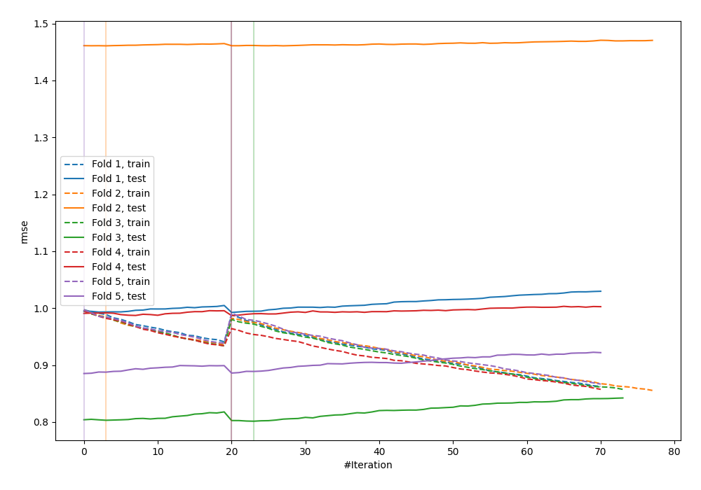
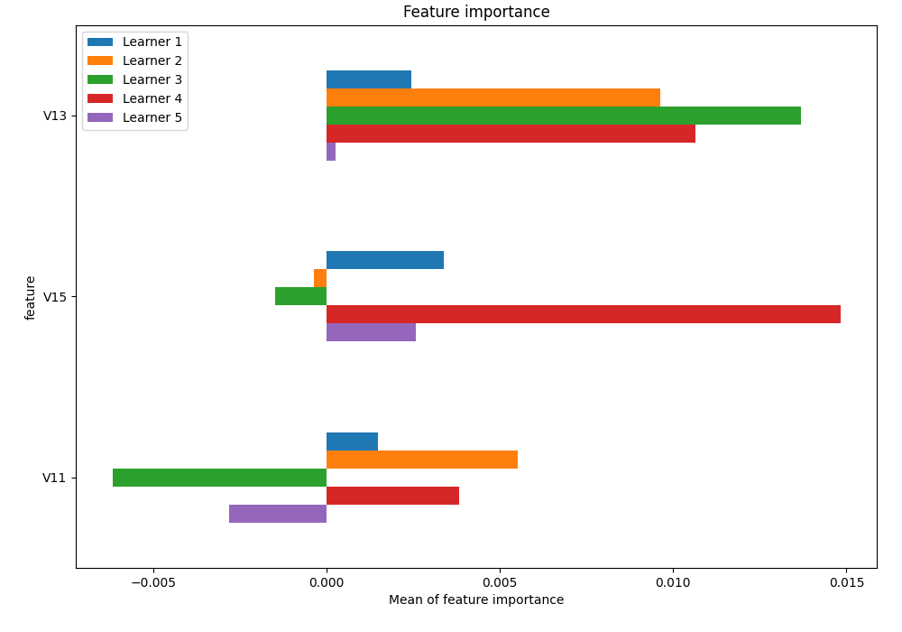
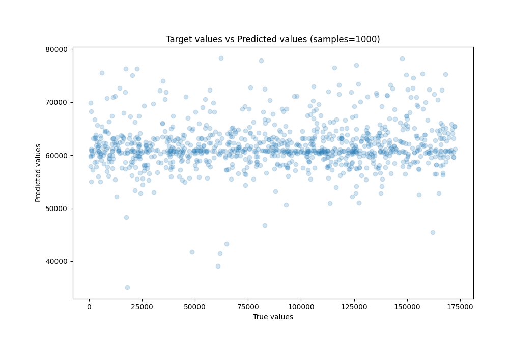
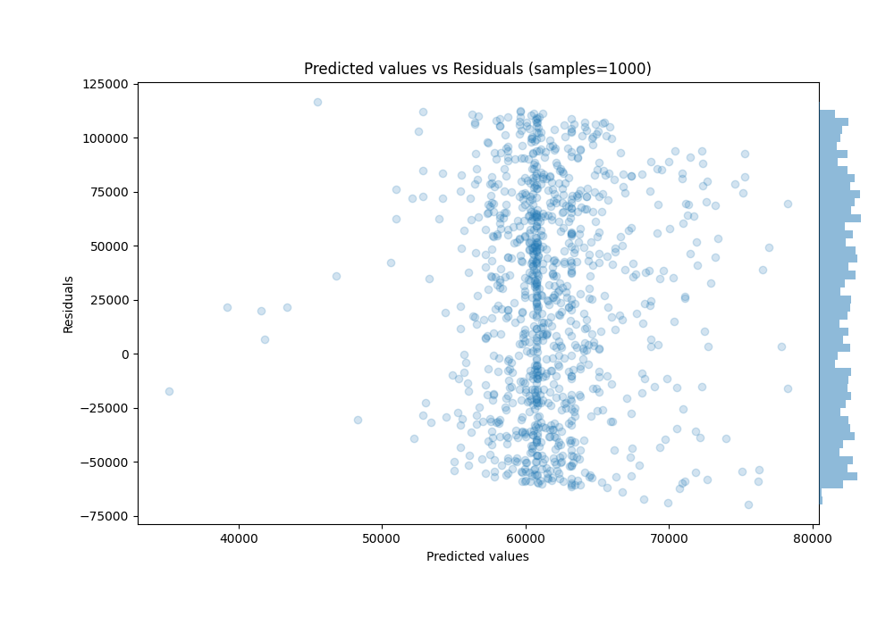

# Summary of 43_CatBoost_GoldenFeatures_SelectedFeatures

[<< Go back](../README.md)

## CatBoost
- **n_jobs**: -1
- **learning_rate**: 0.1
- **depth**: 7
- **rsm**: 1.0
- **loss_function**: RMSE
- **eval_metric**: RMSE
- **explain_level**: 1

## Validation
 - **validation_type**: kfold
 - **k_folds**: 5
 - **shuffle**: True

## Optimized metric
rmse

## Training time

15.7 seconds

### Metric details:
| Metric   |           Score |
|:---------|----------------:|
| MAE      | 47364.6         |
| MSE      |     3.08028e+09 |
| RMSE     | 55500.2         |
| R2       |    -0.233021    |
| MAPE     |     1.94432     |

## Learning curves

## Permutation-based Importance

## True vs Predicted

## Predicted vs Residuals

[<< Go back](../README.md)
